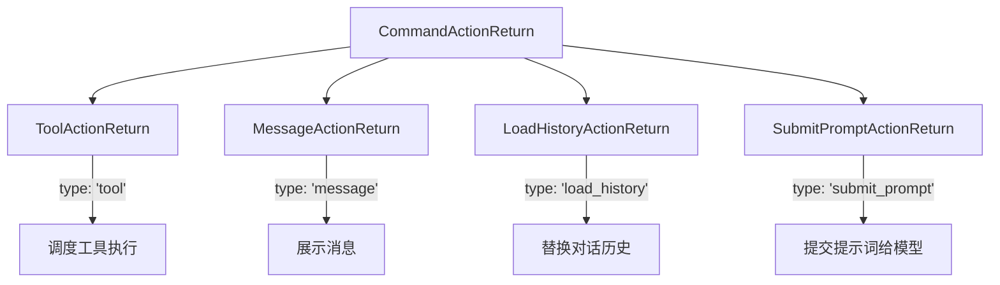

# types.ts (commands)

> 定义所有斜杠命令的返回类型联合，规范命令与 UI 层的交互协议。

## 概述

`types.ts` 定义了命令系统的返回类型体系。每个斜杠命令（如 `/init`、`/memory`、`/restore`）执行后返回一个 `CommandActionReturn` 联合类型，指示 UI 层应该执行什么操作：显示消息、调度工具调用、加载历史记录或提交提示词。这种设计实现了命令逻辑与 UI 展示的彻底解耦。

## 架构图

## 主要导出

### 接口

| 接口 | 字段 | 说明 |
|------|------|------|
| `ToolActionReturn` | `type: 'tool'`, `toolName`, `toolArgs`, `postSubmitPrompt?` | 命令需要调度一个工具调用 |
| `MessageActionReturn` | `type: 'message'`, `messageType: 'info' \| 'error'`, `content` | 命令产生一条消息展示给用户 |
| `LoadHistoryActionReturn<HistoryType>` | `type: 'load_history'`, `history`, `clientHistory` | 命令需要替换整个对话历史 |
| `SubmitPromptActionReturn` | `type: 'submit_prompt'`, `content` | 命令需要立即向模型提交内容 |

### 类型

| 类型 | 定义 | 说明 |
|------|------|------|
| `CommandActionReturn<HistoryType>` | 上述四个接口的联合类型 | 所有命令的统一返回类型 |

## 核心逻辑

纯类型定义文件，无运行时逻辑。关键设计：

- **判别联合（Discriminated Union）**：通过 `type` 字段区分四种返回类型，允许 UI 层使用类型守卫进行分支处理。
- **泛型历史**：`LoadHistoryActionReturn` 的 `HistoryType` 泛型允许不同前端实现使用各自的历史格式。
- **后续提示**：`ToolActionReturn.postSubmitPrompt` 允许工具执行完成后自动提交后续提示。

## 内部依赖

无（纯类型文件）。

## 外部依赖

| 包名 | 用途 |
|------|------|
| `@google/genai` | `Content`, `PartListUnion` 类型 |
