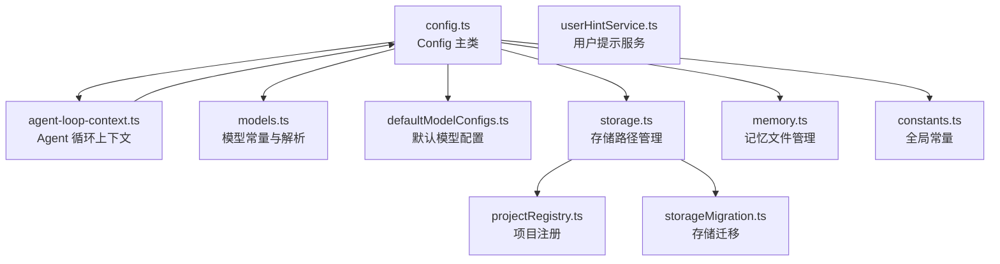

# config 架构

> 配置管理系统，提供全局运行时配置、模型配置、存储管理、记忆文件和项目注册

## 概述

`config/` 模块是 Gemini CLI 的配置中心，管理所有运行时状态和用户设置。核心的 `Config` 类是一个巨大的状态容器，贯穿整个应用生命周期，持有对工具注册表、Agent 注册表、策略引擎、内容生成器等几乎所有核心组件的引用。该模块还负责模型配置解析、持久化存储路径管理、记忆文件读写和项目注册。

## 架构图



## 目录结构

```
config/
├── config.ts              # Config 核心类（~1000+ 行）
├── agent-loop-context.ts  # AgentLoopContext：Agent 循环所需的运行时上下文
├── models.ts              # 模型名称常量、解析函数、自动模型判断
├── defaultModelConfigs.ts # 默认模型配置参数（温度、topP 等）
├── storage.ts             # Storage 类：文件路径管理
├── memory.ts              # 记忆文件（GEMINI.md）读写
├── constants.ts           # 全局常量（文件过滤选项、忽略文件名等）
├── projectRegistry.ts     # 项目注册中心
├── storageMigration.ts    # 存储格式迁移
└── userHintService.ts     # 用户提示（Hint）广播服务
```

## 关键文件

| 文件 | 功能 |
|------|------|
| `config.ts` | `Config` 类：核心配置容器，管理模型选择、认证类型、工具注册表、Agent 注册表、策略引擎、MCP 服务器、Hook 系统、沙箱、遥测等。持有大量 getter/setter 方法 |
| `models.ts` | 模型常量定义：`DEFAULT_GEMINI_MODEL`（gemini-2.5-pro）、`DEFAULT_GEMINI_FLASH_MODEL`（gemini-2.5-flash）等；`resolveModel`（解析模型别名）、`isAutoModel`/`isPreviewModel`（模型判断） |
| `storage.ts` | `Storage` 类：管理 `~/.gemini/` 全局目录和项目级 `.gemini/` 目录下的所有文件路径，包括 OAuth 凭据、策略文件、Agent 目录、临时文件等 |
| `agent-loop-context.ts` | `AgentLoopContext` 类：为 Agent 执行循环提供所需的上下文引用（config、toolRegistry、messageBus、promptId 等） |
| `memory.ts` | 记忆文件管理：发现并读取 `GEMINI.md` 文件（支持全局、项目和目录级别），合并为系统指令的一部分 |
| `constants.ts` | 全局常量：`FileFilteringOptions`（文件过滤选项）、`GEMINI_IGNORE_FILE_NAME`（.geminiignore） |
| `userHintService.ts` | 用户提示广播服务：允许在 Agent 执行期间注入用户反馈提示 |

## 内部依赖

- `core/` - ContentGenerator、GeminiClient、BaseLlmClient
- `tools/` - ToolRegistry、各类工具定义
- `agents/` - AgentRegistry
- `policy/` - PolicyEngine
- `hooks/` - HookSystem
- `services/` - 各类服务（FileDiscovery、Git、Sandbox 等）
- `telemetry/` - 遥测初始化
- `mcp/` - MCPOAuthConfig
- `billing/` - OverageStrategy
- `fallback/` - FallbackModelHandler

## 外部依赖

| 依赖 | 用途 |
|------|------|
| `zod` | 配置 schema 验证 |
| `dotenv` / `dotenv-expand` | 环境变量加载 |
