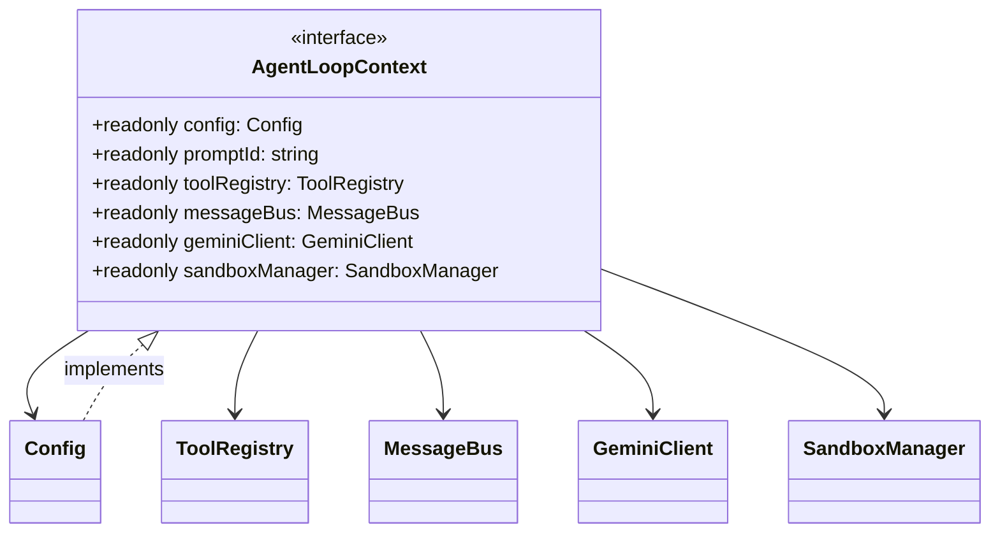

# agent-loop-context.ts

> 定义单次 Agent 循环执行时的作用域上下文接口。

## 概述

`agent-loop-context.ts` 声明了 `AgentLoopContext` 接口，它代表了一个 Agent 轮次（turn）或子 Agent 循环中可见的"世界视图"。该接口将运行时所需的核心依赖（配置、工具注册表、消息总线、LLM 客户端、沙箱管理器）统一封装为一个只读上下文对象，供 Agent 循环内部的各组件注入使用。

**设计动机：** 通过定义一个薄的上下文接口，将 Agent 循环与具体的 `Config` 类解耦，使得子系统可以仅依赖它真正需要的能力，而非整个巨型 Config 对象。这也方便了单元测试时的 mock 替换。

**在模块中的角色：** 作为 config 模块的一部分，它是连接核心运行时配置与 Agent 执行层的桥梁接口。`Config` 类直接实现了此接口。

## 架构图

## 主要导出

### `interface AgentLoopContext`

Agent 循环执行的作用域上下文。

| 属性 | 类型 | 说明 |
|------|------|------|
| `config` | `Config` (readonly) | 全局运行时配置对象 |
| `promptId` | `string` (readonly) | 当前用户轮次或 Agent 思考循环的唯一 ID |
| `toolRegistry` | `ToolRegistry` (readonly) | 当前上下文中可用的工具注册表 |
| `messageBus` | `MessageBus` (readonly) | 用户确认和消息传递总线 |
| `geminiClient` | `GeminiClient` (readonly) | 与 LLM 通信的客户端 |
| `sandboxManager` | `SandboxManager` (readonly) | 命令沙箱化执行服务 |

## 核心逻辑

该文件仅包含一个纯接口声明，没有任何业务逻辑。所有属性均为 `readonly`，强制调用方不可在循环执行过程中替换上下文依赖。

## 内部依赖

| 模块 | 说明 |
|------|------|
| `../core/client.js` | 提供 `GeminiClient` 类型 |
| `../confirmation-bus/message-bus.js` | 提供 `MessageBus` 类型 |
| `../tools/tool-registry.js` | 提供 `ToolRegistry` 类型 |
| `../services/sandboxManager.js` | 提供 `SandboxManager` 类型 |
| `./config.js` | 提供 `Config` 类型 |

## 外部依赖

无外部第三方依赖。
