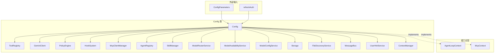

# config.ts

> Gemini CLI 核心运行时配置中心，统一管理所有子系统的状态、参数和生命周期。

## 概述

`config.ts` 是整个 Gemini CLI 核心包中最大的文件（约 3200+ 行），承担了全局配置容器和服务定位器的双重角色。`Config` 类实现了 `McpContext` 和 `AgentLoopContext` 接口，是几乎所有子系统的入口点。

**主要职责：**
1. **参数管理**：接收并存储来自 CLI 启动参数的数百个配置项
2. **服务生命周期**：初始化并持有 ToolRegistry、GeminiClient、HookSystem、PolicyEngine、McpClientManager 等核心服务
3. **模型管理**：模型选择、切换、配额跟踪、降级策略
4. **认证刷新**：`refreshAuth` 方法处理认证切换和相关状态重置
5. **策略引擎集成**：审批模式管理、策略热加载
6. **扩展管理**：MCP 服务器、扩展加载器、技能管理
7. **类型导出**：定义了大量接口和类型，供整个代码库使用

**设计动机：** 作为单例配置容器，避免在系统各处传递大量独立参数。代价是该文件责任过重，已有 TODO 标注未来的拆分方向。

**在模块中的角色：** config 模块的核心文件，被核心包中几乎所有其他模块引用。

## 架构图



## 主要导出

### 类型/接口

| 名称 | 说明 |
|------|------|
| `ConfigParameters` | Config 构造函数参数接口，包含所有可配置项（约 130+ 字段） |
| `AccessibilitySettings` | 无障碍设置（屏幕阅读器、加载短语） |
| `TelemetrySettings` | 遥测配置（端点、协议、采集选项） |
| `SandboxConfig` | 沙箱配置（启用、路径白名单、网络访问） |
| `MCPServerConfig` | MCP 服务器配置类（支持 stdio/sse/http/websocket 传输） |
| `GeminiCLIExtension` | 扩展的完整描述（MCP、hooks、skills、agents、themes、policies） |
| `CustomTheme` | 自定义主题配置 |
| `AgentSettings` / `AgentOverride` | Agent 覆盖配置 |
| `BrowserAgentCustomConfig` | 浏览器 Agent 配置 |
| `McpEnablementCallbacks` | MCP 服务器启用状态回调 |
| `ToolOutputMaskingConfig` | 工具输出遮蔽配置 |
| `OutputSettings` | 输出格式设置 |
| `PlanSettings` | 计划模式设置 |
| `AuthProviderType` | 认证提供者类型枚举（动态发现、Google 凭证、服务账号模拟） |
| `ConfigSchema` | Zod 校验模式（沙箱配置） |
| `FileFilteringOptions` | re-export 自 constants.ts |

### `class Config`

#### 构造函数

```typescript
constructor(params: ConfigParameters)
```

接收约 130+ 个配置参数，初始化所有内部状态。关键初始化步骤包括：
- 创建 Storage、PolicyEngine、MessageBus、ModelConfigService
- 设置全局代理
- 创建 GeminiClient 和 SandboxManager
- 初始化安全基础设施（CheckerRunner、ConsecaSafetyChecker）

#### 核心生命周期方法

| 方法 | 说明 |
|------|------|
| `initialize()` | 异步初始化（去重）：Storage、ToolRegistry、McpClientManager、HookSystem、ContextManager、GeminiClient |
| `refreshAuth(authMethod, apiKey?, baseUrl?, customHeaders?)` | 认证切换：重建 ContentGenerator、刷新配额/实验/管理控制 |
| `reload()` | 在 `onReload` 回调后重新加载技能、Agent 等运行时状态 |

#### 模型管理方法

| 方法 | 说明 |
|------|------|
| `getModel() / setModel(model, isTemporary?)` | 获取/设置当前模型（触发事件和可用性重置） |
| `getActiveModel() / setActiveModel(model)` | 获取/设置活跃模型（用于自动路由） |
| `activateFallbackMode(model)` | 激活降级模式 |
| `setQuota(remaining, limit, modelId?)` | 更新模型配额 |
| `refreshUserQuota()` | 从 CodeAssist 服务器刷新配额 |
| `getQuotaRemaining() / getQuotaLimit() / getQuotaResetTime()` | 获取配额信息（支持自动路由模型池化） |

#### 策略与审批方法

| 方法 | 说明 |
|------|------|
| `getApprovalMode() / setApprovalMode(mode)` | 获取/设置审批模式（含信任检查） |
| `getPolicyEngine()` | 获取策略引擎 |
| `loadWorkspacePolicies(policyDir)` | 热加载工作区策略 |
| `isTrustedFolder()` | 判断当前工作区是否可信 |
| `isYoloModeDisabled()` | Yolo 模式是否被禁用 |

#### 工具与扩展方法

| 方法 | 说明 |
|------|------|
| `getToolRegistry()` / `toolRegistry` | 工具注册表 |
| `getExcludeTools(metadata?, allNames?)` | 获取排除工具集（合并配置 + 扩展 + 策略） |
| `getMcpClientManager()` | MCP 客户端管理器 |
| `getExtensions() / getExtensionLoader()` | 扩展列表/加载器 |
| `getSkillManager()` | 技能管理器 |
| `getAgentRegistry()` | Agent 注册表 |

#### Hook 系统方法

| 方法 | 说明 |
|------|------|
| `getHookSystem()` | 获取 Hook 系统实例 |
| `getEnableHooks()` | Hook 是否启用 |
| `getHooks() / getProjectHooks()` | 获取 Hook 配置 |

#### 上下文与记忆方法

| 方法 | 说明 |
|------|------|
| `getUserMemory() / setUserMemory()` | 用户记忆管理 |
| `refreshMcpContext()` | 刷新 MCP 上下文（记忆、工具、系统指令） |
| `getContextManager()` | JIT 上下文管理器 |

#### 存储与文件方法

| 方法 | 说明 |
|------|------|
| `storage` | Storage 实例 |
| `getFileService()` | 文件发现服务（惰性初始化） |
| `getGitService()` | Git 服务 |
| `getFileExclusions()` | 文件排除规则 |

## 核心逻辑

### 初始化流程

```
Config.initialize()
  -> Storage.initialize()      // 项目注册 + 迁移
  -> FileDiscoveryService      // 文件索引
  -> ToolRegistry              // 注册内置工具
  -> AgentRegistry             // 初始化 Agent
  -> McpClientManager          // 启动 MCP 服务器（非阻塞）
  -> SkillManager              // 发现技能
  -> HookSystem                // 初始化 Hook
  -> ContextManager            // JIT 上下文（可选）
  -> GeminiClient.initialize() // LLM 客户端
```

### 工具注册

`createToolRegistry()` 方法根据配置注册以下内置工具：
- 文件操作：ReadFile、WriteFile、Edit、LS、Glob
- 搜索：Grep/RipGrep（自动检测 ripgrep 可用性）
- 执行：Shell
- 网络：WebFetch、WebSearch
- 内存：Memory
- 计划：EnterPlanMode、ExitPlanMode
- 追踪器：TrackerCreate/Update/Get/List/AddDependency/Visualize（条件注册）
- Agent：Subagent（条件注册）
- 技能：ActivateSkill
- 用户交互：AskUser
- 待办：WriteTodos（条件注册）

### 配额池化

对于自动路由模型（`auto`），系统将 Pro 和 Flash 模型的配额合并计算，提供统一的剩余量和上限视图。

### 审批模式切换

切换到 PLAN 或 YOLO 模式时会同步更新工具列表和系统指令，并记录遥测事件。

## 内部依赖

| 模块 | 说明 |
|------|------|
| `./storage.js` | 存储路径管理 |
| `./models.js` | 模型常量与解析 |
| `./constants.js` | 文件过滤常量 |
| `./defaultModelConfigs.js` | 默认模型配置 |
| `./memory.js` | 分层记忆 |
| `./userHintService.js` | 用户提示服务 |
| `../core/client.js` | GeminiClient |
| `../core/contentGenerator.js` | 内容生成器 |
| `../tools/*.js` | 各内置工具类 |
| `../hooks/index.js` | HookSystem |
| `../policy/policy-engine.js` | 策略引擎 |
| `../services/*.js` | 各服务类 |
| `../telemetry/index.js` | 遥测 |
| `../agents/registry.js` | Agent 注册 |
| `../skills/skillManager.js` | 技能管理 |

## 外部依赖

| 包 | 说明 |
|------|------|
| `zod` | ConfigSchema 校验 |
| `@google/genai` | GenerateContentParameters 类型 |
| `node:fs` | 文件操作 |
| `node:path` | 路径处理 |
| `node:util` | inspect |
| `node:process` | 进程信息 |
