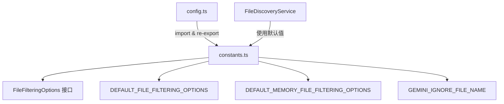

# constants.ts

> 定义文件过滤选项接口和全局文件发现默认常量。

## 概述

`constants.ts` 集中管理文件发现（file discovery）功能的配置常量和类型定义。它提供了两套默认过滤选项：一套用于内存文件（memory files）搜索，另一套用于通用文件搜索。两者在是否遵守 `.gitignore` 上有区别——内存文件不受 `.gitignore` 限制，因为 GEMINI.md 等记忆文件可能被 git 忽略但仍需被系统读取。

**设计动机：** 将文件过滤的默认行为抽取为可复用常量，避免在代码各处散落魔术数字，同时让上层（如 `Config`）能按需覆盖。

**在模块中的角色：** 被 `config.ts` 引用并 re-export，为文件发现服务提供默认参数。

## 架构图

## 主要导出

### `interface FileFilteringOptions`

文件过滤选项接口。

| 属性 | 类型 | 说明 |
|------|------|------|
| `respectGitIgnore` | `boolean` | 是否遵守 `.gitignore` 规则 |
| `respectGeminiIgnore` | `boolean` | 是否遵守 `.geminiignore` 规则 |
| `maxFileCount` | `number?` | 最大搜索文件数量 |
| `searchTimeout` | `number?` | 搜索超时时间（毫秒） |
| `customIgnoreFilePaths` | `string[]` | 自定义忽略文件路径列表 |

### `const DEFAULT_MEMORY_FILE_FILTERING_OPTIONS`

用于记忆文件搜索的默认选项。`respectGitIgnore: false`，最大 20000 文件，超时 5 秒。

### `const DEFAULT_FILE_FILTERING_OPTIONS`

用于通用文件搜索的默认选项。`respectGitIgnore: true`，最大 20000 文件，超时 5 秒。

### `const GEMINI_IGNORE_FILE_NAME`

值为 `'.geminiignore'`，通用排除文件名。

## 核心逻辑

纯常量和类型定义，无运行时逻辑。两套默认选项的关键区别在于 `respectGitIgnore` 字段。

## 内部依赖

无。

## 外部依赖

无。
