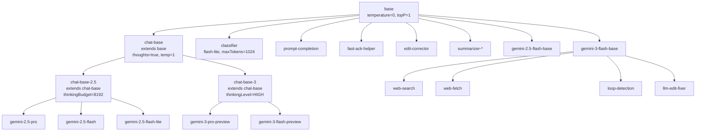

# defaultModelConfigs.ts

> 定义所有 Gemini 模型的默认生成配置（别名、继承关系和参数）。

## 概述

`defaultModelConfigs.ts` 导出 `DEFAULT_MODEL_CONFIGS` 常量，它是一个 `ModelConfigServiceConfig` 对象，包含所有预设模型配置别名（aliases）和条件覆盖规则（overrides）。该配置采用层级继承模式：`base` 作为所有配置的根，`chat-base` 作为交互式聊天模型的父级，具体模型配置通过 `extends` 继承父级参数并可覆盖。

**设计动机：** 集中管理模型参数，避免在代码各处硬编码 temperature、topP 等参数。继承机制减少重复配置，使新增模型配置只需指定差异部分。

**在模块中的角色：** 被 `Config` 构造函数和 `ModelConfigService` 使用，作为模型配置的默认值源。

## 架构图

## 主要导出

### `const DEFAULT_MODEL_CONFIGS: ModelConfigServiceConfig`

包含两个顶级字段：

#### `aliases` - 模型配置别名映射

| 分类 | 别名 | 继承自 | 用途 |
|------|------|--------|------|
| **基础** | `base` | - | 所有配置的根，temperature=0 |
| **聊天基础** | `chat-base` | `base` | 交互式聊天基础，开启 thoughts |
| | `chat-base-2.5` | `chat-base` | Gemini 2.5 系列聊天基础 |
| | `chat-base-3` | `chat-base` | Gemini 3 系列聊天基础 |
| **用户可选模型** | `gemini-3-pro-preview` | `chat-base-3` | Gemini 3 Pro |
| | `gemini-3-flash-preview` | `chat-base-3` | Gemini 3 Flash |
| | `gemini-2.5-pro` | `chat-base-2.5` | Gemini 2.5 Pro |
| | `gemini-2.5-flash` | `chat-base-2.5` | Gemini 2.5 Flash |
| | `gemini-2.5-flash-lite` | `chat-base-2.5` | Gemini 2.5 Flash Lite |
| **内部辅助** | `classifier` | `base` | 分类器，低 token 预算 |
| | `prompt-completion` | `base` | 提示补全，thinkingBudget=0 |
| | `fast-ack-helper` | `base` | 快速确认，maxTokens=120 |
| | `edit-corrector` | `base` | 编辑修正 |
| | `summarizer-*` | `base` | 摘要生成 |
| | `web-search` | `gemini-3-flash-base` | 网页搜索（带 googleSearch 工具） |
| | `web-fetch` | `gemini-3-flash-base` | 网页抓取（带 urlContext 工具） |
| | `loop-detection` | `gemini-3-flash-base` | 循环检测 |
| | `chat-compression-*` | - | 对话压缩（各模型版本） |

#### `overrides` - 条件覆盖规则

当 `chat-base` 配置在重试（`isRetry: true`）时，temperature 设为 1。

## 核心逻辑

纯配置常量。`extends` 字段在运行时由 `ModelConfigService` 解析为完整的配置合并链。

## 内部依赖

| 模块 | 说明 |
|------|------|
| `./models.js` | 提供 `DEFAULT_THINKING_MODE` (8192) |
| `../services/modelConfigService.js` | 提供 `ModelConfigServiceConfig` 类型 |

## 外部依赖

| 包 | 说明 |
|------|------|
| `@google/genai` | 提供 `ThinkingLevel` 枚举 |
