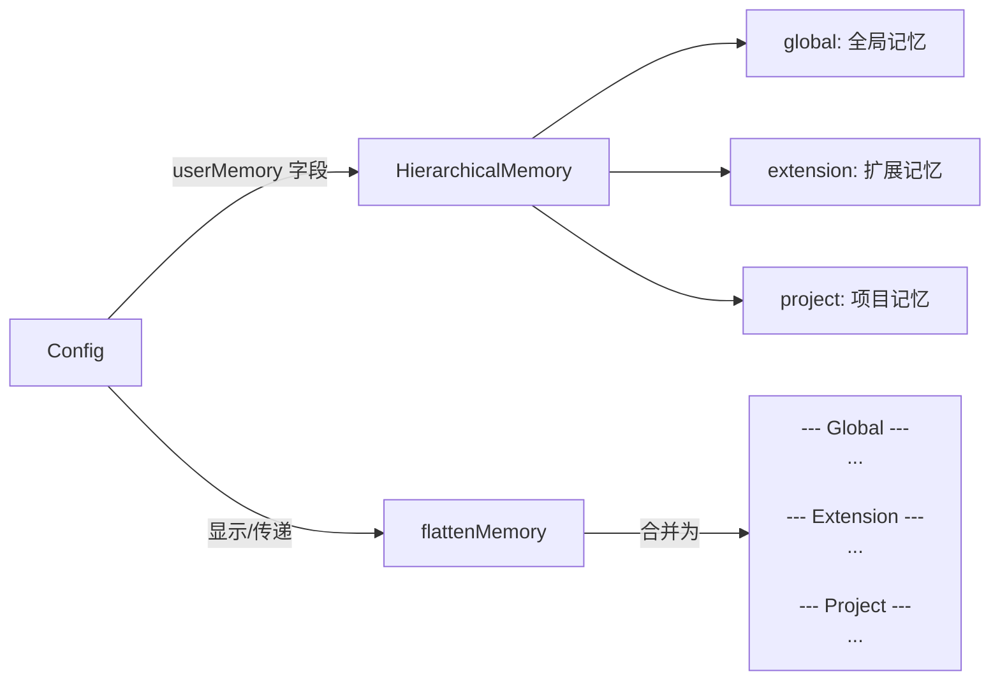

# memory.ts

> 定义分层记忆数据结构及其扁平化工具函数。

## 概述

`memory.ts` 提供 `HierarchicalMemory` 接口和 `flattenMemory` 函数，用于管理 Gemini CLI 的多层级记忆体系。记忆分为三个层级：全局（global）、扩展（extension）和项目（project），每个层级的内容可以独立存在。`flattenMemory` 负责将这种层级结构合并为单一字符串，用于展示或传递给 LLM。

**设计动机：** 支持用户在不同粒度下管理上下文记忆——全局记忆适用于所有项目，扩展记忆由插件提供，项目记忆仅在特定工作区生效。扁平化函数兼容遗留的纯字符串格式。

**在模块中的角色：** 被 `Config` 类使用，存储和检索用户配置的记忆内容。

## 架构图

## 主要导出

### `interface HierarchicalMemory`

分层记忆结构。

| 属性 | 类型 | 说明 |
|------|------|------|
| `global` | `string?` | 全局记忆内容 |
| `extension` | `string?` | 扩展提供的记忆内容 |
| `project` | `string?` | 项目级记忆内容 |

### `function flattenMemory(memory?: string | HierarchicalMemory): string`

将分层记忆扁平化为单一字符串。

- 输入为 `undefined` 或空时返回空字符串
- 输入为纯 `string` 时直接返回（兼容遗留格式）
- 输入为 `HierarchicalMemory` 时，按 Global -> Extension -> Project 顺序拼接，每个非空层级以 `--- 层级名 ---` 为标题

## 核心逻辑

`flattenMemory` 的处理流程：
1. 空值检查：无内容返回空串
2. 类型判断：字符串直接返回
3. 遍历三个层级，过滤掉空白内容
4. 将非空层级格式化为 `--- Name ---\ncontent` 并用双换行连接

## 内部依赖

无。

## 外部依赖

无。
