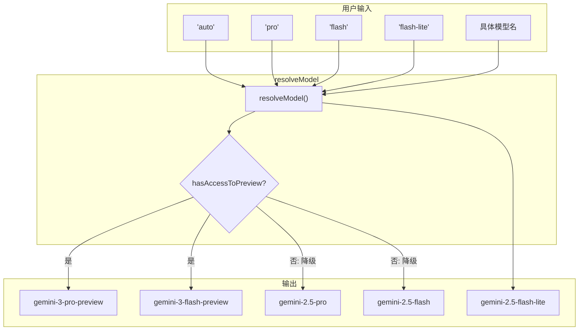

# models.ts

> 定义 Gemini 模型标识常量和模型解析、判别工具函数。

## 概述

`models.ts` 是模型管理的核心模块，提供以下功能：
1. **模型标识常量**：所有支持的 Gemini 模型名称、自动路由模型标识、用户别名
2. **模型解析**：将用户输入的别名或自动路由标识解析为具体模型名称
3. **模型分类**：判断模型是否为预览版、Pro 型、Gemini 3/2 系列、自定义模型等
4. **分类器模型解析**：根据分类器决策将自动路由模型解析为 Pro 或 Flash

**设计动机：** 用户可通过简短别名（如 `pro`、`flash`、`auto`）指定模型，系统需要统一将这些别名解析为 API 实际需要的模型名。同时需处理预览版访问权限降级、Gemini 3.1 特殊路由等复杂场景。

**在模块中的角色：** 被 `Config`、`defaultModelConfigs`、`ModelRouterService` 等广泛引用。

## 架构图

## 主要导出

### 模型常量

| 常量 | 值 | 说明 |
|------|------|------|
| `PREVIEW_GEMINI_MODEL` | `'gemini-3-pro-preview'` | Gemini 3 Pro 预览版 |
| `PREVIEW_GEMINI_3_1_MODEL` | `'gemini-3.1-pro-preview'` | Gemini 3.1 Pro 预览版 |
| `PREVIEW_GEMINI_3_1_CUSTOM_TOOLS_MODEL` | `'gemini-3.1-pro-preview-customtools'` | 3.1 Pro 自定义工具版 |
| `PREVIEW_GEMINI_FLASH_MODEL` | `'gemini-3-flash-preview'` | Gemini 3 Flash 预览版 |
| `DEFAULT_GEMINI_MODEL` | `'gemini-2.5-pro'` | 默认稳定版 Pro |
| `DEFAULT_GEMINI_FLASH_MODEL` | `'gemini-2.5-flash'` | 默认稳定版 Flash |
| `DEFAULT_GEMINI_FLASH_LITE_MODEL` | `'gemini-2.5-flash-lite'` | 默认 Flash Lite |
| `VALID_GEMINI_MODELS` | `Set<string>` | 所有有效模型集合 |
| `DEFAULT_THINKING_MODE` | `8192` | 思考 token 上限 |

### 别名常量

| 常量 | 值 |
|------|------|
| `GEMINI_MODEL_ALIAS_AUTO` | `'auto'` |
| `GEMINI_MODEL_ALIAS_PRO` | `'pro'` |
| `GEMINI_MODEL_ALIAS_FLASH` | `'flash'` |
| `GEMINI_MODEL_ALIAS_FLASH_LITE` | `'flash-lite'` |

### 核心函数

#### `resolveModel(requestedModel, useGemini3_1?, useCustomToolModel?, hasAccessToPreview?): string`

将别名或自动路由标识解析为具体模型名。支持 Gemini 3.1 路由和预览版降级。

#### `resolveClassifierModel(requestedModel, modelAlias, useGemini3_1?, useCustomToolModel?): string`

根据分类器选择（`flash` 或 `pro`）解析模型，用于自动路由场景。

#### `getDisplayString(model): string`

获取模型的用户友好展示名称。

#### 判别函数

| 函数 | 说明 |
|------|------|
| `isPreviewModel(model)` | 是否为预览版模型 |
| `isProModel(model)` | 是否为 Pro 模型 |
| `isGemini3Model(model)` | 是否为 Gemini 3 系列 |
| `isGemini2Model(model)` | 是否为 Gemini 2.x 系列 |
| `isCustomModel(model)` | 是否为非 Gemini 品牌自定义模型 |
| `supportsModernFeatures(model)` | 是否支持现代特性（thoughts 等） |
| `isAutoModel(model)` | 是否为自动路由模型 |
| `supportsMultimodalFunctionResponse(model)` | 是否支持多模态函数响应 |
| `isActiveModel(model, useGemini3_1?, useCustomToolModel?)` | 模型在当前配置下是否激活 |

## 核心逻辑

`resolveModel` 的关键流程：
1. **别名匹配**：`auto`/`pro` -> Preview Pro；`flash` -> Preview Flash；`flash-lite` -> Flash Lite
2. **3.1 路由**：若 `useGemini3_1` 为 true，Pro 别名解析为 3.1 版（可选 customtools 变体）
3. **预览版降级**：若用户无预览版权限，将预览模型降级为对应的稳定版（如 3-pro -> 2.5-pro）

## 内部依赖

无（纯函数模块）。

## 外部依赖

无。
