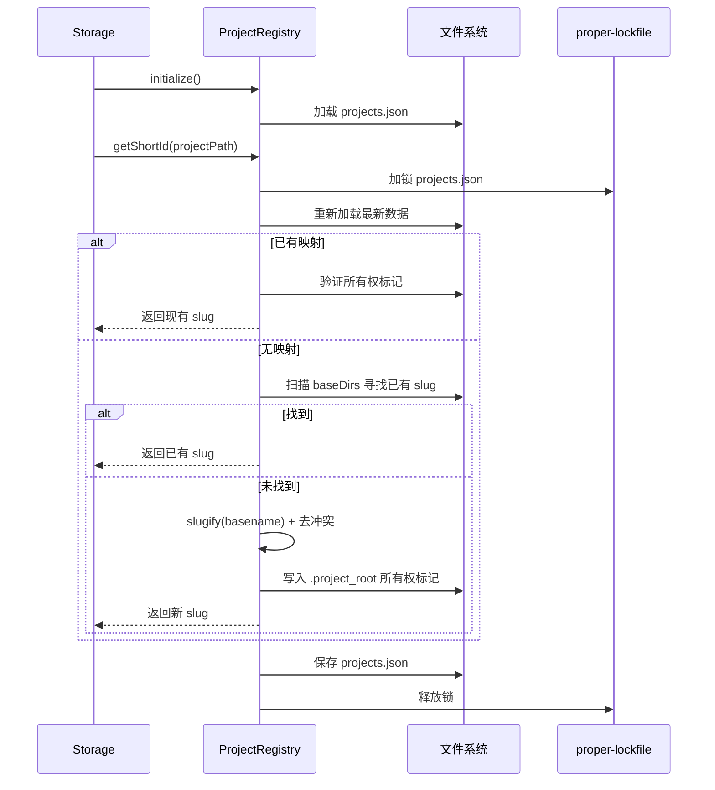

# projectRegistry.ts

> 管理项目路径与短标识符之间的映射关系，替代哈希值实现人类可读的项目标识。

## 概述

`ProjectRegistry` 类维护一个从绝对项目路径到短标识符（slug）的持久化映射。这些短标识符用于组织项目的临时文件、历史记录等存储目录。相比之前的 SHA-256 哈希方案，slug 格式更直观可读（如 `my-project` 而非 `a1b2c3d4...`）。

**设计动机：** 减少上下文膨胀（context bloat），让临时目录名称对人类更友好。通过文件锁机制和所有权标记（ownership markers）支持多进程并发安全。

**在模块中的角色：** 被 `Storage.initialize()` 调用，为项目分配唯一短标识符，驱动存储目录的组织结构。

## 架构图



## 主要导出

### `interface RegistryData`

注册表数据结构：`{ projects: Record<string, string> }` — 路径到 slug 的映射。

### `class ProjectRegistry`

#### 构造函数

```typescript
constructor(registryPath: string, baseDirs: string[] = [])
```

- `registryPath`: 注册表 JSON 文件路径
- `baseDirs`: 需要维护所有权标记的基础目录列表

#### 公开方法

| 方法 | 签名 | 说明 |
|------|------|------|
| `initialize()` | `(): Promise<void>` | 从磁盘加载注册表数据 |
| `getShortId(projectPath)` | `(string): Promise<string>` | 获取或创建项目的短标识符 |

## 核心逻辑

### 短标识符分配流程（`getShortId`）

1. **加锁**：使用 `proper-lockfile` 对 `projects.json` 加文件锁，防止并发冲突
2. **重新加载**：在锁保护下重新读取最新数据
3. **查找现有映射**：若路径已在注册表中，验证所有权标记一致性
4. **扫描磁盘**：遍历所有 `baseDirs` 查找已存在的 `.project_root` 标记文件
5. **生成新 slug**：对项目名 slugify（小写、替换特殊字符），自动追加数字后缀避免冲突
6. **声明所有权**：在每个 `baseDir` 下创建 `slug/.project_root` 文件，内容为规范化路径
7. **保存并释放锁**

### 安全机制

- **原子写入**：先写 `.tmp` 文件再 rename
- **所有权验证**：通过 `.project_root` 标记文件验证 slug 归属
- **愈合机制**：若标记文件缺失，自动补建
- **Windows 兼容**：路径在 Windows 上统一转小写

## 内部依赖

| 模块 | 说明 |
|------|------|
| `../utils/debugLogger.js` | 调试日志 |

## 外部依赖

| 包 | 说明 |
|------|------|
| `proper-lockfile` | 跨进程文件锁 |
| `node:fs` | 文件系统操作 |
| `node:path` | 路径处理 |
| `node:os` | 平台检测（Windows 路径规范化） |
