# storage.ts

> 统一管理 Gemini CLI 的全局和项目级文件存储路径。

## 概述

`Storage` 类是 Gemini CLI 的文件系统布局管理器，负责计算和提供所有配置文件、临时文件、历史记录、扩展、策略、会话等的存储路径。它同时管理全局路径（`~/.gemini/`）和项目级路径（基于项目根目录和通过 `ProjectRegistry` 分配的短标识符）。

**设计动机：** 将散落的路径计算逻辑集中化，确保所有组件使用一致的目录布局。通过 `ProjectRegistry` 实现人类可读的项目标识符，并自动执行从旧哈希格式到新 slug 格式的迁移。

**在模块中的角色：** 作为 `Config` 的核心成员，被几乎所有需要文件 I/O 的子系统引用。

## 架构图

```mermaid
graph TD
    subgraph "全局路径 (~/.gemini/)"
        G1[settings.json]
        G2[oauth_creds.json]
        G3[memory.md]
        G4[policies/]
        G5[commands/]
        G6[skills/]
        G7[agents/]
        G8[tmp/]
        G9[history/]
        G10[projects.json]
        G11[trusted_hooks.json]
    end

    subgraph "项目级路径"
        P1[.gemini/settings.json]
        P2[.gemini/extensions/]
        P3[.gemini/commands/]
        P4[.gemini/skills/]
        P5[.gemini/policies/]
    end

    subgraph "项目临时目录 (tmp/<slug>/)"
        T1[checkpoints/]
        T2[logs/]
        T3[plans/]
        T4[tracker/]
        T5[tasks/]
        T6[chats/]
        T7[shell_history]
    end

    Storage --> G1
    Storage --> P1
    Storage --> T1
    Storage -->|ProjectRegistry| G10
```



## 主要导出

### 常量

| 常量 | 值 | 说明 |
|------|------|------|
| `OAUTH_FILE` | `'oauth_creds.json'` | OAuth 凭证文件名 |
| `AUTO_SAVED_POLICY_FILENAME` | `'auto-saved.toml'` | 自动保存的策略文件名 |

### `class Storage`

#### 构造函数

```typescript
constructor(targetDir: string, sessionId?: string)
```

#### 静态方法（全局路径）

| 方法 | 返回路径 |
|------|---------|
| `getGlobalGeminiDir()` | `~/.gemini/` |
| `getGlobalSettingsPath()` | `~/.gemini/settings.json` |
| `getGlobalMemoryFilePath()` | `~/.gemini/memory.md` |
| `getOAuthCredsPath()` | `~/.gemini/oauth_creds.json` |
| `getMcpOAuthTokensPath()` | `~/.gemini/mcp-oauth-tokens.json` |
| `getUserPoliciesDir()` | `~/.gemini/policies/` |
| `getUserCommandsDir()` | `~/.gemini/commands/` |
| `getUserSkillsDir()` | `~/.gemini/skills/` |
| `getUserAgentsDir()` | `~/.gemini/agents/` |
| `getGlobalTempDir()` | `~/.gemini/tmp/` |
| `getGlobalBinDir()` | `~/.gemini/tmp/bin/` |
| `getSystemSettingsPath()` | 系统级配置路径（跨平台） |
| `getSystemPoliciesDir()` | 系统级策略目录 |

#### 实例方法（项目级路径）

| 方法 | 说明 |
|------|------|
| `initialize()` | 初始化存储：设置 ProjectRegistry，执行迁移 |
| `getGeminiDir()` | `<targetDir>/.gemini/` |
| `getProjectTempDir()` | `~/.gemini/tmp/<slug>/` |
| `getHistoryDir()` | `~/.gemini/history/<slug>/` |
| `getWorkspaceSettingsPath()` | `<targetDir>/.gemini/settings.json` |
| `getWorkspacePoliciesDir()` | `<targetDir>/.gemini/policies/` |
| `getProjectCommandsDir()` | `<targetDir>/.gemini/commands/` |
| `getProjectSkillsDir()` | `<targetDir>/.gemini/skills/` |
| `getProjectTempPlansDir()` | 计划文件临时目录（支持 session 隔离） |
| `getProjectTempTrackerDir()` | 追踪器临时目录（支持 session 隔离） |
| `getPlansDir()` | 计划目录（支持自定义路径，有路径越界检查） |
| `listProjectChatFiles()` | 列出项目的聊天会话文件 |
| `loadProjectTempFile<T>(filePath)` | 加载项目临时文件为 JSON |
| `isWorkspaceHomeDir()` | 判断工作区是否就是用户主目录 |

## 核心逻辑

### 初始化流程

1. 创建 `ProjectRegistry`，关联 `tmp/` 和 `history/` 两个基础目录
2. 通过 `ProjectRegistry` 获取项目短标识符
3. 执行 `performMigration()`：将旧的 SHA-256 哈希目录迁移到新的 slug 目录

### 路径安全

- `getPlansDir()` 中对自定义路径执行 `isSubpath` 检查，防止路径遍历攻击
- `isWorkspaceHomeDir()` 处理符号链接和平台差异

### 跨平台系统配置路径

| 平台 | 路径 |
|------|------|
| macOS | `/Library/Application Support/GeminiCli/` |
| Windows | `C:\ProgramData\gemini-cli\` |
| Linux | `/etc/gemini-cli/` |

## 内部依赖

| 模块 | 说明 |
|------|------|
| `./projectRegistry.js` | 项目路径到 slug 的映射 |
| `./storageMigration.js` | 目录迁移工具 |
| `../utils/paths.js` | 路径工具函数 |

## 外部依赖

| 包 | 说明 |
|------|------|
| `node:path` | 路径处理 |
| `node:os` | 主目录、平台检测 |
| `node:crypto` | SHA-256 哈希（旧方案兼容） |
| `node:fs` | 文件系统操作 |
