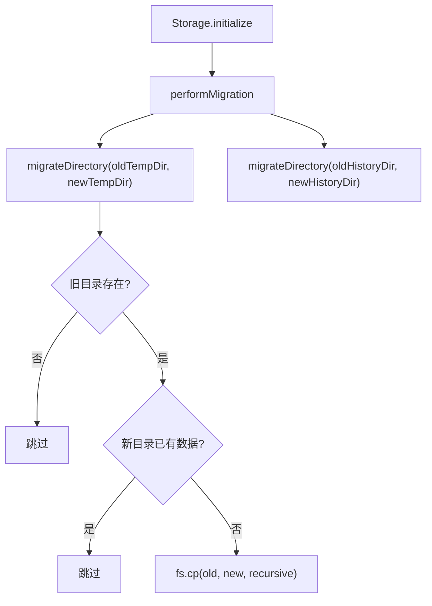

# storageMigration.ts

> 提供从旧哈希目录格式到新 slug 目录格式的迁移工具。

## 概述

`StorageMigration` 是一个纯静态工具类，负责将旧的基于 SHA-256 哈希的项目存储目录迁移到新的基于 slug 的格式。迁移是安全的、非破坏性的——只在旧目录存在且新目录为空（或仅包含 `.project_root` 标记文件）时执行复制操作。

**设计动机：** 项目存储目录从难以辨识的哈希值（如 `a1b2c3d4e5f6...`）切换为人类可读的 slug（如 `my-project`），需要平滑迁移已有数据。

**在模块中的角色：** 被 `Storage.performMigration()` 在初始化时调用，处理临时目录和历史目录的迁移。

## 架构图



## 主要导出

### `class StorageMigration`

#### 静态方法

```typescript
static async migrateDirectory(oldPath: string, newPath: string): Promise<void>
```

**参数：**
- `oldPath`: 旧目录路径（基于哈希）
- `newPath`: 新目录路径（基于 slug）

**行为：**
1. 旧目录不存在 -> 无操作
2. 新目录已存在且包含实质内容（不仅仅是 `.project_root`） -> 无操作
3. 否则：确保父目录存在，执行递归复制 `fs.cp(old, new, { recursive: true })`
4. 失败时静默记录调试日志，不中断主流程

## 核心逻辑

迁移的安全性保障：
- **幂等性**：如果新目录已有数据，不会覆盖
- **非破坏性**：使用复制（cp）而非移动（rename），因为复制能处理跨设备场景
- **容错性**：所有错误被 catch 并记录到 debugLogger，不会导致 CLI 启动失败
- **`.project_root` 感知**：新目录如果仅包含 `ProjectRegistry` 创建的标记文件，仍视为"空"目录

## 内部依赖

| 模块 | 说明 |
|------|------|
| `../utils/debugLogger.js` | 调试日志输出 |

## 外部依赖

| 包 | 说明 |
|------|------|
| `node:fs` | 文件系统操作（existsSync, readdir, mkdir, cp） |
| `node:path` | 路径处理 |
