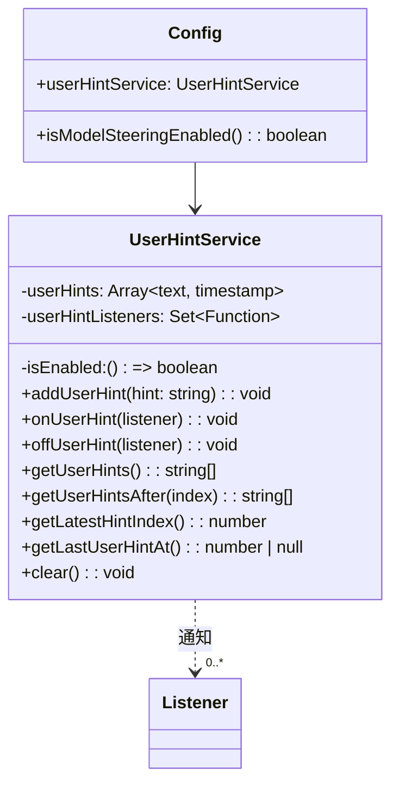

# userHintService.ts

> 管理用户在会话期间的实时引导提示（steering hints）。

## 概述

`UserHintService` 是一个轻量级的会话内提示收集服务。当模型引导（model steering）功能启用时，用户可以在 Agent 执行期间发送引导提示（hints），这些提示被收集并可供系统在后续轮次中注入到上下文中，从而实时调整 Agent 的行为方向。

**设计动机：** 支持用户在不中断 Agent 执行的情况下提供方向性反馈。通过发布-订阅模式，让感兴趣的组件可以实时响应新提示。

**在模块中的角色：** 作为 `Config` 的成员（`config.userHintService`），在 Agent 循环中被调用以收集和检索用户提示。

## 架构图



## 主要导出

### `class UserHintService`

#### 构造函数

```typescript
constructor(isEnabled: () => boolean)
```

接受一个函数，动态判断服务是否启用。在 `Config` 中绑定为 `() => this.isModelSteeringEnabled()`。

#### 公开方法

| 方法 | 签名 | 说明 |
|------|------|------|
| `addUserHint` | `(hint: string): void` | 添加一条用户提示。若服务未启用或内容为空则忽略。添加后通知所有监听器。 |
| `onUserHint` | `(listener: (hint: string) => void): void` | 注册新提示监听器 |
| `offUserHint` | `(listener: (hint: string) => void): void` | 移除监听器 |
| `getUserHints` | `(): string[]` | 获取所有已收集的提示文本 |
| `getUserHintsAfter` | `(index: number): string[]` | 获取指定索引之后的提示。index < 0 时返回全部。 |
| `getLatestHintIndex` | `(): number` | 返回最新提示的索引（基于 0），无提示时返回 -1 |
| `getLastUserHintAt` | `(): number \| null` | 返回最后一条提示的时间戳，无提示时返回 null |
| `clear` | `(): void` | 清空所有已收集的提示 |

## 核心逻辑

- 每条提示存储为 `{ text, timestamp }` 元组
- `addUserHint` 先检查 `isEnabled()`（惰性检查，不在构造时固定），trim 后忽略空串
- 监听器通过 `Set` 管理，保证无重复注册
- `getUserHintsAfter(index)` 使用 `slice(index + 1)` 实现增量获取，适合在轮次间追踪新增提示
- `clear()` 通过设置 `length = 0` 清空数组，保持引用不变

## 内部依赖

无。

## 外部依赖

无。
