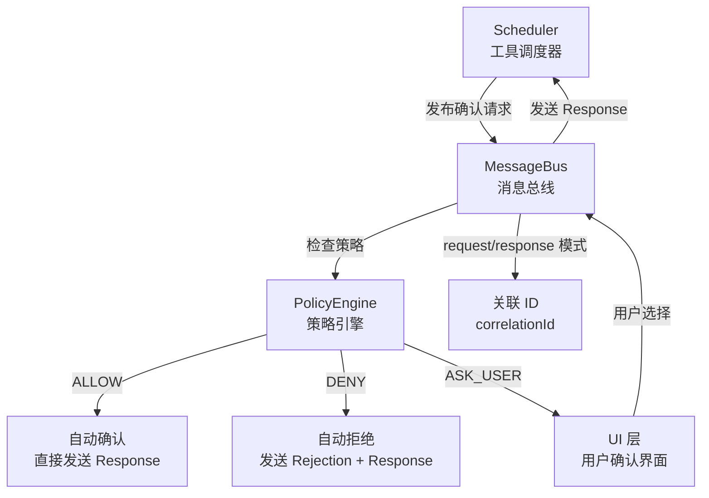

# confirmation-bus 架构

> 工具确认消息总线，实现基于发布-订阅模式的工具执行确认、策略决策和用户交互流程

## 概述

`confirmation-bus/` 模块实现了工具执行确认的核心通信机制。当 LLM 请求执行工具时，调度器通过 `MessageBus` 发布确认请求，消息总线根据策略引擎的决策自动允许、拒绝或转发给 UI 层等待用户确认。这种发布-订阅模式将工具执行决策逻辑与 UI 展示完全解耦，使得 CLI、SDK 和无头模式可以使用相同的确认流程。

## 架构图



## 目录结构

```
confirmation-bus/
├── index.ts        # 模块入口
├── types.ts        # 消息类型定义
└── message-bus.ts  # MessageBus 实现
```

## 关键文件

| 文件 | 功能 |
|------|------|
| `types.ts` | 定义所有消息类型：`ToolConfirmationRequest`（工具确认请求，含工具调用、注解、子 Agent 信息）、`ToolConfirmationResponse`（确认响应，含 outcome 和 payload）、`UpdatePolicy`（策略更新）、`AskUserRequest/Response`（用户问答）、`SerializableConfirmationDetails`（6 种确认详情：info/edit/exec/mcp/ask_user/exit_plan_mode）；`MessageBusType` 枚举和 `Message` 联合类型 |
| `message-bus.ts` | `MessageBus` 类：继承 `EventEmitter`，核心 `publish` 方法实现策略检查分流（ALLOW/DENY/ASK_USER）；`request` 方法实现请求-响应关联模式（通过 correlationId + 超时机制）；`subscribe`/`unsubscribe` 提供类型安全的事件监听 |
| `index.ts` | 简单的重新导出 |

## 内部依赖

- `policy/policy-engine.ts` - PolicyEngine（策略检查）
- `policy/types.ts` - PolicyDecision 枚举
- `tools/tools.ts` - ToolConfirmationOutcome、ToolConfirmationPayload
- `scheduler/types.ts` - ToolCall 类型
- `utils/debugLogger.ts` - 调试日志
- `utils/safeJsonStringify.ts` - 安全的 JSON 序列化

## 外部依赖

| 依赖 | 用途 |
|------|------|
| `@google/genai` | `FunctionCall` 类型 |
| `node:crypto` | `randomUUID` 生成关联 ID |
| `node:events` | `EventEmitter` 基类 |
