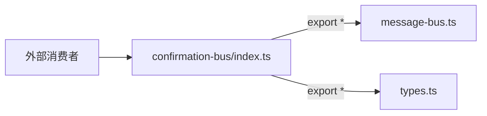

# index.ts (confirmation-bus)

> 确认总线模块的桶文件，重新导出消息总线和类型定义。

## 概述

`confirmation-bus/index.ts` 是确认总线模块的入口文件，汇聚导出 `message-bus.ts` 和 `types.ts` 的全部公共 API。确认总线是工具执行前用户确认流程的核心基础设施。

## 架构图

## 主要导出

重新导出以下模块的所有内容：
- `message-bus.ts`：`MessageBus` 类
- `types.ts`：`MessageBusType` 枚举、各种消息接口和类型

## 核心逻辑

无业务逻辑，纯导出聚合。

## 内部依赖

| 模块 | 导入项 | 用途 |
|------|--------|------|
| `./message-bus.js` | `*`（全部） | 消息总线实现 |
| `./types.js` | `*`（全部） | 消息类型定义 |

## 外部依赖

无。
