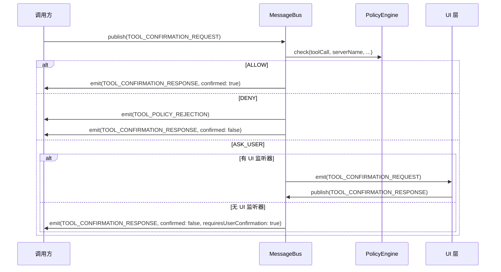

# message-bus.ts

> 基于 EventEmitter 的消息总线，集成策略引擎实现工具调用的确认/拒绝流程。

## 概述

`message-bus.ts` 实现了 Gemini CLI 的核心确认总线 `MessageBus`。它继承自 Node.js `EventEmitter`，在发布/订阅模式之上集成了策略引擎（PolicyEngine），使得每次工具确认请求都会先经过策略检查（ALLOW/DENY/ASK_USER），再决定是自动放行、自动拒绝还是交给 UI 层让用户决定。该总线还提供了请求-响应模式（request/response），通过 correlationId 实现异步消息的同步化调用。

## 架构图

## 主要导出

### 类 `MessageBus`

继承自 `EventEmitter`，构造参数：`(policyEngine: PolicyEngine, debug?: boolean)`

| 方法 | 签名 | 说明 |
|------|------|------|
| `publish` | `(message: Message) => Promise<void>` | 发布消息，工具确认请求会经过策略检查 |
| `subscribe` | `<T>(type, listener) => void` | 订阅指定类型的消息 |
| `unsubscribe` | `<T>(type, listener) => void` | 取消订阅 |
| `request` | `<TReq, TRes>(request, responseType, timeoutMs?) => Promise<TRes>` | 请求-响应模式，自动生成 correlationId 并等待匹配响应 |

## 核心逻辑

1. **策略集成**：`TOOL_CONFIRMATION_REQUEST` 消息的特殊处理 -- 先通过 `policyEngine.check()` 评估，根据 `PolicyDecision` 分三路处理：
   - `ALLOW`：直接发出确认响应
   - `DENY`：发出拒绝事件 + 否定确认响应
   - `ASK_USER`：如果有 UI 监听器，转发给 UI；否则返回 `requiresUserConfirmation: true`
2. **请求-响应关联**：`request` 方法生成 UUID 作为 `correlationId`，订阅响应事件并按 correlationId 匹配，支持超时（默认 60 秒）。
3. **消息验证**：`isValidMessage` 确保消息结构有效，`TOOL_CONFIRMATION_REQUEST` 必须包含 `correlationId`。
4. **调试模式**：可选的 debug 参数启用消息发布日志。

## 内部依赖

| 模块 | 导入项 | 用途 |
|------|--------|------|
| `../policy/policy-engine.js` | `PolicyEngine` (type) | 策略引擎接口 |
| `../policy/types.js` | `PolicyDecision` | 策略决策枚举 |
| `./types.js` | `MessageBusType`, `Message` | 消息类型定义 |
| `../utils/safeJsonStringify.js` | `safeJsonStringify` | 安全 JSON 序列化 |
| `../utils/debugLogger.js` | `debugLogger` | 调试日志 |

## 外部依赖

| 包名 | 用途 |
|------|------|
| `node:crypto` | `randomUUID` 生成关联 ID |
| `node:events` | `EventEmitter` 基类 |
