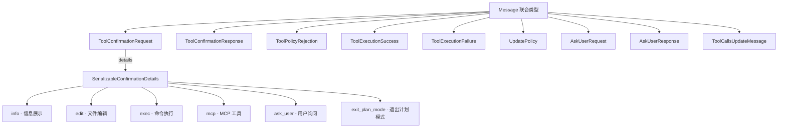

# types.ts (confirmation-bus)

> 定义确认总线的所有消息类型、枚举和数据结构。

## 概述

`types.ts` 是确认总线模块的类型基础，定义了 `MessageBus` 中流转的所有消息类型。它涵盖了工具确认请求/响应、策略拒绝、工具执行结果、策略更新、用户询问等完整的消息协议。`SerializableConfirmationDetails` 是一个丰富的判别联合类型，针对不同工具类型（编辑、执行、MCP、用户询问等）提供专门的确认详情结构。

## 架构图

## 主要导出

### 枚举

| 枚举 | 值 | 说明 |
|------|-----|------|
| `MessageBusType` | `TOOL_CONFIRMATION_REQUEST`, `TOOL_CONFIRMATION_RESPONSE`, `TOOL_POLICY_REJECTION`, `TOOL_EXECUTION_SUCCESS`, `TOOL_EXECUTION_FAILURE`, `UPDATE_POLICY`, `TOOL_CALLS_UPDATE`, `ASK_USER_REQUEST`, `ASK_USER_RESPONSE` | 消息总线事件类型 |
| `QuestionType` | `CHOICE`, `TEXT`, `YESNO` | 用户询问的问题类型 |

### 接口

| 接口 | 说明 |
|------|------|
| `ToolConfirmationRequest` | 工具确认请求，包含 toolCall、correlationId、可选的服务器名和注解 |
| `ToolConfirmationResponse` | 工具确认响应，包含 confirmed 状态、可选的 outcome 和 payload |
| `ToolPolicyRejection` | 策略拒绝通知 |
| `ToolExecutionSuccess<T>` | 工具执行成功事件 |
| `ToolExecutionFailure<E>` | 工具执行失败事件 |
| `UpdatePolicy` | 策略更新请求，支持持久化范围（workspace/user） |
| `ToolCallsUpdateMessage` | 工具调用批量更新 |
| `Question` | 用户询问的问题结构 |
| `QuestionOption` | 问题选项结构 |
| `AskUserRequest` | 用户询问请求 |
| `AskUserResponse` | 用户询问响应 |

### 类型

| 类型 | 说明 |
|------|------|
| `SerializableConfirmationDetails` | 6 种确认详情的判别联合：info、edit、exec、mcp、ask_user、exit_plan_mode |
| `Message` | 所有消息类型的联合 |

## 核心逻辑

纯类型定义文件，无运行时逻辑。关键设计：

- **判别联合模式**：`Message` 和 `SerializableConfirmationDetails` 均使用 `type` 字段作为判别符。
- **泛型错误/结果**：`ToolExecutionSuccess<T>` 和 `ToolExecutionFailure<E>` 支持自定义结果/错误类型。
- **丰富的确认详情**：`edit` 类型包含完整的 diff 信息和原始/新内容；`exec` 类型包含根命令和完整命令列表。

## 内部依赖

| 模块 | 导入项 | 用途 |
|------|--------|------|
| `../tools/tools.js` | `ToolConfirmationOutcome`, `ToolConfirmationPayload` (types) | 工具确认结果类型 |
| `../scheduler/types.js` | `ToolCall` (type) | 工具调用类型 |

## 外部依赖

| 包名 | 用途 |
|------|------|
| `@google/genai` | `FunctionCall` 类型 |
