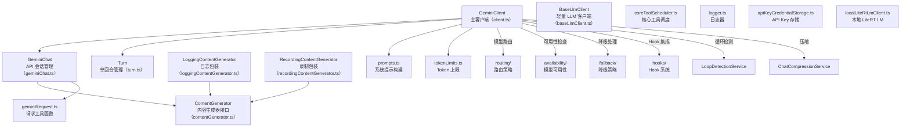

# core 架构

> 核心 LLM 客户端模块，管理与 Gemini API 的会话、消息流、Token 限制、上下文压缩和循环检测

## 概述

`core/` 模块是 Gemini CLI 与 LLM 交互的最底层实现。`GeminiClient` 是主 Agent 循环的核心，负责管理整个对话生命周期：初始化会话、发送消息流、处理模型路由、检测循环、压缩上下文窗口、管理 IDE 上下文增量同步。`GeminiChat` 封装了与 Gemini API 的底层通信。`Turn` 类表示一次完整的模型交互回合。`ContentGenerator` 定义了内容生成的抽象接口，支持多种认证方式。

## 架构图



## 目录结构

```
core/
├── client.ts                      # GeminiClient：主 Agent 循环客户端
├── geminiChat.ts                  # GeminiChat：Gemini API 会话封装
├── turn.ts                        # Turn：单回合交互（流式响应处理）
├── contentGenerator.ts            # ContentGenerator 接口与 AuthType 枚举
├── baseLlmClient.ts               # BaseLlmClient：轻量级 LLM 调用
├── loggingContentGenerator.ts     # LoggingContentGenerator：遥测日志包装
├── recordingContentGenerator.ts   # RecordingContentGenerator：会话录制包装
├── prompts.ts                     # 系统提示模板构建
├── tokenLimits.ts                 # 各模型的 Token 上限定义
├── geminiRequest.ts               # 请求构建工具函数
├── coreToolScheduler.ts           # 核心工具调度器
├── coreToolHookTriggers.ts        # Hook 触发器
├── logger.ts                      # 日志器
├── apiKeyCredentialStorage.ts     # API Key 持久化存储
├── localLiteRtLmClient.ts         # 本地 LiteRT LM 客户端
└── fakeContentGenerator.ts        # 测试用假内容生成器
```

## 关键文件

| 文件 | 功能 |
|------|------|
| `client.ts` | **核心文件**。`GeminiClient` 类（~1250 行）：(1) `sendMessageStream` - 主消息发送入口，集成 Hook 生命周期（BeforeAgent/AfterAgent）；(2) `processTurn` - 单回合处理，含上下文压缩、IDE 上下文同步、循环检测、模型路由、可用性选择；(3) `generateContent` - 独立的内容生成（用于非聊天场景），含重试和降级；(4) `tryCompressChat` - 上下文窗口压缩 |
| `geminiChat.ts` | `GeminiChat` 类：封装 Gemini API 的 `sendMessageStream`，管理对话历史、系统指令、工具声明，处理流式响应的解码和分块 |
| `turn.ts` | `Turn` 类：表示一次模型交互回合，解析流式响应中的文本、工具调用、Thought（思考过程），管理压缩状态 |
| `contentGenerator.ts` | `ContentGenerator` 接口：定义 `generateContent` 和 `countTokens` 方法；`AuthType` 枚举（API_KEY、LOGIN_WITH_GOOGLE、COMPUTE_ADC、SERVICE_ACCOUNT 等）；`createContentGenerator` 工厂函数 |
| `prompts.ts` | `getCoreSystemPrompt`：构建主系统提示，注入用户记忆、工具说明和环境上下文 |
| `tokenLimits.ts` | `tokenLimit` 函数：返回各模型的 Token 上限（如 Pro 约 100 万，Flash 约 100 万） |

## 内部依赖

- `config/` - Config 类、模型配置
- `tools/` - ToolRegistry
- `scheduler/` - Scheduler
- `confirmation-bus/` - MessageBus
- `hooks/` - HookSystem
- `availability/` - policyHelpers
- `fallback/` - handleFallback
- `routing/` - ModelRouterService
- `services/` - LoopDetectionService、ChatCompressionService、ChatRecordingService
- `ide/` - ideContextStore
- `telemetry/` - 日志记录
- `utils/` - 错误处理、重试、Token 计算

## 外部依赖

| 依赖 | 用途 |
|------|------|
| `@google/genai` | Gemini API SDK（Content、Tool、GenerateContentResponse 等） |
