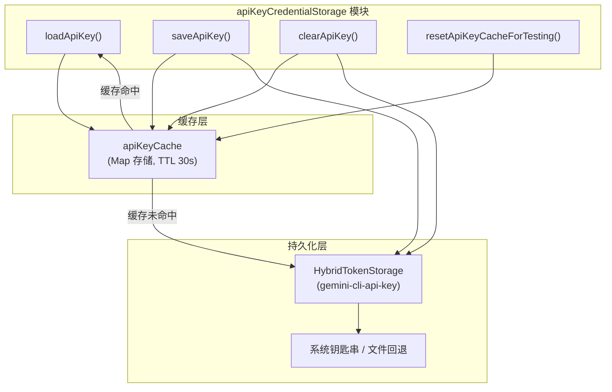

# apiKeyCredentialStorage.ts

> API Key 的安全持久化存储管理，支持通过系统钥匙串（Keychain）加密存储和带缓存的快速读取。

## 概述

`apiKeyCredentialStorage.ts` 提供了 Gemini CLI 中 API Key 的完整生命周期管理：加载、保存和清除。它使用 `HybridTokenStorage`（基于系统钥匙串的混合存储）来安全地持久化 API Key，并在内存中维护一个带 TTL 的缓存层来减少频繁的钥匙串访问开销。

该文件在认证流程中扮演底层存储角色，被 `contentGenerator.ts` 中的 `createContentGeneratorConfig` 调用以获取保存的 API Key。

## 架构图



## 主要导出

### 函数

#### `resetApiKeyCacheForTesting()`

```typescript
export function resetApiKeyCacheForTesting(): void
```

**用途：** 清空 API Key 内存缓存。仅用于测试隔离，标记为 `@internal`。

---

#### `loadApiKey()`

```typescript
export async function loadApiKey(): Promise<string | null>
```

**用途：** 加载已缓存的 API Key。优先从内存缓存读取（30 秒 TTL），缓存未命中时从 `HybridTokenStorage` 加载。如果存储中存在凭据且包含 `accessToken`，返回该值；否则返回 `null`。加载失败时记录错误日志并返回 `null`（不会崩溃）。

**返回值：** API Key 字符串或 `null`

---

#### `saveApiKey()`

```typescript
export async function saveApiKey(
  apiKey: string | null | undefined,
): Promise<void>
```

**用途：** 保存 API Key 到持久化存储。

**行为：**
- 首先清除缓存中的条目
- 如果 `apiKey` 为 `null`、`undefined` 或空白字符串，则删除存储中的凭据
- 否则将 API Key 包装为 `OAuthCredentials` 格式（`tokenType: 'ApiKey'`）后存储

---

#### `clearApiKey()`

```typescript
export async function clearApiKey(): Promise<void>
```

**用途：** 从缓存和持久化存储中完全清除 API Key。清除失败时记录错误日志但不抛出异常。

## 核心逻辑

### 存储架构

采用两层存储架构：

1. **内存缓存层（apiKeyCache）：** 使用 `createCache` 工具函数创建，基于 Map 存储，默认 TTL 为 30 秒。避免在短时间内重复访问系统钥匙串，提升性能
2. **持久化层（HybridTokenStorage）：** 使用 `HybridTokenStorage` 实例，服务名为 `'gemini-cli-api-key'`。HybridTokenStorage 优先使用系统钥匙串（macOS Keychain、Linux Secret Service、Windows Credential Manager），在钥匙串不可用时回退到文件存储

### API Key 到 OAuthCredentials 的映射

由于 `HybridTokenStorage` 设计用于存储 OAuth 凭据，API Key 需要适配为 `OAuthCredentials` 格式：

```typescript
{
  serverName: 'default-api-key',
  token: {
    accessToken: apiKey,       // API Key 存储在 accessToken 字段
    tokenType: 'ApiKey',       // 标记为 ApiKey 类型
  },
  updatedAt: Date.now(),
}
```

读取时从 `credentials.token.accessToken` 提取 API Key。

### 缓存策略

- **getOrCreate 模式：** `loadApiKey()` 使用 `apiKeyCache.getOrCreate()` 实现缓存穿透保护——如果缓存中没有值，执行加载函数并将结果存入缓存
- **写入/删除时失效：** `saveApiKey()` 和 `clearApiKey()` 在操作持久化层前先 `delete` 缓存条目，确保下次读取时获得最新值
- **30 秒 TTL：** 缓存条目在 30 秒后自动过期，平衡了性能和数据新鲜度

### 错误容错

所有与存储交互的操作都有 try-catch 保护：
- `loadApiKey()` 失败返回 `null`
- `saveApiKey()` 删除操作失败仅记录警告
- `clearApiKey()` 失败仅记录错误

这确保了存储层的异常不会导致 CLI 崩溃，用户可以重新输入 Key。

## 内部依赖

| 模块路径 | 导入内容 | 用途 |
|---------|---------|------|
| `../mcp/token-storage/hybrid-token-storage.js` | `HybridTokenStorage` | 混合 Token 存储（钥匙串 + 文件回退） |
| `../mcp/token-storage/types.js` | `OAuthCredentials` | OAuth 凭据类型定义 |
| `../utils/debugLogger.js` | `debugLogger` | 调试日志记录器 |
| `../utils/cache.js` | `createCache` | 通用缓存工厂函数 |

## 外部依赖

无直接的 npm 外部包依赖。所有功能均通过内部模块间接使用。
