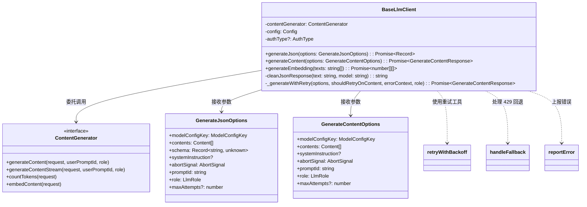
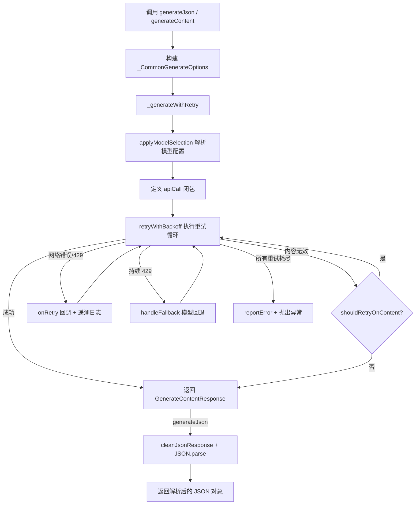

# baseLlmClient.ts

> 提供无状态、面向工具调用的 LLM 客户端，封装了 JSON 生成、文本生成和 Embedding 生成功能，并内置重试与回退机制。

## 概述

`baseLlmClient.ts` 定义了 `BaseLlmClient` 类，它是 Gemini CLI 核心模块中专门用于执行**无状态、实用型 LLM 调用**的客户端。与主对话流（流式交互）不同，`BaseLlmClient` 针对的是需要一次性获取完整响应的场景，例如：

- 从 LLM 获取结构化 JSON 输出（用于工具参数解析、子任务分派等）
- 生成普通文本内容
- 生成文本嵌入向量（Embedding）

该文件的设计动机在于将**重试逻辑**、**模型回退**、**错误报告**和**遥测日志**统一封装，使上层调用者无需关心这些横切关注点。它在模块中扮演的角色是：作为 `ContentGenerator` 接口的高层包装器，为各种子代理（sub-agent）和工具提供简洁的调用入口。

## 架构图





## 主要导出

### 接口 `GenerateJsonOptions`

```typescript
export interface GenerateJsonOptions {
  modelConfigKey: ModelConfigKey;
  contents: Content[];
  schema: Record<string, unknown>;
  systemInstruction?: string | Part | Part[] | Content;
  abortSignal: AbortSignal;
  promptId: string;
  role: LlmRole;
  maxAttempts?: number;
}
```

用于 `generateJson` 方法的选项接口。各字段说明：

| 字段 | 类型 | 说明 |
|------|------|------|
| `modelConfigKey` | `ModelConfigKey` | 指定模型配置的键（含模型名、覆盖范围等） |
| `contents` | `Content[]` | 输入的提示词或对话历史 |
| `schema` | `Record<string, unknown>` | 期望的 JSON 输出 Schema |
| `systemInstruction` | `string \| Part \| Part[] \| Content` | 可选的系统指令 |
| `abortSignal` | `AbortSignal` | 取消信号 |
| `promptId` | `string` | 用于日志和遥测关联的唯一提示 ID |
| `role` | `LlmRole` | LLM 调用角色（如 UTILITY_TOOL） |
| `maxAttempts` | `number` | 可选的最大重试次数 |

### 接口 `GenerateContentOptions`

```typescript
export interface GenerateContentOptions {
  modelConfigKey: ModelConfigKey;
  contents: Content[];
  systemInstruction?: string | Part | Part[] | Content;
  abortSignal: AbortSignal;
  promptId: string;
  role: LlmRole;
  maxAttempts?: number;
}
```

用于 `generateContent` 方法的选项接口。与 `GenerateJsonOptions` 类似，但不包含 `schema` 字段，因为不要求 JSON 格式输出。

### 类 `BaseLlmClient`

```typescript
export class BaseLlmClient {
  constructor(
    private readonly contentGenerator: ContentGenerator,
    private readonly config: Config,
    private readonly authType?: AuthType,
  )
}
```

无状态、面向实用工具的 LLM 客户端类。

#### 方法 `generateJson(options: GenerateJsonOptions): Promise<Record<string, unknown>>`

向 LLM 请求结构化 JSON 输出。内部会：
1. 将 `schema` 作为 `responseJsonSchema` 附加到请求配置中
2. 设置 `responseMimeType` 为 `application/json`
3. 通过 `_generateWithRetry` 发起请求
4. 对返回的文本进行 `cleanJsonResponse` 清洗（移除可能的 markdown 代码块包装）
5. 使用 `JSON.parse` 解析并返回

重试条件：响应为空或 JSON 解析失败时触发重试。

#### 方法 `generateContent(options: GenerateContentOptions): Promise<GenerateContentResponse>`

向 LLM 请求普通文本内容。重试条件：响应为空时触发重试。

#### 方法 `generateEmbedding(texts: string[]): Promise<number[][]>`

批量生成文本嵌入向量。流程如下：
1. 空输入直接返回空数组
2. 使用 `config.getEmbeddingModel()` 获取嵌入模型
3. 调用 `contentGenerator.embedContent()` 获取嵌入结果
4. 验证返回的嵌入数量与输入文本数量是否匹配
5. 验证每个嵌入向量不为空
6. 返回 `number[][]` 格式的向量数组

## 核心逻辑

### 私有方法 `_generateWithRetry`

```typescript
private async _generateWithRetry(
  options: _CommonGenerateOptions,
  shouldRetryOnContent: (response: GenerateContentResponse) => boolean,
  errorContext: 'generateJson' | 'generateContent',
  role: LlmRole = LlmRole.UTILITY_TOOL,
): Promise<GenerateContentResponse>
```

这是 `BaseLlmClient` 的核心方法，统一处理所有生成请求的重试逻辑。详细流程：

1. **模型配置解析**：调用 `applyModelSelection(config, modelConfigKey)` 获取当前模型名、生成配置和可用性策略定义的最大重试次数。

2. **可用性上下文提供器**：通过 `createAvailabilityContextProvider` 创建一个动态获取可用性上下文的回调函数，确保在重试循环中使用最新的模型状态。

3. **API 调用闭包**：定义 `apiCall` 函数，每次执行时检测活跃模型是否发生变化（因回退而改变），若变化则重新解析模型配置。最终构建 `GenerateContentParameters` 并委托给 `contentGenerator.generateContent()`。

4. **重试执行**：调用 `retryWithBackoff(apiCall, options)` 执行带指数退避的重试循环。重试配置包括：
   - `shouldRetryOnContent`：内容级重试条件（空响应、JSON 解析失败等）
   - `maxAttempts`：优先使用可用性策略的值，其次使用调用方指定值，最后使用默认值 5
   - `onPersistent429`：仅在交互模式下，遇到持续 429 错误时触发 `handleFallback` 执行模型回退
   - `authType`：传递认证类型以便重试逻辑做出正确判断
   - `retryFetchErrors`：是否重试网络级别的 fetch 错误
   - `onRetry`：每次重试时发射遥测事件和核心事件

5. **错误处理**：
   - 如果 `abortSignal` 已取消，直接重新抛出原始错误
   - 如果错误信息包含 `"Retry attempts exhausted"`，报告为内容无效错误
   - 其他错误报告为 API 错误
   - 最终包装为统一的 `"Failed to generate content: ..."` 错误抛出

### 私有方法 `cleanJsonResponse`

```typescript
private cleanJsonResponse(text: string, model: string): string
```

清理 LLM 返回的 JSON 响应。某些模型可能会将 JSON 包装在 markdown 代码块中（即以 `` ```json `` 开头、以 `` ``` `` 结尾）。此方法会：
1. 检测是否存在 markdown 代码块包装
2. 如果存在，记录一条 `MalformedJsonResponseEvent` 遥测事件
3. 去除包装，返回纯 JSON 文本

### 内部接口 `_CommonGenerateOptions`

```typescript
interface _CommonGenerateOptions {
  modelConfigKey: ModelConfigKey;
  contents: Content[];
  systemInstruction?: string | Part | Part[] | Content;
  abortSignal: AbortSignal;
  promptId: string;
  maxAttempts?: number;
  additionalProperties?: {
    responseJsonSchema: Record<string, unknown>;
    responseMimeType: string;
  };
}
```

仅在文件内部使用，用于统一 `generateJson` 和 `generateContent` 的参数传递。`additionalProperties` 仅在 JSON 模式下填充。

### 常量 `DEFAULT_MAX_ATTEMPTS`

```typescript
const DEFAULT_MAX_ATTEMPTS = 5;
```

默认最大重试次数，当可用性策略和调用方均未指定时使用。

## 内部依赖

| 模块路径 | 导入项 | 用途 |
|----------|--------|------|
| `../config/config.js` | `Config` (类型) | 全局配置对象 |
| `./contentGenerator.js` | `ContentGenerator` (类型), `AuthType` (类型) | 内容生成器接口和认证类型 |
| `../fallback/handler.js` | `handleFallback` | 模型回退处理（遇到持续 429 时切换模型） |
| `../utils/partUtils.js` | `getResponseText` | 从 `GenerateContentResponse` 中提取文本 |
| `../utils/errorReporting.js` | `reportError` | 错误上报 |
| `../utils/errors.js` | `getErrorMessage` | 从错误对象中提取可读消息 |
| `../telemetry/loggers.js` | `logMalformedJsonResponse`, `logNetworkRetryAttempt` | 遥测日志记录函数 |
| `../telemetry/types.js` | `MalformedJsonResponseEvent`, `LlmRole`, `NetworkRetryAttemptEvent` | 遥测事件类型和 LLM 角色枚举 |
| `../utils/retry.js` | `retryWithBackoff`, `getRetryErrorType` | 带指数退避的重试工具函数 |
| `../utils/events.js` | `coreEvents` | 核心事件发射器 |
| `../config/models.js` | `getDisplayString` | 获取模型的显示名称 |
| `../services/modelConfigService.js` | `ModelConfigKey` (类型) | 模型配置键类型 |
| `../availability/policyHelpers.js` | `applyModelSelection`, `createAvailabilityContextProvider` | 可用性策略辅助函数 |

## 外部依赖

| npm 包 | 导入项 | 用途 |
|--------|--------|------|
| `@google/genai` | `Content`, `Part`, `EmbedContentParameters`, `GenerateContentResponse`, `GenerateContentParameters`, `GenerateContentConfig` (均为类型) | Google Generative AI SDK 的核心类型定义 |
