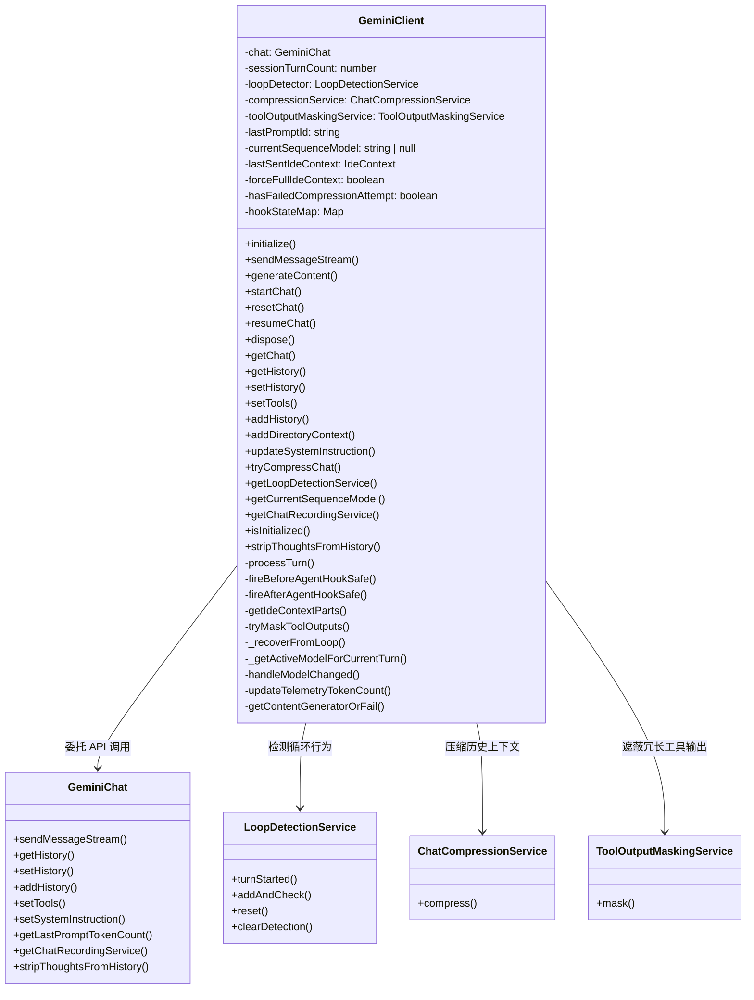
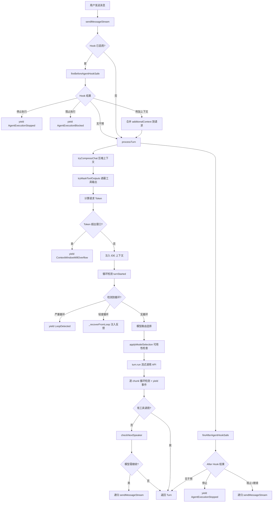

# client.ts

> Gemini CLI 的核心客户端类，负责管理与 Gemini 模型的对话会话、消息流式传输、上下文压缩、循环检测及 Hook 生命周期。

## 概述

`client.ts` 文件定义了 `GeminiClient` 类，它是 Gemini CLI 核心交互层的最高级别封装。该类的设计动机是将底层的 `GeminiChat`（聊天会话管理）与上层的 Agent 循环逻辑（工具调用、Hook 系统、模型路由、循环检测、上下文压缩等）桥接起来，提供统一的消息发送与会话管理接口。

在整个模块架构中，`GeminiClient` 扮演着"协调者"角色：
- 向上对接 Agent 循环（`AgentLoopContext`），接收用户消息并返回流式事件
- 向下委托 `GeminiChat` 进行实际的 API 调用
- 横向集成循环检测（`LoopDetectionService`）、上下文压缩（`ChatCompressionService`）、工具输出遮蔽（`ToolOutputMaskingService`）、IDE 上下文注入、模型路由、Hook 系统等多个子系统

## 架构图





## 主要导出

### 类 `GeminiClient`

Gemini CLI 的核心客户端类，封装了完整的对话会话管理和消息处理逻辑。

#### 构造函数

```typescript
constructor(private readonly context: AgentLoopContext)
```

- 接受 `AgentLoopContext` 作为整个运行上下文
- 初始化 `LoopDetectionService`、`ChatCompressionService`、`ToolOutputMaskingService`
- 监听 `CoreEvent.ModelChanged` 事件，当模型切换时清除 `currentSequenceModel`

#### 公共方法

##### `initialize(): Promise<void>`
初始化聊天会话，调用 `startChat()` 创建 `GeminiChat` 实例并更新 Token 计数遥测。

##### `sendMessageStream(request, signal, prompt_id, turns?, isInvalidStreamRetry?, displayContent?, stopHookActive?): AsyncGenerator<ServerGeminiStreamEvent, Turn>`
核心消息发送方法。这是一个异步生成器，流式返回各类事件（内容块、工具调用、错误、压缩通知等）。

```typescript
async *sendMessageStream(
  request: PartListUnion,          // 用户消息内容
  signal: AbortSignal,             // 中止信号
  prompt_id: string,               // 提示 ID
  turns: number = MAX_TURNS,       // 最大轮数（默认 100）
  isInvalidStreamRetry: boolean = false, // 是否为无效流重试
  displayContent?: PartListUnion,  // 可选的显示内容
  stopHookActive: boolean = false, // AfterAgent Hook 标记
): AsyncGenerator<ServerGeminiStreamEvent, Turn>
```

**关键流程：**
1. 重置轮次配置（非重试时）
2. 检查 prompt_id 变化，重置循环检测器和 Hook 状态
3. 触发 `BeforeAgent` Hook（去重逻辑确保同一 prompt_id 只触发一次）
4. 委托 `processTurn` 执行实际的 API 调用
5. 触发 `AfterAgent` Hook，处理停止/阻止/继续指令
6. 管理 Hook 状态的活跃调用计数

##### `generateContent(modelConfigKey, contents, abortSignal, role): Promise<GenerateContentResponse>`
非流式内容生成方法，用于独立的内容生成请求（如非对话场景）。

```typescript
async generateContent(
  modelConfigKey: ModelConfigKey,
  contents: Content[],
  abortSignal: AbortSignal,
  role: LlmRole,
): Promise<GenerateContentResponse>
```

**关键流程：**
1. 获取模型配置和系统指令
2. 应用可用性策略选择最终模型
3. 使用 `retryWithBackoff` 进行带退避重试的 API 调用
4. 处理 429 限流（触发 fallback）和验证错误

##### `startChat(extraHistory?, resumedSessionData?): Promise<GeminiChat>`
创建新的 `GeminiChat` 实例。

```typescript
async startChat(
  extraHistory?: Content[],
  resumedSessionData?: ResumedSessionData,
): Promise<GeminiChat>
```

- 重置各项状态标志
- 获取工具声明、初始历史记录、系统提示
- 传入 `onModelChanged` 回调以在模型切换时更新工具声明

##### `resetChat(): Promise<void>`
重置聊天会话，创建新的 `GeminiChat` 实例并刷新上下文管理器。

##### `resumeChat(history, resumedSessionData?): Promise<void>`
恢复之前的聊天会话，传入历史记录和可选的会话恢复数据。

##### `dispose(): void`
清理资源，移除 `CoreEvent.ModelChanged` 事件监听器。

##### `getChat(): GeminiChat`
获取当前聊天实例，未初始化时抛出错误。

##### `isInitialized(): boolean`
检查聊天是否已初始化。

##### `getHistory(): readonly Content[]`
获取聊天历史记录。

##### `setHistory(history): void`
设置聊天历史记录，同时更新 Token 计数并标记需要发送完整 IDE 上下文。

##### `stripThoughtsFromHistory(): void`
从历史记录中移除 thought signature 数据。

##### `addHistory(content): void`
向历史记录追加一条内容。

##### `setTools(modelId?): Promise<void>`
设置工具声明，当 `modelId` 未变化时跳过更新。

##### `addDirectoryContext(): Promise<void>`
向聊天历史中添加目录上下文信息。

##### `updateSystemInstruction(): void`
更新系统指令，基于当前配置和用户记忆重新生成。

##### `tryCompressChat(prompt_id, force?): Promise<ChatCompressionInfo>`
尝试压缩聊天历史。

```typescript
async tryCompressChat(
  prompt_id: string,
  force: boolean = false,
): Promise<ChatCompressionInfo>
```

**压缩结果处理逻辑：**
- `COMPRESSED`：重建聊天会话并保留录制数据
- `COMPRESSION_FAILED_INFLATED_TOKEN_COUNT`：标记非强制压缩失败
- `CONTENT_TRUNCATED`：仅更新历史记录，不重建会话

##### `getChatRecordingService(): ChatRecordingService | undefined`
获取聊天录制服务实例。

##### `getLoopDetectionService(): LoopDetectionService`
获取循环检测服务实例。

##### `getCurrentSequenceModel(): string | null`
获取当前序列中使用的模型 ID。

#### 私有方法

##### `processTurn(request, signal, prompt_id, boundedTurns, isInvalidStreamRetry, displayContent?): AsyncGenerator<ServerGeminiStreamEvent, Turn>`
单轮处理的核心逻辑：
1. 检查会话轮次上限
2. 尝试上下文压缩
3. 遮蔽冗长的工具输出
4. 估算请求 Token 并检查上下文窗口溢出
5. 注入 IDE 上下文（在非工具调用响应时）
6. 执行循环检测
7. 通过模型路由器选择模型
8. 应用可用性策略
9. 调用 `turn.run()` 并逐 chunk 检测循环
10. 处理无效流重试
11. 执行 `nextSpeaker` 检查决定是否继续对话

##### `fireBeforeAgentHookSafe(request, prompt_id): Promise<BeforeAgentHookReturn>`
安全触发 BeforeAgent Hook，使用 `hookStateMap` 实现去重（同一 prompt_id 只触发一次）。

##### `fireAfterAgentHookSafe(currentRequest, prompt_id, turn?, stopHookActive?): Promise<DefaultHookOutput | undefined>`
安全触发 AfterAgent Hook，仅在最外层调用（`activeCalls === 1`）且无待处理工具调用时触发。

##### `getIdeContextParts(forceFullContext): { contextParts: string[], newIdeContext: IdeContext | undefined }`
获取 IDE 上下文信息，支持两种模式：
- **完整上下文模式**：首次发送或强制发送时，生成包含活动文件、光标位置、选中文本、其他打开文件的完整 JSON
- **增量更新模式**：仅发送与上次的差异（文件打开/关闭、活动文件切换、光标移动、选区变化）

##### `_getActiveModelForCurrentTurn(): string`
获取当前轮次应使用的模型。优先使用 `currentSequenceModel`（序列粘性），否则从配置中解析。

##### `tryMaskToolOutputs(history): Promise<void>`
当配置启用工具输出遮蔽时，调用 `ToolOutputMaskingService` 替换冗长的工具输出以节省上下文窗口空间。

##### `_recoverFromLoop(loopResult, signal, prompt_id, boundedTurns, isInvalidStreamRetry, displayContent?, controllerToAbort?): AsyncGenerator<ServerGeminiStreamEvent, Turn>`
循环恢复机制。当检测到轻度循环时：
1. 中止当前控制器
2. 清除检测标志
3. 注入反馈提示（要求模型反思并调整策略）
4. 递归调用 `sendMessageStream` 进行新一轮尝试

### 类型 `BeforeAgentHookReturn`

BeforeAgent Hook 的返回类型，是联合类型：

```typescript
type BeforeAgentHookReturn =
  | { type: GeminiEventType.AgentExecutionStopped; value: { reason: string; systemMessage?: string } }
  | { type: GeminiEventType.AgentExecutionBlocked; value: { reason: string; systemMessage?: string } }
  | { additionalContext: string | undefined }
  | undefined;
```

### 常量 `MAX_TURNS`

```typescript
const MAX_TURNS = 100;
```

单次消息流中允许的最大轮次数，防止无限递归。

## 核心逻辑

### 消息流式传输流程

`sendMessageStream` 是整个客户端的核心入口。其控制流程分为三个层次：

1. **Hook 层（sendMessageStream）**：管理 BeforeAgent/AfterAgent Hook 的生命周期，包括去重机制（同一 prompt_id 只触发一次 BeforeAgent）和累积响应追踪
2. **轮次处理层（processTurn）**：处理单轮对话的完整生命周期，包括上下文管理、模型选择、API 调用、流验证
3. **递归续接层**：在以下场景中递归调用自身：
   - 无效流重试（注入 "System: Please continue."）
   - `nextSpeaker` 检查判定模型需要继续
   - AfterAgent Hook 发出阻止+继续指令
   - 循环恢复（注入反馈提示）

### Hook 状态管理

使用 `hookStateMap`（以 `prompt_id` 为键）跟踪：
- `hasFiredBeforeAgent`：防止重复触发
- `cumulativeResponse`：累积多轮响应文本，供 AfterAgent Hook 使用
- `activeCalls`：嵌套调用计数，确保仅在最外层触发 AfterAgent
- `originalRequest`：保存原始请求

### IDE 上下文注入

在 IDE 模式下，每次发送消息时注入编辑器状态：
- 首次交互或会话重置后发送**完整上下文**（活动文件、光标、选区、打开文件列表）
- 后续交互发送**增量差异**（仅变化的部分）
- 等待工具调用响应期间不注入上下文（Gemini API 要求 functionResponse 紧跟 functionCall）

### 模型选择与路由

模型选择遵循优先级链：
1. `currentSequenceModel`（序列粘性——同一对话序列内保持模型不变）
2. 模型路由器（`ModelRouterService`）根据历史和请求动态选择
3. 可用性策略（`applyModelSelection`）检查模型配额和状态

### 循环检测与恢复

循环检测发生在两个时机：
1. **轮次开始时**（`turnStarted`）：检测整体轮次级别的重复模式
2. **流式传输中**（`addAndCheck`）：逐 chunk 检测响应级别的重复

检测结果分三级：
- `count === 0`：正常继续
- `count === 1`：轻度循环，注入反馈提示并重试
- `count > 1`：严重循环，直接终止并通知用户

### 上下文压缩

当上下文接近 Token 限制时自动触发压缩：
- 使用 `ChatCompressionService` 尝试压缩历史
- 压缩成功后重建整个聊天会话（保留录制数据）
- 如果压缩导致 Token 数反而增加，标记失败以避免重复尝试
- 支持轻量级的内容截断模式（`CONTENT_TRUNCATED`）

## 内部依赖

| 模块路径 | 导入项 | 用途 |
|---------|--------|------|
| `./geminiRequest.js` | `partListUnionToString` | 将消息部分转为字符串 |
| `../utils/environmentContext.js` | `getDirectoryContextString`, `getInitialChatHistory` | 获取目录上下文和初始历史 |
| `./turn.js` | `CompressionStatus`, `Turn`, `GeminiEventType`, `ServerGeminiStreamEvent`, `ChatCompressionInfo` | 轮次管理和事件类型 |
| `../config/config.js` | `Config` | 配置类型 |
| `../config/agent-loop-context.js` | `AgentLoopContext` | Agent 循环上下文 |
| `./prompts.js` | `getCoreSystemPrompt` | 获取核心系统提示 |
| `../utils/nextSpeakerChecker.js` | `checkNextSpeaker` | 检查下一个说话者 |
| `../utils/errorReporting.js` | `reportError` | 错误上报 |
| `./geminiChat.js` | `GeminiChat` | 底层聊天会话管理 |
| `../utils/retry.js` | `retryWithBackoff`, `RetryAvailabilityContext` | 重试与退避 |
| `../utils/googleQuotaErrors.js` | `ValidationRequiredError` | 验证错误类型 |
| `../utils/errors.js` | `getErrorMessage`, `isAbortError` | 错误处理工具 |
| `./tokenLimits.js` | `tokenLimit` | Token 限制查询 |
| `../services/chatRecordingService.js` | `ChatRecordingService`, `ResumedSessionData` | 聊天录制服务 |
| `./contentGenerator.js` | `ContentGenerator` | 内容生成器接口 |
| `../services/loopDetectionService.js` | `LoopDetectionService` | 循环检测服务 |
| `../services/chatCompressionService.js` | `ChatCompressionService` | 聊天压缩服务 |
| `../ide/ideContext.js` | `ideContextStore` | IDE 上下文存储 |
| `../telemetry/loggers.js` | `logContentRetryFailure`, `logNextSpeakerCheck` | 遥测日志 |
| `../hooks/types.js` | `DefaultHookOutput`, `AfterAgentHookOutput` | Hook 输出类型 |
| `../telemetry/types.js` | `ContentRetryFailureEvent`, `NextSpeakerCheckEvent`, `LlmRole` | 遥测事件类型 |
| `../telemetry/uiTelemetry.js` | `uiTelemetryService` | UI 遥测服务 |
| `../ide/types.js` | `IdeContext`, `File` | IDE 类型定义 |
| `../fallback/handler.js` | `handleFallback` | 模型降级处理 |
| `../routing/routingStrategy.js` | `RoutingContext` | 路由上下文类型 |
| `../utils/debugLogger.js` | `debugLogger` | 调试日志 |
| `../services/modelConfigService.js` | `ModelConfigKey` | 模型配置键类型 |
| `../services/toolOutputMaskingService.js` | `ToolOutputMaskingService` | 工具输出遮蔽服务 |
| `../utils/tokenCalculation.js` | `calculateRequestTokenCount` | 请求 Token 计算 |
| `../availability/policyHelpers.js` | `applyModelSelection`, `createAvailabilityContextProvider` | 可用性策略辅助 |
| `../config/models.js` | `getDisplayString`, `resolveModel`, `isGemini2Model` | 模型工具函数 |
| `../utils/partUtils.js` | `partToString` | Part 转字符串 |
| `../utils/events.js` | `coreEvents`, `CoreEvent` | 核心事件系统 |

## 外部依赖

| npm 包 | 导入项 | 用途 |
|--------|--------|------|
| `@google/genai` | `createUserContent`, `GenerateContentConfig`, `PartListUnion`, `Content`, `Tool`, `GenerateContentResponse` | Google Generative AI SDK，提供模型交互的基础类型和工具函数 |
