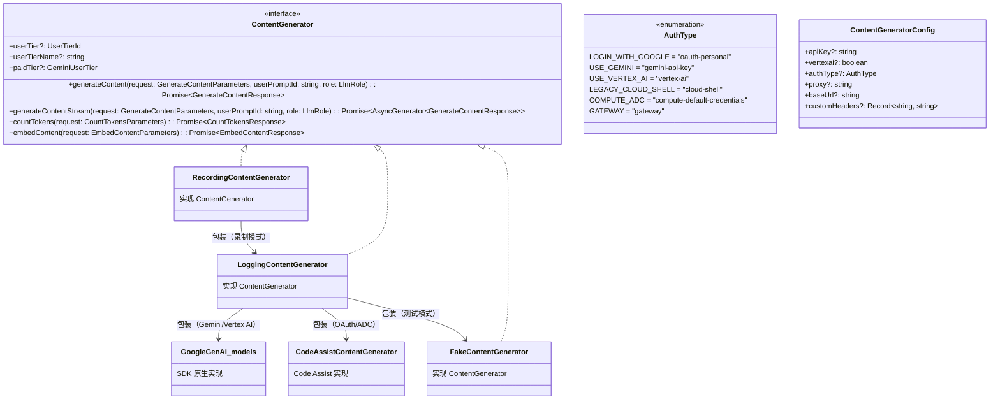
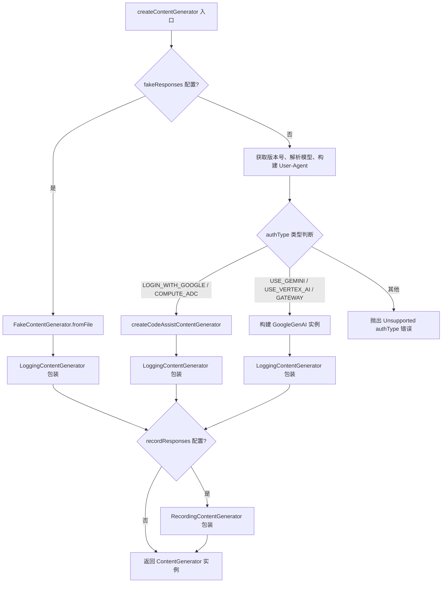
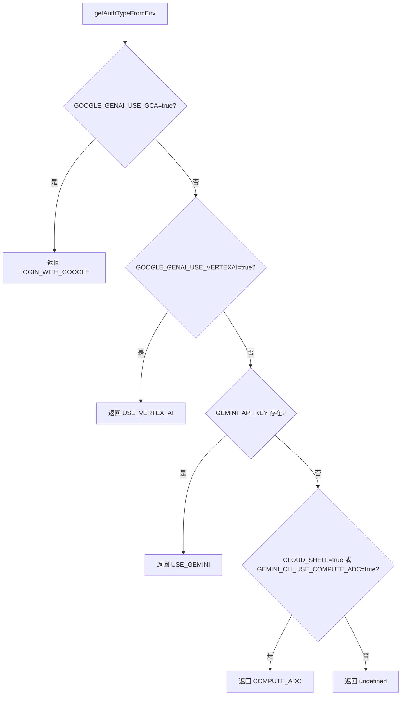

# contentGenerator.ts

> 定义内容生成器的核心接口、认证类型枚举，以及内容生成器的工厂创建函数，是 Gemini CLI 与 LLM API 交互的基础抽象层。

## 概述

`contentGenerator.ts` 是 Gemini CLI 核心模块中最基础的文件之一，负责定义**与 LLM 通信的抽象接口**和**创建具体实现实例的工厂逻辑**。它的核心设计动机有三点：

1. **接口抽象**：通过 `ContentGenerator` 接口将 LLM 调用抽象化，使上层代码不直接依赖具体的 API 实现（Google GenAI SDK、Code Assist 服务等），从而支持多种后端和测试替身。

2. **认证管理**：通过 `AuthType` 枚举和 `getAuthTypeFromEnv()` 函数统一管理多种认证方式（OAuth、API Key、Vertex AI、Cloud Shell 等），根据环境变量自动检测最佳认证类型。

3. **工厂模式**：通过 `createContentGenerator()` 和 `createContentGeneratorConfig()` 两个工厂函数，根据配置和认证类型创建对应的内容生成器实例，并自动叠加日志装饰器和录制装饰器。

在模块中的角色：该文件处于依赖图的中心位置。`BaseLlmClient` 依赖它定义的 `ContentGenerator` 接口，`LoggingContentGenerator`、`FakeContentGenerator`、`RecordingContentGenerator` 均实现该接口，主会话流和子代理通过工厂函数获取实例。

## 架构图







## 主要导出

### 接口 `ContentGenerator`

```typescript
export interface ContentGenerator {
  generateContent(
    request: GenerateContentParameters,
    userPromptId: string,
    role: LlmRole,
  ): Promise<GenerateContentResponse>;

  generateContentStream(
    request: GenerateContentParameters,
    userPromptId: string,
    role: LlmRole,
  ): Promise<AsyncGenerator<GenerateContentResponse>>;

  countTokens(request: CountTokensParameters): Promise<CountTokensResponse>;

  embedContent(request: EmbedContentParameters): Promise<EmbedContentResponse>;

  userTier?: UserTierId;
  userTierName?: string;
  paidTier?: GeminiUserTier;
}
```

核心抽象接口，定义了与 LLM 交互的四大能力：

| 方法/属性 | 说明 |
|-----------|------|
| `generateContent` | 非流式内容生成。接收请求参数、用户提示 ID 和 LLM 角色，返回完整响应。 |
| `generateContentStream` | 流式内容生成。返回异步生成器，逐块产出响应。 |
| `countTokens` | Token 计数。计算给定内容的 token 数量。 |
| `embedContent` | 文本嵌入。将文本转换为向量表示。 |
| `userTier` | 可选属性，表示用户的层级 ID。 |
| `userTierName` | 可选属性，表示用户层级的可读名称。 |
| `paidTier` | 可选属性，表示用户的付费层级信息。 |

### 枚举 `AuthType`

```typescript
export enum AuthType {
  LOGIN_WITH_GOOGLE = 'oauth-personal',
  USE_GEMINI = 'gemini-api-key',
  USE_VERTEX_AI = 'vertex-ai',
  LEGACY_CLOUD_SHELL = 'cloud-shell',
  COMPUTE_ADC = 'compute-default-credentials',
  GATEWAY = 'gateway',
}
```

定义了 Gemini CLI 支持的所有认证类型：

| 枚举值 | 字符串值 | 说明 |
|--------|----------|------|
| `LOGIN_WITH_GOOGLE` | `"oauth-personal"` | Google OAuth 个人登录认证 |
| `USE_GEMINI` | `"gemini-api-key"` | Gemini API Key 认证 |
| `USE_VERTEX_AI` | `"vertex-ai"` | Google Vertex AI 平台认证 |
| `LEGACY_CLOUD_SHELL` | `"cloud-shell"` | 旧版 Cloud Shell 认证（保留） |
| `COMPUTE_ADC` | `"compute-default-credentials"` | 计算环境默认凭证（ADC）认证 |
| `GATEWAY` | `"gateway"` | 网关认证 |

### 函数 `getAuthTypeFromEnv(): AuthType | undefined`

```typescript
export function getAuthTypeFromEnv(): AuthType | undefined
```

根据环境变量自动检测最佳认证类型。检测优先级顺序：

1. `GOOGLE_GENAI_USE_GCA=true` -> `LOGIN_WITH_GOOGLE`
2. `GOOGLE_GENAI_USE_VERTEXAI=true` -> `USE_VERTEX_AI`
3. `GEMINI_API_KEY` 存在 -> `USE_GEMINI`
4. `CLOUD_SHELL=true` 或 `GEMINI_CLI_USE_COMPUTE_ADC=true` -> `COMPUTE_ADC`
5. 以上均不满足 -> 返回 `undefined`

### 类型 `ContentGeneratorConfig`

```typescript
export type ContentGeneratorConfig = {
  apiKey?: string;
  vertexai?: boolean;
  authType?: AuthType;
  proxy?: string;
  baseUrl?: string;
  customHeaders?: Record<string, string>;
};
```

内容生成器的配置类型，包含创建内容生成器所需的全部信息：

| 字段 | 类型 | 说明 |
|------|------|------|
| `apiKey` | `string` | API 密钥（Gemini API Key 或 Google API Key） |
| `vertexai` | `boolean` | 是否使用 Vertex AI 模式 |
| `authType` | `AuthType` | 认证类型 |
| `proxy` | `string` | HTTP 代理地址 |
| `baseUrl` | `string` | 自定义 API 基础 URL |
| `customHeaders` | `Record<string, string>` | 自定义 HTTP 请求头 |

### 函数 `createContentGeneratorConfig`

```typescript
export async function createContentGeneratorConfig(
  config: Config,
  authType: AuthType | undefined,
  apiKey?: string,
  baseUrl?: string,
  customHeaders?: Record<string, string>,
): Promise<ContentGeneratorConfig>
```

异步工厂函数，根据认证类型和环境变量创建 `ContentGeneratorConfig` 对象。流程如下：

1. 按优先级获取 API Key：参数传入 -> 环境变量 `GEMINI_API_KEY` -> 本地存储 `loadApiKey()`
2. 获取 Google API Key（`GOOGLE_API_KEY`）、Cloud 项目（`GOOGLE_CLOUD_PROJECT`/`GOOGLE_CLOUD_PROJECT_ID`）和区域（`GOOGLE_CLOUD_LOCATION`）
3. 根据 `authType` 构建配置：
   - `LOGIN_WITH_GOOGLE` / `COMPUTE_ADC`：仅返回基础配置（不需要 API Key）
   - `USE_GEMINI`：设置 `apiKey` 和 `vertexai=false`
   - `USE_VERTEX_AI`：设置 `apiKey`（可选）和 `vertexai=true`，需要 Google API Key 或 Cloud 项目+区域

### 函数 `createContentGenerator`

```typescript
export async function createContentGenerator(
  config: ContentGeneratorConfig,
  gcConfig: Config,
  sessionId?: string,
): Promise<ContentGenerator>
```

核心工厂函数，创建并返回完整装配的 `ContentGenerator` 实例。这是整个文件最重要的函数。

### 函数 `validateBaseUrl`

```typescript
export function validateBaseUrl(baseUrl: string): void
```

验证自定义 Base URL 的合法性：
- 必须是有效的 URL 格式
- 必须使用 HTTPS 协议（除非是 localhost / 127.0.0.1 / [::1]）

## 核心逻辑

### `createContentGenerator` 详细流程

这是文件中逻辑最复杂的函数，采用 IIFE（立即执行函数表达式）模式组织内部逻辑：

#### 第一阶段：测试模式检测

```typescript
if (gcConfig.fakeResponses) {
  const fakeGenerator = await FakeContentGenerator.fromFile(gcConfig.fakeResponses);
  return new LoggingContentGenerator(fakeGenerator, gcConfig);
}
```

如果配置了 `fakeResponses`，从文件加载预设响应，创建 `FakeContentGenerator` 并用 `LoggingContentGenerator` 包装。

#### 第二阶段：User-Agent 构建

```typescript
const userAgent = `${userAgentPrefix}/${version}/${model} (${process.platform}; ${process.arch}; ${surface})`;
```

构建标准的 User-Agent 字符串，格式为：`GeminiCLI[-clientName]/版本/模型 (平台; 架构; 运行表面)`。

#### 第三阶段：API Key 认证机制

支持两种 API Key 传递方式：
- 默认：通过 `x-goog-api-key` 请求头（由 SDK 自动处理）
- 可选：通过 `Authorization: Bearer` 请求头（由环境变量 `GEMINI_API_KEY_AUTH_MECHANISM=bearer` 启用）

#### 第四阶段：根据认证类型创建生成器

**OAuth / ADC 路径**（`LOGIN_WITH_GOOGLE` / `COMPUTE_ADC`）：
- 调用 `createCodeAssistContentGenerator()` 创建 Code Assist 后端的生成器
- 用 `LoggingContentGenerator` 包装

**API Key / Vertex AI / Gateway 路径**（`USE_GEMINI` / `USE_VERTEX_AI` / `GATEWAY`）：
- 合并自定义请求头
- 如果启用了使用统计，添加 `x-gemini-api-privileged-user-id` 请求头
- 解析 Base URL（参数传入 -> 环境变量 `GOOGLE_VERTEX_BASE_URL` / `GOOGLE_GEMINI_BASE_URL`）
- 创建 `GoogleGenAI` SDK 实例
- 使用 `googleGenAI.models` 作为底层生成器
- 用 `LoggingContentGenerator` 包装

**其他类型**：抛出不支持的认证类型错误。

#### 第五阶段：录制装饰器

```typescript
if (gcConfig.recordResponses) {
  return new RecordingContentGenerator(generator, gcConfig.recordResponses);
}
```

如果配置了 `recordResponses`，额外包装一层 `RecordingContentGenerator` 用于记录所有 API 响应。

### `validateBaseUrl` 详细逻辑

```typescript
const LOCAL_HOSTNAMES = ['localhost', '127.0.0.1', '[::1]'];
```

安全验证规则：
1. 使用 `new URL()` 解析 URL，格式无效则抛出 `"Invalid custom base URL"` 错误
2. 如果协议不是 `https:` 且主机名不在本地主机列表中，抛出 `"Custom base URL must use HTTPS unless it is localhost."` 错误
3. 本地主机（localhost、127.0.0.1、[::1]）允许使用 HTTP 协议

### 环境变量总览

该文件涉及大量环境变量，汇总如下：

| 环境变量 | 用途 |
|----------|------|
| `GOOGLE_GENAI_USE_GCA` | 设为 `"true"` 启用 Google OAuth 认证 |
| `GOOGLE_GENAI_USE_VERTEXAI` | 设为 `"true"` 启用 Vertex AI 认证 |
| `GEMINI_API_KEY` | Gemini API 密钥 |
| `GOOGLE_API_KEY` | Google API 密钥（Vertex AI 用） |
| `GOOGLE_CLOUD_PROJECT` / `GOOGLE_CLOUD_PROJECT_ID` | Google Cloud 项目 ID |
| `GOOGLE_CLOUD_LOCATION` | Google Cloud 区域 |
| `CLOUD_SHELL` | Cloud Shell 环境标识 |
| `GEMINI_CLI_USE_COMPUTE_ADC` | 启用计算环境默认凭证 |
| `GEMINI_CLI_CUSTOM_HEADERS` | 自定义 HTTP 请求头（需解析） |
| `GEMINI_API_KEY_AUTH_MECHANISM` | API Key 传递方式（默认 `x-goog-api-key`，可设为 `bearer`） |
| `GOOGLE_GENAI_API_VERSION` | 自定义 API 版本号 |
| `GOOGLE_VERTEX_BASE_URL` | Vertex AI 自定义基础 URL |
| `GOOGLE_GEMINI_BASE_URL` | Gemini API 自定义基础 URL |

## 内部依赖

| 模块路径 | 导入项 | 用途 |
|----------|--------|------|
| `../code_assist/codeAssist.js` | `createCodeAssistContentGenerator` | 创建 Code Assist 后端的内容生成器 |
| `../config/config.js` | `Config` (类型) | 全局配置对象 |
| `./apiKeyCredentialStorage.js` | `loadApiKey` | 从本地存储加载 API Key |
| `../code_assist/types.js` | `UserTierId` (类型), `GeminiUserTier` (类型) | 用户层级类型定义 |
| `./loggingContentGenerator.js` | `LoggingContentGenerator` | 日志装饰器，包装底层生成器以记录 API 调用 |
| `../utils/installationManager.js` | `InstallationManager` | 安装管理器，获取安装 ID 用于统计 |
| `./fakeContentGenerator.js` | `FakeContentGenerator` | 测试用假响应生成器 |
| `../utils/customHeaderUtils.js` | `parseCustomHeaders` | 解析自定义请求头字符串 |
| `../utils/surface.js` | `determineSurface` | 检测运行表面（CLI、IDE 插件等） |
| `./recordingContentGenerator.js` | `RecordingContentGenerator` | 响应录制装饰器 |
| `../../index.js` | `getVersion`, `resolveModel` | 获取版本号和解析模型名称 |
| `../telemetry/llmRole.js` | `LlmRole` (类型) | LLM 调用角色枚举类型 |

## 外部依赖

| npm 包 | 导入项 | 用途 |
|--------|--------|------|
| `@google/genai` | `GoogleGenAI`, `CountTokensResponse` (类型), `GenerateContentResponse` (类型), `GenerateContentParameters` (类型), `CountTokensParameters` (类型), `EmbedContentResponse` (类型), `EmbedContentParameters` (类型) | Google Generative AI SDK，提供与 Gemini API 交互的核心类和类型 |
