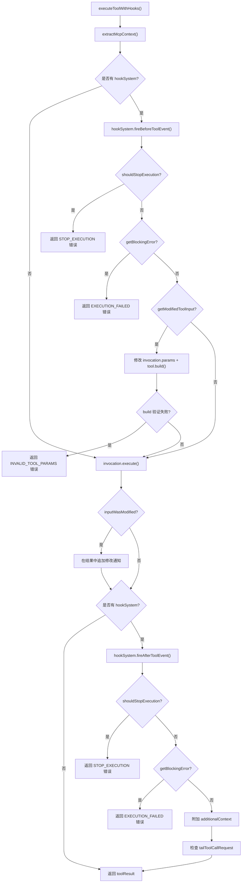

# coreToolHookTriggers.ts

> 为工具执行提供钩子（Hook）生命周期管理，在工具执行前后触发 BeforeTool 和 AfterTool 钩子事件。

## 概述

`coreToolHookTriggers.ts` 是工具执行的核心编排文件，负责将工具的实际执行逻辑与钩子系统（Hook System）集成。它实现了一个完整的工具执行生命周期：在工具执行前触发 `BeforeTool` 钩子（可阻断执行、修改输入参数），执行工具本体，然后触发 `AfterTool` 钩子（可阻断结果返回、注入额外上下文、请求尾调用）。

该文件在模块中扮演"工具执行中间件"的角色，确保所有工具调用都经过统一的钩子处理流程，支持用户自定义的工具行为拦截与增强。

## 架构图



## 主要导出

### 函数

#### `executeToolWithHooks()`

```typescript
export async function executeToolWithHooks(
  invocation: AnyToolInvocation,
  toolName: string,
  signal: AbortSignal,
  tool: AnyDeclarativeTool,
  liveOutputCallback?: (outputChunk: ToolLiveOutput) => void,
  shellExecutionConfig?: ShellExecutionConfig,
  setExecutionIdCallback?: (executionId: number) => void,
  config?: Config,
  originalRequestName?: string,
): Promise<ToolResult>
```

**用途：** 带钩子的工具执行函数。这是工具执行的主入口点，封装了完整的 BeforeTool -> Execute -> AfterTool 生命周期。

**参数说明：**
- `invocation` - 工具调用实例，包含参数和执行逻辑
- `toolName` - 工具名称，用于钩子事件标识
- `signal` - AbortSignal，支持取消操作
- `tool` - 声明式工具定义，用于参数修改后重建 invocation
- `liveOutputCallback` - 可选，实时输出回调
- `shellExecutionConfig` - 可选，Shell 执行配置
- `setExecutionIdCallback` - 可选，设置后台任务执行 ID 的回调
- `config` - 可选，配置对象，用于获取 Hook 系统和 MCP 服务器信息
- `originalRequestName` - 可选，原始请求名称

**返回值：** `Promise<ToolResult>` - 工具执行结果

## 核心逻辑

### 1. MCP 上下文提取

内部函数 `extractMcpContext()` 负责判断工具调用是否为 MCP 工具，如果是则从配置中提取 MCP 服务器的连接信息（command、args、cwd、url、tcp），作为钩子事件的上下文传递。仅当 invocation 是 `DiscoveredMCPToolInvocation` 实例时才会提取。

### 2. BeforeTool 钩子处理

通过 `hookSystem.fireBeforeToolEvent()` 触发前置钩子，返回的 `beforeOutput` 可产生三种效果：

- **停止执行 (`shouldStopExecution`)：** 返回 `STOP_EXECUTION` 类型错误，完全终止 Agent 执行
- **阻断工具 (`getBlockingError`)：** 返回 `EXECUTION_FAILED` 类型错误，阻止该工具执行
- **修改输入 (`getModifiedToolInput`)：** 使用 `Object.assign` 就地修改参数，然后调用 `tool.build()` 重建 invocation 以确保派生状态（如 `ReadFileTool` 的 `resolvedPath`）得到更新。如果重建失败则返回 `INVALID_TOOL_PARAMS` 错误

### 3. 工具执行

调用 `invocation.execute()` 执行实际工具逻辑，传入 signal、liveOutputCallback、shellExecutionConfig 和 setExecutionIdCallback。

### 4. 输入修改通知

如果参数在 BeforeTool 阶段被修改，会在工具结果的 `llmContent` 中追加系统通知消息，告知 LLM 哪些参数被修改。支持 string、数组和单个 Part 三种 llmContent 格式。

### 5. AfterTool 钩子处理

通过 `hookSystem.fireAfterToolEvent()` 触发后置钩子，返回的 `afterOutput` 可产生四种效果：

- **停止执行：** 同 BeforeTool
- **阻断结果：** 同 BeforeTool
- **附加上下文 (`getAdditionalContext`)：** 将额外上下文包裹在 `<hook_context>` 标签中追加到结果
- **尾工具调用 (`getTailToolCallRequest`)：** 请求在当前工具执行后追加一个额外的工具调用

## 内部依赖

| 模块路径 | 导入内容 | 用途 |
|---------|---------|------|
| `../hooks/types.js` | `McpToolContext`, `BeforeToolHookOutput` | Hook 类型定义 |
| `../config/config.js` | `Config` | 配置类型 |
| `../tools/tools.js` | `ToolResult`, `AnyDeclarativeTool`, `AnyToolInvocation`, `ToolLiveOutput` | 工具类型定义 |
| `../tools/tool-error.js` | `ToolErrorType` | 工具错误枚举 |
| `../utils/debugLogger.js` | `debugLogger` | 调试日志 |
| `../index.js` | `ShellExecutionConfig` | Shell 执行配置类型 |
| `../tools/mcp-tool.js` | `DiscoveredMCPToolInvocation` | MCP 工具调用类 |

## 外部依赖

无直接的 npm 外部包依赖。所有类型和功能均来自内部模块。
