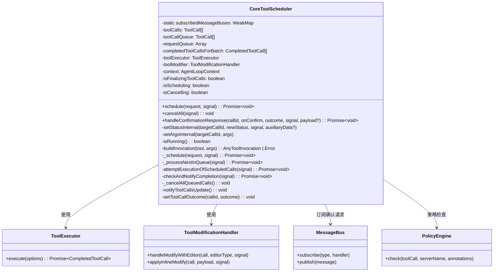
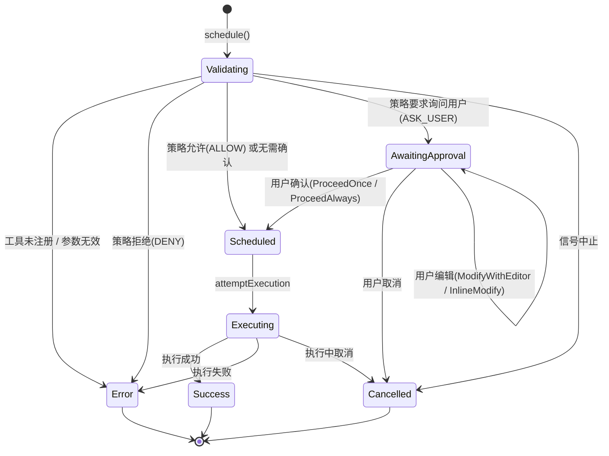

# coreToolScheduler.ts

> 核心工具调度器，负责工具调用的全生命周期管理：验证、策略检查、用户确认、执行与完成通知。

## 概述

`coreToolScheduler.ts` 是 Gemini CLI 工具调用系统的核心调度引擎。它实现了一个**串行化的工具调用队列**，将 AI 模型发出的工具调用请求按顺序经过验证(Validating)、策略检查(Policy Check)、用户确认(Awaiting Approval)、排程(Scheduled)、执行(Executing)等阶段，最终汇报完成结果。

**设计动机：**
- AI 模型可能同时返回多个工具调用请求，但工具执行需要有序进行（例如文件编辑需要逐一确认）
- 工具调用需要经过安全策略引擎(PolicyEngine)的权限检查
- 交互模式下某些操作需要用户手动确认/取消/编辑
- 需要支持取消操作的级联传播
- 需要防止 MessageBus 重复订阅导致的内存泄漏

**在模块中的角色：**
该文件是 `core` 模块与 `scheduler`、`tools`、`policy`、`telemetry` 等子系统之间的桥梁。上层的 Agent Loop 通过 `CoreToolScheduler` 来调度所有工具调用，而 `CoreToolScheduler` 内部组合使用了 `ToolExecutor`（负责实际执行）和 `ToolModificationHandler`（负责编辑器修改）。

## 架构图





## 主要导出

### 重导出类型

文件从 `../scheduler/types.js` 重导出了以下所有工具调用相关的类型，方便上层模块统一从此文件导入：

| 类型名 | 说明 |
|--------|------|
| `ToolCall` | 所有工具调用状态的联合类型 |
| `ValidatingToolCall` | 处于验证阶段的工具调用 |
| `ScheduledToolCall` | 已排程待执行的工具调用 |
| `ErroredToolCall` | 出错的工具调用 |
| `SuccessfulToolCall` | 成功完成的工具调用 |
| `ExecutingToolCall` | 正在执行中的工具调用 |
| `CancelledToolCall` | 已取消的工具调用 |
| `WaitingToolCall` | 等待用户审批的工具调用 |
| `Status` | 工具调用状态枚举值的类型别名 |
| `CompletedToolCall` | 已完成的工具调用（成功/错误/取消） |
| `ConfirmHandler` | 确认处理回调类型 |
| `OutputUpdateHandler` | 输出更新回调类型 |
| `AllToolCallsCompleteHandler` | 所有工具调用完成回调类型 |
| `ToolCallsUpdateHandler` | 工具调用列表更新回调类型 |
| `ToolCallRequestInfo` | 工具调用请求信息 |
| `ToolCallResponseInfo` | 工具调用响应信息 |

### `class CoreToolScheduler`

核心工具调度器类。

**构造函数签名：**
```typescript
constructor(options: CoreToolSchedulerOptions)
```

**`CoreToolSchedulerOptions` 接口：**
```typescript
interface CoreToolSchedulerOptions {
  context: AgentLoopContext;                    // Agent 循环上下文（包含配置、工具注册表、消息总线等）
  outputUpdateHandler?: OutputUpdateHandler;    // 工具执行过程中的实时输出回调
  onAllToolCallsComplete?: AllToolCallsCompleteHandler;  // 一批工具调用全部完成时的回调
  onToolCallsUpdate?: ToolCallsUpdateHandler;   // 工具调用列表状态变化时的回调
  getPreferredEditor: () => EditorType | undefined;      // 获取用户首选编辑器
}
```

#### 公共方法

##### `schedule(request, signal): Promise<void>`
```typescript
schedule(
  request: ToolCallRequestInfo | ToolCallRequestInfo[],
  signal: AbortSignal,
): Promise<void>
```
调度一个或多个工具调用请求。如果当前有正在运行的工具调用或正在调度中，请求会被放入 `requestQueue` 队列中排队等待。支持通过 `AbortSignal` 取消排队中的请求。

##### `cancelAll(signal): void`
```typescript
cancelAll(signal: AbortSignal): void
```
取消所有正在进行的工具调用。包括当前活跃的调用和队列中等待的调用。使用 `isCancelling` 标志防止重入。

##### `handleConfirmationResponse(callId, originalOnConfirm, outcome, signal, payload?): Promise<void>`
```typescript
async handleConfirmationResponse(
  callId: string,
  originalOnConfirm: (outcome: ToolConfirmationOutcome) => Promise<void>,
  outcome: ToolConfirmationOutcome,
  signal: AbortSignal,
  payload?: ToolConfirmationPayload,
): Promise<void>
```
处理用户对工具调用确认请求的响应。根据不同的 `outcome` 执行相应操作：
- `Cancel`: 触发 `cancelAll` 级联取消
- `ModifyWithEditor`: 打开外部编辑器修改工具参数
- `ProceedOnce` / `ProceedAlways`: 将工具调用状态推进到 `Scheduled`
- 如果 `payload` 中包含 `newContent`，执行内联修改并等待再次确认

## 核心逻辑

### 1. 调度流程 (`schedule` -> `_schedule` -> `_processNextInQueue`)

调度采用**两级队列**设计：

- **`requestQueue`**：外层请求队列。当调度器正在运行时，新请求进入此队列排队。每批请求完成后，从队列中取出下一批继续处理。
- **`toolCallQueue`**：内层工具调用队列。一批请求中的多个工具调用在此队列中串行处理。

```
schedule() 入口
  ├─ 如果 isRunning 或 isScheduling → 放入 requestQueue 排队
  └─ 否则 → 调用 _schedule()
        ├─ 遍历请求，查找工具实例，构建 invocation
        │   ├─ 工具未注册 → 创建 Error 状态的 ToolCall
        │   ├─ 参数构建失败 → 创建 Error 状态的 ToolCall
        │   └─ 成功 → 创建 Validating 状态的 ToolCall
        ├─ 全部放入 toolCallQueue
        └─ 调用 _processNextInQueue()
```

### 2. 逐个处理逻辑 (`_processNextInQueue`)

```
_processNextInQueue()
  ├─ 如果已有活跃调用或队列为空 → 返回
  ├─ 如果 signal 已中止 → 取消所有排队调用并完成
  └─ 取出队列第一个 → 设为活跃调用
        ├─ 如果已是 Error 状态 → 直接进入完成检查
        └─ 如果是 Validating 状态
              ├─ 策略检查(PolicyEngine.check)
              │   ├─ DENY → 设为 Error
              │   ├─ ALLOW → 设为 Scheduled
              │   └─ ASK_USER
              │         ├─ invocation.shouldConfirmExecute() 返回 null → 设为 Scheduled
              │         └─ 返回确认详情 → 设为 AwaitingApproval
              └─ 异常处理 → 设为 Error 或 Cancelled
```

### 3. 状态机管理 (`setStatusInternal`)

`setStatusInternal` 是一个重载方法，根据目标状态接受不同的辅助数据：
- `Success` / `Error`: 接受 `ToolCallResponseInfo`
- `AwaitingApproval`: 接受 `ToolCallConfirmationDetails`
- `Cancelled`: 接受原因字符串（string）或 `ToolCallResponseInfo`
- `Executing` / `Scheduled` / `Validating`: 无需辅助数据

关键规则：**已处于终态（Success / Error / Cancelled）的调用不可再被修改**。每次状态变更后自动调用 `notifyToolCallsUpdate()` 通知 UI。

### 4. 完成检查与批处理 (`checkAndNotifyCompletion`)

```
checkAndNotifyCompletion()
  ├─ 如果活跃调用处于终态 → 移入 completedToolCallsForBatch，记录遥测日志
  ├─ 清空 toolCalls 活跃槽位
  └─ 检查批次是否完成
        ├─ toolCallQueue 还有待处理 → 调用 _processNextInQueue() 继续
        └─ toolCallQueue 为空 或 signal 已中止
              ├─ 设置 isFinalizingToolCalls = true
              ├─ while 循环上报完成的调用（处理并发新增）
              ├─ 通知 onAllToolCallsComplete 回调
              └─ 从 requestQueue 取下一批请求继续调度
```

### 5. 取消级联 (`cancelAll` / `_cancelAllQueuedCalls`)

`cancelAll` 执行以下操作：
1. 取消当前活跃的工具调用（如果处于可取消状态）
2. 调用 `_cancelAllQueuedCalls()` 将队列中所有未完成的调用标记为 `Cancelled`
3. 触发 `checkAndNotifyCompletion` 完成批处理

### 6. MessageBus 订阅防重复

使用 **静态 `WeakMap<MessageBus, handler>`** 跟踪已订阅的 MessageBus 实例，确保：
- 即使创建多个 `CoreToolScheduler` 实例（如 React 每次渲染），也只对每个 MessageBus 注册一次处理器
- WeakMap 允许 MessageBus 被垃圾回收时自动清理引用
- 对 `ASK_USER` 策略决定的确认请求，默认回复 `requiresUserConfirmation: true`，告知工具使用传统确认流程

### 7. 编辑器修改流程 (`ModifyWithEditor` / `InlineModify`)

当用户选择在编辑器中修改工具参数时：
1. 将确认详情标记为 `isModifying: true`
2. 调用 `ToolModificationHandler.handleModifyWithEditor()` 打开外部编辑器
3. 编辑完成后，使用 `setArgsInternal()` 更新工具调用参数
4. 恢复 `isModifying: false` 并更新 diff 显示
5. 工具调用保持在 `AwaitingApproval` 状态，等待用户再次确认

## 内部依赖

| 模块路径 | 导入内容 | 用途 |
|----------|----------|------|
| `../tools/tools.js` | `ToolResultDisplay`, `AnyDeclarativeTool`, `AnyToolInvocation`, `ToolCallConfirmationDetails`, `ToolConfirmationPayload`, `ToolConfirmationOutcome` | 工具相关核心类型 |
| `../utils/editor.js` | `EditorType` | 编辑器类型定义 |
| `../policy/types.js` | `PolicyDecision` | 策略决定枚举 |
| `../telemetry/loggers.js` | `logToolCall` | 工具调用遥测日志记录 |
| `../tools/tool-error.js` | `ToolErrorType` | 工具错误类型枚举 |
| `../telemetry/types.js` | `ToolCallEvent` | 工具调用遥测事件类型 |
| `../telemetry/trace.js` | `runInDevTraceSpan` | 开发追踪 span 包装 |
| `../scheduler/tool-modifier.js` | `ToolModificationHandler` | 工具参数修改处理器 |
| `../utils/tool-utils.js` | `getToolSuggestion`, `isToolCallResponseInfo` | 工具名称建议与类型守卫 |
| `../confirmation-bus/types.js` | `ToolConfirmationRequest`, `MessageBusType` | 确认总线消息类型 |
| `../confirmation-bus/message-bus.js` | `MessageBus` | 消息总线接口 |
| `../scheduler/types.js` | `CoreToolCallStatus` 及所有 ToolCall 相关类型 | 工具调用状态机类型定义 |
| `../scheduler/tool-executor.js` | `ToolExecutor` | 工具实际执行器 |
| `../tools/mcp-tool.js` | `DiscoveredMCPTool` | MCP 工具类（用于获取 serverName） |
| `../scheduler/policy.js` | `getPolicyDenialError` | 策略拒绝错误信息生成 |
| `../telemetry/constants.js` | `GeminiCliOperation` | 遥测操作常量 |
| `../config/agent-loop-context.js` | `AgentLoopContext` | Agent 循环上下文类型 |

## 外部依赖

本文件没有直接导入任何 npm 外部包。所有外部依赖通过内部模块间接使用。
