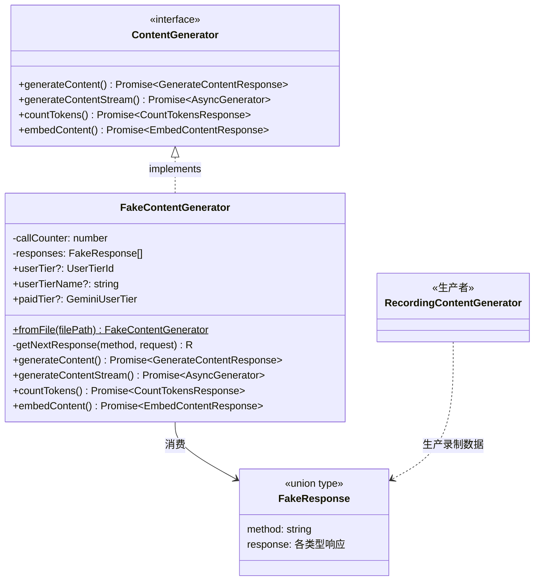

# fakeContentGenerator.ts

> 基于预录制响应的模拟内容生成器，用于测试和离线回放场景，无需实际调用 Gemini API。

## 概述

`fakeContentGenerator.ts` 实现了 `FakeContentGenerator` 类和 `FakeResponse` 类型。该类实现了 `ContentGenerator` 接口，但不进行真实的 API 调用，而是按顺序返回预先录制的假响应（canned responses）。这些响应通常来自 `RecordingContentGenerator` 录制的文件，通过 `--fake-responses` CLI 参数加载。

该文件是测试基础设施的核心组件，与 `RecordingContentGenerator` 形成录制/回放对，使得开发者可以在不消耗 API 配额的情况下进行可重复的集成测试。

## 架构图



## 主要导出

### 类型

#### `FakeResponse`

```typescript
export type FakeResponse =
  | { method: 'generateContent'; response: GenerateContentResponse }
  | { method: 'generateContentStream'; response: GenerateContentResponse[] }
  | { method: 'countTokens'; response: CountTokensResponse }
  | { method: 'embedContent'; response: EmbedContentResponse };
```

**用途：** 区分联合类型（Discriminated Union），表示四种可能的假响应。`method` 字段作为判别字段，`response` 字段对应该方法的响应类型。流式响应使用 `GenerateContentResponse[]` 数组表示多个 chunk。

### 类

#### `FakeContentGenerator`

```typescript
export class FakeContentGenerator implements ContentGenerator {
  constructor(private readonly responses: FakeResponse[])
}
```

**用途：** 基于预录制响应数组的模拟内容生成器。按调用顺序依次返回响应。

**属性：**
- `callCounter` (private) - 内部调用计数器，追踪当前应返回哪个响应
- `userTier` (public, optional) - 用户层级 ID
- `userTierName` (public, optional) - 用户层级名称
- `paidTier` (public, optional) - Gemini 付费层级

**静态方法：**

##### `fromFile()`
```typescript
static async fromFile(filePath: string): Promise<FakeContentGenerator>
```
从 JSONL 格式文件创建 `FakeContentGenerator` 实例。读取文件内容，按行分割，过滤空行，将每行解析为 `FakeResponse` 对象。

**实例方法：**

##### `generateContent()`
```typescript
async generateContent(
  request: GenerateContentParameters,
  _userPromptId: string,
  role: LlmRole,
): Promise<GenerateContentResponse>
```
返回下一个 `generateContent` 类型的假响应，并通过 `Object.setPrototypeOf` 将其原型设置为 `GenerateContentResponse.prototype`。

##### `generateContentStream()`
```typescript
async generateContentStream(
  request: GenerateContentParameters,
  _userPromptId: string,
  role: LlmRole,
): Promise<AsyncGenerator<GenerateContentResponse>>
```
返回一个异步生成器，依次 yield 预录制的响应数组中的每个元素，每个元素都设置正确的原型。

##### `countTokens()`
```typescript
async countTokens(
  request: CountTokensParameters,
): Promise<CountTokensResponse>
```
返回下一个 `countTokens` 类型的假响应。

##### `embedContent()`
```typescript
async embedContent(
  request: EmbedContentParameters,
): Promise<EmbedContentResponse>
```
返回下一个 `embedContent` 类型的假响应，并设置正确的原型。

## 核心逻辑

### 响应分发机制

核心逻辑集中在 `getNextResponse()` 私有泛型方法：

```typescript
private getNextResponse<
  M extends FakeResponse['method'],
  R = Extract<FakeResponse, { method: M }>['response'],
>(method: M, request: unknown): R
```

**工作流程：**
1. 使用 `callCounter` 作为索引，从 `responses` 数组中获取下一个响应
2. 每次调用后 `callCounter++` 递增
3. 如果没有更多响应可用，抛出错误并包含请求内容以便调试
4. 如果下一个响应的 `method` 与期望的不匹配（例如期望 `generateContent` 但得到 `countTokens`），抛出类型不匹配错误
5. 返回类型安全的响应

### 原型恢复

由于从 JSON 反序列化的对象会丢失原型链，`generateContent` 和 `embedContent` 方法使用 `Object.setPrototypeOf()` 恢复正确的原型（`GenerateContentResponse.prototype` 和 `EmbedContentResponse.prototype`），确保返回的对象上可调用类上的方法（如 `.text` getter）。

### 严格顺序匹配

`FakeContentGenerator` 要求调用顺序与录制顺序严格一致。不支持乱序调用或按名称查找。如果调用顺序与录制不符，将抛出明确的错误信息。

## 内部依赖

| 模块路径 | 导入内容 | 用途 |
|---------|---------|------|
| `./contentGenerator.js` | `ContentGenerator` | 接口定义 |
| `../code_assist/types.js` | `UserTierId`, `GeminiUserTier` | 用户层级类型 |
| `../utils/safeJsonStringify.js` | `safeJsonStringify` | 错误信息中安全序列化请求 |
| `../telemetry/types.js` | `LlmRole` | LLM 角色类型 |

## 外部依赖

| npm 包 | 导入内容 | 用途 |
|--------|---------|------|
| `@google/genai` | `GenerateContentResponse`, `CountTokensResponse`, `GenerateContentParameters`, `CountTokensParameters`, `EmbedContentResponse`, `EmbedContentParameters` | Google GenAI SDK 类型和类定义 |
| `node:fs` | `promises` (fs.promises) | 异步读取录制文件 |
