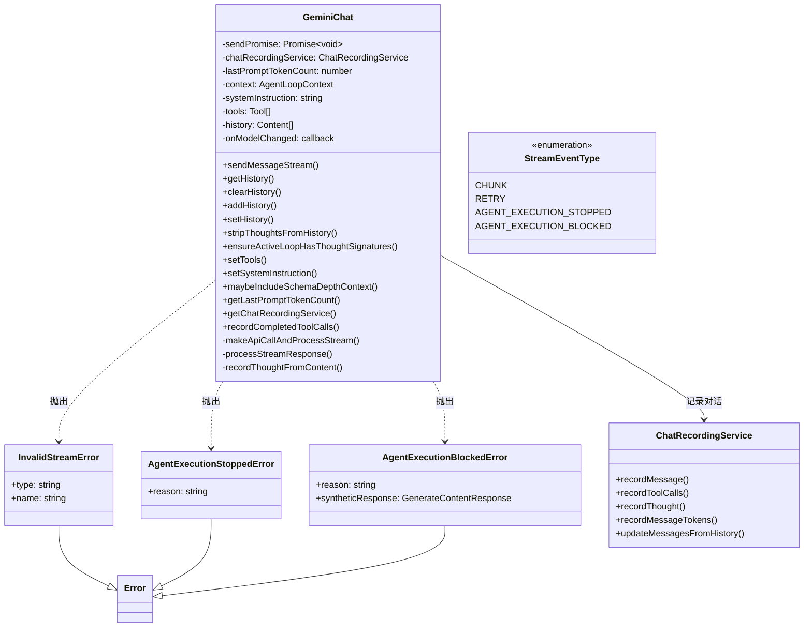
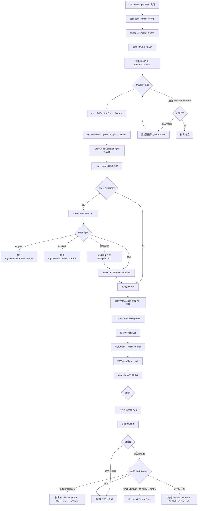

# geminiChat.ts

> 封装 Gemini API 的聊天会话管理类，负责维护对话历史、流式消息传输、流重试与验证、Hook 集成及聊天录制。

## 概述

`geminiChat.ts` 是对 Google `@google/genai` SDK 中 `chats.ts` 的自定义实现（文件头注释明确说明了这一点），目的是解决原始 SDK 中函数响应（function responses）不被视为"有效"响应的关键 Bug。

该文件定义了 `GeminiChat` 类以及围绕流式传输的多个辅助类型和验证函数。在模块架构中，`GeminiChat` 处于 `GeminiClient`（上层客户端）和 `ContentGenerator`（底层 API 调用）之间，职责包括：

- **对话历史管理**：维护完整的 user/model 交替历史，支持"综合历史"和"筛选历史"两种视图
- **流式消息传输**：包装 API 的流式响应，加入重试逻辑和内容验证
- **Hook 集成**：在 API 调用前后触发 BeforeModel/AfterModel/BeforeToolSelection Hook
- **聊天录制**：通过 `ChatRecordingService` 记录所有消息、思考和工具调用
- **Thought Signature 管理**：确保活动循环中的 function call 带有有效的 thoughtSignature

## 架构图





## 主要导出

### 枚举 `StreamEventType`

流式事件类型枚举，用于 `sendMessageStream` 返回的事件流。

```typescript
export enum StreamEventType {
  CHUNK = 'chunk',                           // 正常的 API 内容块
  RETRY = 'retry',                           // 重试信号，UI 应丢弃之前的部分内容
  AGENT_EXECUTION_STOPPED = 'agent_execution_stopped',  // Hook 停止执行
  AGENT_EXECUTION_BLOCKED = 'agent_execution_blocked',  // Hook 阻止执行
}
```

### 类型 `StreamEvent`

流式事件的联合类型：

```typescript
export type StreamEvent =
  | { type: StreamEventType.CHUNK; value: GenerateContentResponse }
  | { type: StreamEventType.RETRY }
  | { type: StreamEventType.AGENT_EXECUTION_STOPPED; reason: string }
  | { type: StreamEventType.AGENT_EXECUTION_BLOCKED; reason: string };
```

### 常量 `SYNTHETIC_THOUGHT_SIGNATURE`

```typescript
export const SYNTHETIC_THOUGHT_SIGNATURE = 'skip_thought_signature_validator';
```

合成的 thought signature 值，当活动循环中的 function call 缺少 `thoughtSignature` 属性时使用此值填充，以避免 API 返回 400 错误。

### 类 `InvalidStreamError`

自定义错误类，表示流完成但内容无效，应触发重试。

```typescript
export class InvalidStreamError extends Error {
  readonly type:
    | 'NO_FINISH_REASON'
    | 'NO_RESPONSE_TEXT'
    | 'MALFORMED_FUNCTION_CALL'
    | 'UNEXPECTED_TOOL_CALL';

  constructor(message: string, type: ...)
}
```

**错误类型说明：**
- `NO_FINISH_REASON`：流结束但没有 finishReason
- `NO_RESPONSE_TEXT`：流结束但响应文本为空（可能只有 thoughts）
- `MALFORMED_FUNCTION_CALL`：模型生成了格式错误的函数调用
- `UNEXPECTED_TOOL_CALL`：模型生成了意外的工具调用

### 类 `AgentExecutionStoppedError`

```typescript
export class AgentExecutionStoppedError extends Error {
  constructor(public reason: string)
}
```

Hook 系统停止 Agent 执行时抛出的自定义错误。

### 类 `AgentExecutionBlockedError`

```typescript
export class AgentExecutionBlockedError extends Error {
  constructor(
    public reason: string,
    public syntheticResponse?: GenerateContentResponse,
  )
}
```

Hook 系统阻止 Agent 执行时抛出的自定义错误，可携带合成响应。

### 类 `GeminiChat`

核心聊天会话管理类。

#### 构造函数

```typescript
constructor(
  private readonly context: AgentLoopContext,  // Agent 循环上下文
  private systemInstruction: string = '',     // 系统指令
  private tools: Tool[] = [],                 // 工具声明列表
  private history: Content[] = [],            // 初始历史记录
  resumedSessionData?: ResumedSessionData,    // 恢复会话数据
  private readonly onModelChanged?: (modelId: string) => Promise<Tool[]>, // 模型变更回调
  kind: 'main' | 'subagent' = 'main',       // 会话类型
)
```

- 验证历史记录中的角色合法性
- 创建 `ChatRecordingService` 并初始化
- 估算初始 Token 计数

#### 公共方法

##### `sendMessageStream(modelConfigKey, message, prompt_id, signal, role, displayContent?): Promise<AsyncGenerator<StreamEvent>>`

核心流式消息发送方法。

```typescript
async sendMessageStream(
  modelConfigKey: ModelConfigKey,
  message: PartListUnion,
  prompt_id: string,
  signal: AbortSignal,
  role: LlmRole,
  displayContent?: PartListUnion,
): Promise<AsyncGenerator<StreamEvent>>
```

**关键特性：**
- **串行化保障**：通过 `sendPromise` 确保同一时间只有一个消息在处理
- **用户消息录制**：非函数响应的用户消息会被录制（包含可选的 displayContent）
- **多层重试**：
  - 连接阶段错误由 `retryWithBackoff` 处理
  - 流式传输阶段错误由内置的中流重试逻辑处理（最多 4 次尝试）
- **错误分类**：区分连接阶段和流式阶段的错误，分别使用不同的重试策略

##### `getHistory(curated?: boolean): readonly Content[]`

获取聊天历史记录。

```typescript
getHistory(curated: boolean = false): readonly Content[]
```

- `curated = false`（默认）：返回**综合历史**——包含所有轮次（含无效或空的模型输出）
- `curated = true`：返回**筛选历史**——仅包含有效轮次，用于后续 API 请求

##### `clearHistory(): void`
清空聊天历史。

##### `addHistory(content: Content): void`
向历史末尾追加一条内容。

##### `setHistory(history: readonly Content[]): void`
替换整个历史记录，同时重新估算 Token 计数并更新录制服务。

##### `stripThoughtsFromHistory(): void`
从历史记录中移除所有 `thoughtSignature` 属性。用于切换到不支持 thought 的模型时清理历史。

##### `ensureActiveLoopHasThoughtSignatures(requestContents: readonly Content[]): readonly Content[]`
确保活动循环（从最后一条用户文本消息开始）中每个 model 轮次的第一个 function call 都带有 `thoughtSignature`。

**算法：**
1. 从历史末尾向前查找最后一条包含文本的用户消息，确定活动循环起始位置
2. 遍历起始位置之后的所有 model 消息
3. 对每个 model 消息，检查其第一个 function call part
4. 如果没有 `thoughtSignature`，用 `SYNTHETIC_THOUGHT_SIGNATURE` 填充

##### `setTools(tools: Tool[]): void`
替换工具声明列表。

##### `setSystemInstruction(sysInstr: string): void`
更新系统指令。

##### `maybeIncludeSchemaDepthContext(error: StructuredError): Promise<void>`
检查错误是否与 schema 深度或无效参数相关，若是则检测注册工具中的循环 schema 并在错误消息中追加诊断信息。

##### `getLastPromptTokenCount(): number`
获取最后一次请求的 prompt Token 计数。

##### `getChatRecordingService(): ChatRecordingService`
获取聊天录制服务实例。

##### `recordCompletedToolCalls(model: string, toolCalls: CompletedToolCall[]): void`
记录已完成的工具调用及其完整元数据。

```typescript
recordCompletedToolCalls(
  model: string,
  toolCalls: CompletedToolCall[],
): void
```

记录的信息包括：调用 ID、工具名称、参数、结果、状态、时间戳、结果显示内容、调用描述。

#### 私有方法

##### `makeApiCallAndProcessStream(modelConfigKey, requestContents, prompt_id, abortSignal, role): Promise<AsyncGenerator<GenerateContentResponse>>`

执行实际的 API 调用并返回处理后的响应流。

**完整流程：**
1. 调用 `ensureActiveLoopHasThoughtSignatures` 处理 thought signatures
2. 通过 `applyModelSelection` 应用可用性策略选择最终模型
3. 在 `apiCall` 闭包中：
   - 解析模型（`resolveModel`），检测是否有 fallback 模型变更
   - 触发 `BeforeModel` Hook——可能停止/阻止执行或修改配置和内容
   - 触发 `BeforeToolSelection` Hook——可能修改工具配置
   - 调用 `onModelChanged` 回调更新工具声明
   - 通过 `ContentGenerator.generateContentStream` 发起流式请求
4. 使用 `retryWithBackoff` 包装整个 API 调用以处理连接阶段错误
5. 将响应流传递给 `processStreamResponse` 进行后处理

##### `processStreamResponse(model, streamResponse, originalRequest): AsyncGenerator<GenerateContentResponse>`

处理流式响应的核心逻辑。

**详细流程：**
1. 逐 chunk 遍历响应流
2. 提取 `finishReason`
3. 收集有效的 model 响应 parts（过滤 thought parts 但记录 thoughts）
4. 记录 Token 使用量
5. 触发 `AfterModel` Hook——可能停止/阻止执行或修改响应
6. 流结束后合并连续的文本 parts
7. 录制模型响应文本
8. **流验证**：
   - 有工具调用时视为成功
   - 无工具调用时检查 finishReason 和响应文本
   - 缺少 finishReason、格式错误的函数调用、空响应文本均抛出 `InvalidStreamError`
9. 将合并后的响应追加到历史记录

##### `recordThoughtFromContent(content: Content): void`
从内容中提取并录制思考。使用正则匹配 `**subject**` 格式提取主题，剩余部分作为描述。

### 函数 `isValidResponse(response: GenerateContentResponse): boolean`

验证 API 响应是否有效：
- 必须有 candidates 且非空
- 第一个 candidate 必须有 content
- content 必须通过 `isValidContent` 验证

### 函数 `isValidNonThoughtTextPart(part: Part): boolean`

```typescript
export function isValidNonThoughtTextPart(part: Part): boolean
```

判断 part 是否为有效的非思考文本：必须有 `text` 属性、不是 `thought`、不包含 functionCall/functionResponse/inlineData/fileData。

### 函数 `isSchemaDepthError(errorMessage: string): boolean`

```typescript
export function isSchemaDepthError(errorMessage: string): boolean
```

检查错误消息是否包含 "maximum schema depth exceeded"。用于诊断循环 schema 问题。

### 函数 `isInvalidArgumentError(errorMessage: string): boolean`

```typescript
export function isInvalidArgumentError(errorMessage: string): boolean
```

检查错误消息是否包含 "Request contains an invalid argument"。

## 核心逻辑

### 消息串行化机制

`GeminiChat` 使用 `sendPromise` 实现消息的严格串行化：

```
消息1 → await sendPromise → 处理中... → resolve → 消息2 → await sendPromise → ...
```

每次调用 `sendMessageStream` 时：
1. 先 `await this.sendPromise` 等待前一条消息处理完毕
2. 创建新的 Promise 和对应的 resolver
3. 将新 Promise 赋给 `sendPromise`
4. 在 `finally` 块中调用 resolver 释放锁

### 中流重试策略

流式传输阶段的重试独立于连接阶段的重试：

| 重试参数 | 值 |
|---------|---|
| 最大尝试次数 | 4（1 次初始 + 3 次重试） |
| 初始延迟 | 500ms |
| 延迟策略 | 线性退避：`500ms * (attempt + 1)` |

**可重试的错误类型：**
- `InvalidStreamError`（仅限 Gemini 2 系列模型）
- 瞬时网络错误（SSL 错误、API 断连等）

**不可重试的情况：**
- 信号已中止
- 连接阶段错误（已被 `retryWithBackoff` 穷尽）
- 超过中流最大尝试次数

### 综合历史 vs 筛选历史

`GeminiChat` 维护的 `history` 是**综合历史**，包含所有轮次（含无效输出）。`extractCuratedHistory` 函数从中提取**筛选历史**：

**算法：**
1. 遍历历史记录
2. 用户消息直接保留
3. 模型消息分组检查——如果连续的模型消息中有任何一条无效，则**丢弃整组**
4. 返回筛选后的历史

这确保了发送给 API 的历史始终有效，同时保留完整记录用于调试和录制。

### Thought Signature 补全

Gemini API 的 preview 模型要求活动循环中 function call 必须带有 `thoughtSignature`。`ensureActiveLoopHasThoughtSignatures` 的策略是：

1. 找到"活动循环"的起点——最后一条包含文本内容的用户消息
2. 只处理该起点之后的 model 消息
3. 对每条 model 消息，只检查**第一个** function call part
4. 使用浅拷贝避免修改原始历史

### Hook 集成架构

`GeminiChat` 集成了三层 Hook：

1. **BeforeModel Hook**（`fireBeforeModelEvent`）：
   - 可停止执行（抛出 `AgentExecutionStoppedError`）
   - 可阻止执行并提供合成响应（抛出 `AgentExecutionBlockedError`）
   - 可修改请求配置和内容

2. **BeforeToolSelection Hook**（`fireBeforeToolSelectionEvent`）：
   - 可修改工具配置（`toolConfig`）
   - 可替换工具列表

3. **AfterModel Hook**（`fireAfterModelEvent`）：
   - 对每个 chunk 触发
   - 可停止或阻止执行
   - 可修改响应

### 流验证逻辑

流结束后的验证规则：

```
有工具调用？ → 有效（不检查其他条件）
无工具调用：
  └─ 无 finishReason → InvalidStreamError (NO_FINISH_REASON)
  └─ finishReason = MALFORMED_FUNCTION_CALL → InvalidStreamError
  └─ finishReason = UNEXPECTED_TOOL_CALL → InvalidStreamError
  └─ 无响应文本 → InvalidStreamError (NO_RESPONSE_TEXT)
  └─ 其他 → 有效
```

## 内部依赖

| 模块路径 | 导入项 | 用途 |
|---------|--------|------|
| `../code_assist/converter.js` | `toParts` | 将内容转换为 Part 数组 |
| `../utils/retry.js` | `retryWithBackoff`, `isRetryableError`, `getRetryErrorType` | 重试机制与错误分类 |
| `../utils/googleQuotaErrors.js` | `ValidationRequiredError` | 验证所需错误类型 |
| `../config/models.js` | `resolveModel`, `isGemini2Model`, `supportsModernFeatures` | 模型解析与特性检测 |
| `../tools/tools.js` | `hasCycleInSchema` | Schema 循环检测 |
| `./turn.js` | `StructuredError` | 结构化错误类型 |
| `./coreToolScheduler.js` | `CompletedToolCall` | 已完成工具调用类型 |
| `../telemetry/loggers.js` | `logContentRetry`, `logContentRetryFailure`, `logNetworkRetryAttempt` | 遥测日志函数 |
| `../services/chatRecordingService.js` | `ChatRecordingService`, `ResumedSessionData` | 聊天录制服务 |
| `../telemetry/types.js` | `ContentRetryEvent`, `ContentRetryFailureEvent`, `NetworkRetryAttemptEvent`, `LlmRole` | 遥测事件类型 |
| `../fallback/handler.js` | `handleFallback` | 模型降级处理 |
| `../utils/messageInspectors.js` | `isFunctionResponse` | 检测消息是否为函数响应 |
| `./geminiRequest.js` | `partListUnionToString` | 消息部分转字符串 |
| `../services/modelConfigService.js` | `ModelConfigKey` | 模型配置键类型 |
| `../utils/tokenCalculation.js` | `estimateTokenCountSync` | 同步 Token 估算 |
| `../availability/policyHelpers.js` | `applyModelSelection`, `createAvailabilityContextProvider` | 可用性策略辅助 |
| `../utils/events.js` | `coreEvents` | 核心事件系统 |
| `../config/agent-loop-context.js` | `AgentLoopContext` | Agent 循环上下文类型 |

## 外部依赖

| npm 包 | 导入项 | 用途 |
|--------|--------|------|
| `@google/genai` | `createUserContent`, `FinishReason`, `GenerateContentResponse`, `Content`, `Part`, `Tool`, `PartListUnion`, `GenerateContentConfig`, `GenerateContentParameters` | Google Generative AI SDK，提供模型交互的基础类型、枚举和工具函数 |
