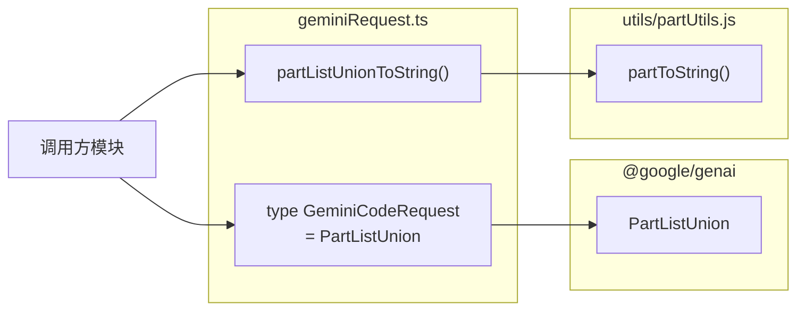

# geminiRequest.ts

> 定义 Gemini API 请求的类型别名，并提供将请求内容转换为字符串的工具函数。

## 概述

`geminiRequest.ts` 是一个轻量的类型定义和工具函数文件。它定义了 `GeminiCodeRequest` 类型（当前是 `PartListUnion` 的别名），并提供了 `partListUnionToString()` 函数将 API 请求内容序列化为人类可读的字符串。

该文件为 Gemini API 请求提供了一层抽象。虽然当前 `GeminiCodeRequest` 仅是 `PartListUnion` 的直接别名，但这种设计为将来扩展请求结构（如添加元数据、配置参数等）预留了空间。

## 架构图



## 主要导出

### 类型

#### `GeminiCodeRequest`

```typescript
export type GeminiCodeRequest = PartListUnion;
```

**用途：** 表示发送给 Gemini API 的请求内容。当前是 `PartListUnion` 的类型别名。

`PartListUnion` 是 `@google/genai` SDK 中的联合类型，可以是：
- 单个 `string`
- 单个 `Part` 对象
- `Part[]` 数组

每个 `Part` 可包含文本（text）、内联数据（inline_data）、函数调用（function_call）、函数响应（function_response）等多种内容类型。

**设计说明：** 类型注释中提到"当前是 PartListUnion 的别名，将来可扩展以包含其他请求参数"。

### 函数

#### `partListUnionToString()`

```typescript
export function partListUnionToString(value: PartListUnion): string
```

**用途：** 将 `PartListUnion` 类型的值转换为人类可读的字符串表示。

**参数：**
- `value` - `PartListUnion` 类型的请求内容

**返回值：** 字符串表示

**实现：** 委托给 `partToString(value, { verbose: true })`，使用详细模式（verbose）输出。

## 核心逻辑

该文件的逻辑非常简单：

1. **类型别名：** `GeminiCodeRequest` 提供了一个语义化的类型名称，使代码中的意图更清晰（"这是一个 Gemini Code 请求"而不是"这是一个 PartListUnion"）
2. **字符串转换：** `partListUnionToString()` 使用 verbose 模式调用 `partToString()`，verbose 模式会输出更完整的内容表示（包括非文本部分的描述），适合日志记录和调试

## 内部依赖

| 模块路径 | 导入内容 | 用途 |
|---------|---------|------|
| `../utils/partUtils.js` | `partToString` | Part 内容到字符串的转换工具 |

## 外部依赖

| npm 包 | 导入内容 | 用途 |
|--------|---------|------|
| `@google/genai` | `PartListUnion` (type) | Google GenAI SDK 的 Part 联合类型定义 |
