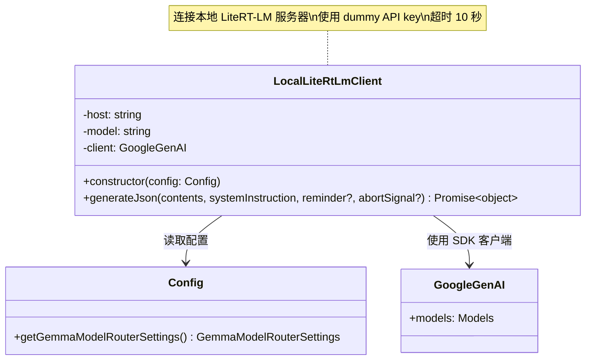
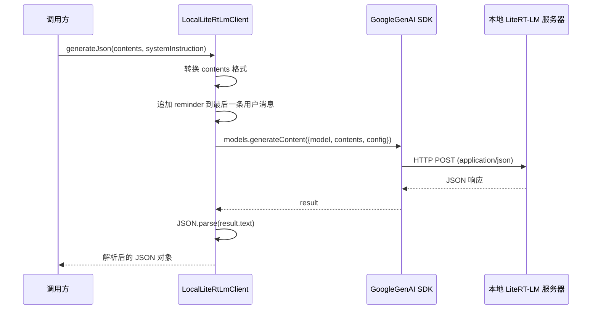

# localLiteRtLmClient.ts

> 本地 LiteRT-LM 服务器的轻量级客户端，用于向本地运行的 Gemini 兼容 API 发送非流式请求并获取 JSON 响应。

## 概述

`localLiteRtLmClient.ts` 实现了 `LocalLiteRtLmClient` 类，用于与本地运行的 LiteRT-LM（Lite Runtime Language Model）服务器通信。LiteRT-LM 是一个提供 Gemini 兼容 API 的本地推理服务器，通常用于运行 Gemma 等本地模型。

该客户端专注于单次、非流式的 JSON 响应请求，主要用于模型路由分类器（Model Router Classifier）场景——通过本地小模型快速判断用户请求应路由到哪个远程模型（如 Pro 或 Flash）。

## 架构图





## 主要导出

### 类

#### `LocalLiteRtLmClient`

```typescript
export class LocalLiteRtLmClient {
  constructor(config: Config)
}
```

**用途：** 与本地 LiteRT-LM 服务器通信的客户端。从配置中读取 Gemma Model Router 设置来确定服务器地址和模型名称。

**构造函数参数：**
- `config` - `Config` 实例，用于获取 `gemmaModelRouterSettings.classifier` 的 `host` 和 `model`

**私有属性：**
- `host: string` - LiteRT-LM 服务器地址
- `model: string` - 要使用的本地模型名称
- `client: GoogleGenAI` - Google GenAI SDK 客户端实例

**方法：**

##### `generateJson()`

```typescript
async generateJson(
  contents: Content[],
  systemInstruction: string,
  reminder?: string,
  abortSignal?: AbortSignal,
): Promise<object>
```

**用途：** 向本地模型发送提示并期望获得 JSON 对象响应。

**参数：**
- `contents` - 对话历史和当前提示（`Content[]` 格式）
- `systemInstruction` - 系统提示
- `reminder` - 可选，追加到最后一条用户消息末尾的提醒文本
- `abortSignal` - 可选，用于取消请求的 AbortSignal

**返回值：** 解析后的 JSON 对象

## 核心逻辑

### 初始化配置

构造函数从 `Config` 的 Gemma Model Router 设置中提取分类器的 `host` 和 `model`，然后创建 `GoogleGenAI` 客户端。关键配置：

- **API Key：** 设置为 `'no-api-key-needed'`，因为本地 LiteRT-LM 服务器不需要认证，但 SDK 要求必须提供 API Key
- **baseUrl：** 指向本地服务器地址
- **timeout：** 固定为 10000ms（10 秒），防止错误端口导致的长时间 TCP 超时

### 内容格式转换

`generateJson()` 方法在发送请求前对 `contents` 进行格式转换，仅保留 `role` 和每个 `part` 的 `text` 字段，过滤掉其他多模态数据（如图片、音频等），因为本地模型通常只处理文本。

### Reminder 注入

如果提供了 `reminder` 参数，会将其追加到最后一条用户消息的第一个 text part 末尾（用 `\n\n` 分隔），用于在请求中加入额外的分类提示。

### 请求配置

- `responseMimeType: 'application/json'` - 强制模型返回 JSON 格式
- `temperature: 0` - 确保确定性输出，适合分类任务
- `maxOutputTokens: 256` - 限制输出长度，分类结果通常很短

### 错误处理

可能出现的错误场景：
1. **端口错误：** TCP 超时（10 秒后触发）
2. **服务器未启动：** 立即连接拒绝
3. **模型不支持/未下载：** 服务器立即返回错误
4. **上下文窗口超限：** 服务器立即返回错误
5. **响应无文本：** 抛出自定义错误

所有错误通过 `debugLogger.error` 记录后重新抛出。

## 内部依赖

| 模块路径 | 导入内容 | 用途 |
|---------|---------|------|
| `../config/config.js` | `Config` | 配置类，获取 Gemma Router 设置 |
| `../utils/debugLogger.js` | `debugLogger` | 调试日志记录器 |

## 外部依赖

| npm 包 | 导入内容 | 用途 |
|--------|---------|------|
| `@google/genai` | `GoogleGenAI`, `Content` | Google GenAI SDK 客户端和内容类型 |
