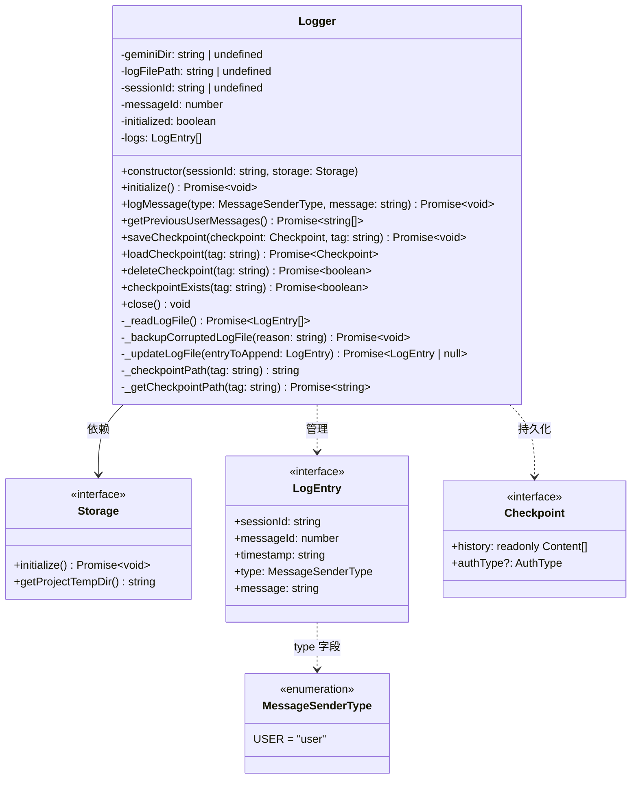

# logger.ts

> 提供会话日志记录与检查点（checkpoint）持久化管理功能，支持多会话并发写入的日志系统。

## 概述

`logger.ts` 是 gemini-cli 核心模块中负责日志持久化和会话状态检查点管理的文件。它定义了 `Logger` 类，以及围绕日志记录和检查点操作所需的辅助类型和工具函数。

**设计动机：** 在 CLI 代理的交互过程中，需要持久化记录用户消息以便后续回溯，同时需要保存和恢复对话历史状态（检查点），以支持会话恢复、上下文压缩等场景。`Logger` 类封装了这些持久化操作，处理了文件系统读写的并发安全、损坏恢复、向后兼容等工程细节。

**模块角色：** `Logger` 在系统中扮演持久化层的角色，被上层的 `ContentGenerator`（内容生成器）等组件持有和使用。它依赖 `Storage` 服务获取项目临时目录路径，将日志和检查点以 JSON 文件形式存储在本地文件系统中。

## 架构图

```mermaid
flowchart TD
    subgraph 初始化流程
        A[Logger.initialize] --> B[storage.initialize]
        B --> C[获取 geminiDir]
        C --> D[创建目录 recursive]
        D --> E{日志文件存在?}
        E -->|否| F[创建空 JSON 数组文件]
        E -->|是| G[读取现有日志]
        F --> G
        G --> H[计算当前 session 的 messageId]
        H --> I[initialized = true]
    end

    subgraph 日志写入流程
        J[logMessage] --> K{已初始化?}
        K -->|否| L[静默返回]
        K -->|是| M[构建 LogEntry]
        M --> N[_updateLogFile]
        N --> O[从磁盘重新读取日志]
        O --> P[重新计算 messageId]
        P --> Q{检查重复?}
        Q -->|重复| R[跳过, 返回 null]
        Q -->|不重复| S[追加并写入文件]
        S --> T[更新内存缓存]
    end

    subgraph 检查点流程
        U[saveCheckpoint] --> V[编码 tag 名称]
        V --> W[JSON 序列化并写入文件]

        X[loadCheckpoint] --> Y[_getCheckpointPath]
        Y --> Z{新路径存在?}
        Z -->|是| AA[使用新路径]
        Z -->|否| AB{旧路径存在?}
        AB -->|是| AC[使用旧路径 - 向后兼容]
        AB -->|否| AD[返回新路径作为规范路径]
        AA --> AE[读取并解析 JSON]
        AC --> AE
        AE --> AF{是数组格式?}
        AF -->|是| AG[包装为 Checkpoint - 遗留格式]
        AF -->|否| AH{是对象且有 history?}
        AH -->|是| AI[直接返回 Checkpoint]
        AH -->|否| AJ[返回空 Checkpoint]
    end
```





## 主要导出

### 枚举（Enums）

#### `MessageSenderType`
```typescript
export enum MessageSenderType {
  USER = 'user',
}
```
消息发送者类型枚举。目前仅定义了 `USER` 类型，用于标识用户发送的消息。

### 接口（Interfaces）

#### `LogEntry`
```typescript
export interface LogEntry {
  sessionId: string;
  messageId: number;
  timestamp: string;
  type: MessageSenderType;
  message: string;
}
```
单条日志记录的结构：
- `sessionId` — 所属会话的唯一标识
- `messageId` — 在该会话内递增的消息编号
- `timestamp` — ISO 8601 格式的时间戳
- `type` — 消息发送者类型
- `message` — 消息内容

#### `Checkpoint`
```typescript
export interface Checkpoint {
  history: readonly Content[];
  authType?: AuthType;
}
```
检查点结构，用于保存和恢复会话状态：
- `history` — 只读的对话历史内容数组（`Content` 来自 `@google/genai`）
- `authType` — 可选的认证类型信息

### 函数（Functions）

#### `encodeTagName`
```typescript
export function encodeTagName(str: string): string
```
将字符串编码为文件名安全的格式。内部使用 `encodeURIComponent` 对特殊字符进行百分号编码，确保生成的字符串可以安全地用作文件名的一部分。

**用途：** 将检查点 tag 名称编码后用于构建文件路径，避免特殊字符导致文件系统问题。

#### `decodeTagName`
```typescript
export function decodeTagName(str: string): string
```
将 `encodeTagName` 编码后的字符串解码回原始字符串。内部使用 `decodeURIComponent`，并提供了一个兼容旧编码格式的回退方案：当 `decodeURIComponent` 抛出异常时，使用正则表达式手动解析 `%XX` 格式的编码。

### 类（Classes）

#### `Logger`
```typescript
export class Logger {
  constructor(sessionId: string, storage: Storage);

  // 生命周期
  async initialize(): Promise<void>;
  close(): void;

  // 日志操作
  async logMessage(type: MessageSenderType, message: string): Promise<void>;
  async getPreviousUserMessages(): Promise<string[]>;

  // 检查点操作
  async saveCheckpoint(checkpoint: Checkpoint, tag: string): Promise<void>;
  async loadCheckpoint(tag: string): Promise<Checkpoint>;
  async deleteCheckpoint(tag: string): Promise<boolean>;
  async checkpointExists(tag: string): Promise<boolean>;
}
```

`Logger` 是本文件的核心类，提供日志记录和检查点管理的完整功能。

**构造参数：**
- `sessionId: string` — 当前会话的唯一标识
- `storage: Storage` — 存储服务实例，提供项目临时目录路径

## 核心逻辑

### 初始化流程 (`initialize`)

1. 调用 `storage.initialize()` 初始化存储服务
2. 获取项目临时目录路径 `geminiDir`
3. 拼接日志文件路径：`<geminiDir>/logs.json`
4. 递归创建目录（`mkdir -p` 语义）
5. 检查日志文件是否已存在
6. 调用 `_readLogFile()` 读取现有日志
7. 如果文件不存在且日志为空，写入空 JSON 数组 `[]`
8. 过滤出当前 session 的日志，计算下一个 `messageId`
9. 设置 `initialized = true`

该流程是幂等的——重复调用不会产生副作用。

### 日志写入流程 (`logMessage` → `_updateLogFile`)

日志写入采用了 **读取-验证-追加-写入** 的模式，确保并发安全：

1. **`logMessage`** 构建 `LogEntry` 对象（使用实例内部的 `messageId`）
2. **`_updateLogFile`** 执行实际的磁盘操作：
   - 重新从磁盘读取当前日志文件（获取最新状态）
   - 根据磁盘上同 session 的最大 `messageId` 重新计算即将写入的 `messageId`
   - 检查是否存在完全相同的条目（基于 sessionId + messageId + timestamp + message），避免重复写入
   - 如果不重复，追加条目并将完整数组写回文件
   - 更新内存缓存 `this.logs`
3. 写入成功后，`logMessage` 更新实例的 `messageId` 为写入值 + 1

**设计亮点：** 每次写入前都重新读取磁盘，而非依赖内存缓存，这使得多个进程/实例可以安全地共享同一个日志文件。

### 损坏文件恢复 (`_readLogFile` + `_backupCorruptedLogFile`)

读取日志文件时的容错处理：
- **文件不存在**（`ENOENT`）：返回空数组
- **JSON 解析失败**（`SyntaxError`）：备份损坏文件（重命名为 `.invalid_json.<timestamp>.bak`），返回空数组
- **非数组格式**：备份损坏文件（重命名为 `.malformed_array.<timestamp>.bak`），返回空数组
- **字段验证**：过滤掉字段类型不匹配的条目，确保类型安全

### 检查点持久化

#### 路径策略（新旧兼容）

检查点文件采用编码后的 tag 名称作为文件名的一部分。为了向后兼容旧版本未编码的文件名，系统实现了双路径查找策略：

1. **`_checkpointPath(tag)`**：生成新格式路径 `<geminiDir>/checkpoint-<encodedTag>.json`
2. **`_getCheckpointPath(tag)`**：
   - 先检查新编码路径是否存在
   - 如不存在，回退检查旧的原始路径 `<geminiDir>/checkpoint-<rawTag>.json`
   - 如都不存在，返回新编码路径作为规范路径

#### 保存检查点 (`saveCheckpoint`)
始终使用新编码路径写入，将 `Checkpoint` 对象 JSON 序列化后存储。

#### 加载检查点 (`loadCheckpoint`)
使用双路径策略查找文件，并兼容两种存储格式：
- **遗留格式**：纯 `Content[]` 数组 → 包装为 `{ history: [...] }`
- **新格式**：`{ history: [...], authType?: ... }` 对象 → 直接返回
- 文件不存在时返回空检查点 `{ history: [] }`

#### 删除检查点 (`deleteCheckpoint`)
同时尝试删除新编码路径和旧原始路径的文件，确保不留残余。返回是否成功删除了至少一个文件。

#### 检查存在性 (`checkpointExists`)
通过 `_getCheckpointPath` 获取路径后再次验证文件存在性（因为该方法在两种路径都不存在时仍会返回规范路径）。

### 获取历史用户消息 (`getPreviousUserMessages`)

过滤日志中所有 `USER` 类型的条目，按时间戳降序排序（最新的在前），返回消息内容字符串数组。

### 关闭 (`close`)

重置所有实例状态：`initialized`、`logFilePath`、`logs`、`sessionId`、`messageId`，释放内存缓存。

## 内部依赖

| 模块路径 | 导入项 | 用途 |
|----------|--------|------|
| `./contentGenerator.js` | `AuthType`（类型导入） | 检查点中保存的认证类型 |
| `../config/storage.js` | `Storage`（类型导入） | 存储服务接口，提供项目临时目录路径 |
| `../utils/debugLogger.js` | `debugLogger` | 调试级别日志输出 |
| `../utils/events.js` | `coreEvents` | 核心事件发射器，用于发送反馈事件 |

## 外部依赖

| npm 包 / 内置模块 | 导入项 | 用途 |
|-------------------|--------|------|
| `node:path` | `path`（默认导入） | 文件路径拼接 |
| `node:fs` | `promises as fs` | 文件系统异步操作（读写文件、创建目录、删除文件、重命名等） |
| `@google/genai` | `Content`（类型导入） | Google Generative AI SDK 中的对话内容类型，用于检查点中的 history 字段 |
