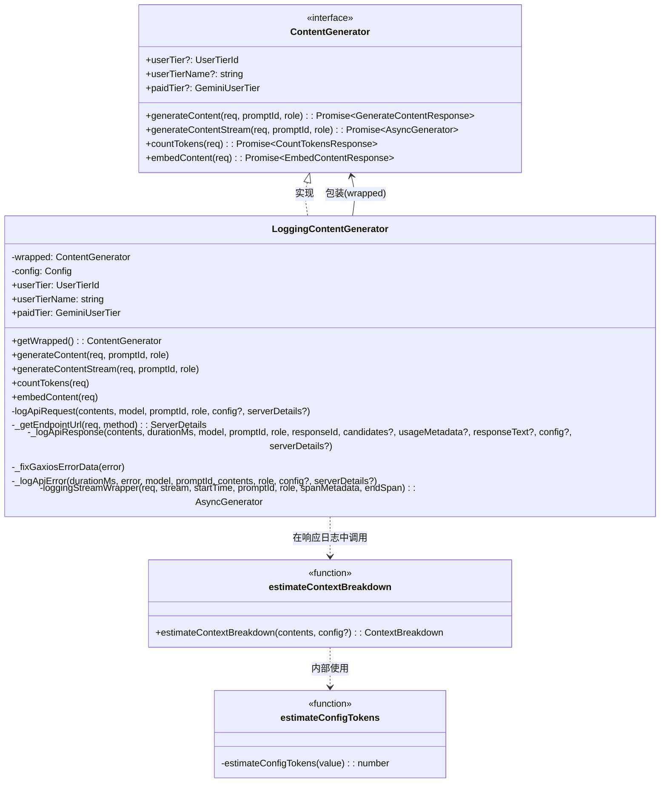
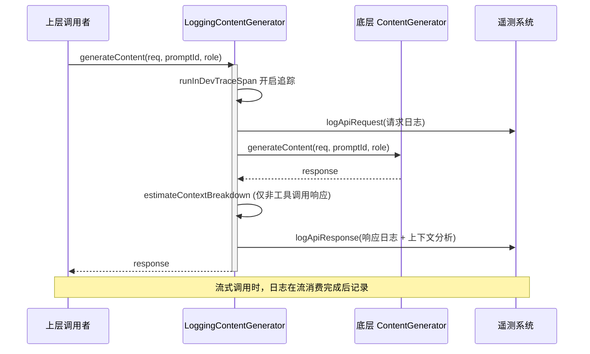

# loggingContentGenerator.ts

> 内容生成器的日志装饰器，为所有 LLM API 调用添加遥测日志记录和追踪 span。

## 概述

`loggingContentGenerator.ts` 实现了 `ContentGenerator` 接口的**装饰器模式**包装类 `LoggingContentGenerator`，以及一个独立的上下文分析辅助函数 `estimateContextBreakdown`。

**设计动机：**
- 所有 LLM API 调用（`generateContent`、`generateContentStream`、`countTokens`、`embedContent`）都需要统一的遥测日志记录，包括请求日志、响应日志、错误日志
- 需要记录 API 调用的耗时、token 使用量、模型版本等关键指标
- 需要将日志逻辑与实际的 API 调用逻辑解耦，不侵入底层实现
- 需要对上下文窗口的组成进行分类估算（系统指令、工具定义、历史消息、工具调用、MCP 服务器），以便分析上下文使用情况

**在模块中的角色：**
在 `contentGenerator.ts` 的工厂函数 `createContentGenerator` 中，所有实际的内容生成器（`GoogleGenAI.models`、`CodeAssistServer`、`FakeContentGenerator`）都会被 `LoggingContentGenerator` 包装后返回。因此，它是 API 调用链路上的一个透明中间层，对上层调用者不可见。

## 架构图





## 主要导出

### `function estimateContextBreakdown(contents, config?): ContextBreakdown`

```typescript
export function estimateContextBreakdown(
  contents: Content[],
  config?: GenerateContentConfig,
): ContextBreakdown
```

估算上下文窗口的组成分布，用于遥测分析。返回的各字段互不重叠，总和近似于总上下文大小。

**参数：**
- `contents: Content[]` - 对话内容数组
- `config?: GenerateContentConfig` - 生成配置（包含系统指令和工具定义）

**返回值 `ContextBreakdown`：**
| 字段 | 类型 | 说明 |
|------|------|------|
| `system_instructions` | `number` | 系统指令占用的 token 数 |
| `tool_definitions` | `number` | 非 MCP 工具定义占用的 token 数 |
| `history` | `number` | 对话历史（排除工具调用/响应部分）占用的 token 数 |
| `tool_calls` | `Record<string, number>` | 各非 MCP 工具的调用+响应 token 数（按工具名分组） |
| `mcp_servers` | `number` | MCP 工具定义 + MCP 工具调用/响应占用的 token 数总和 |

**分类策略：**
- 系统指令和工具定义通过 `estimateConfigTokens`（JSON.stringify 后除以 4）粗略估算
- 对话内容中的各部分(Part)通过 `estimateTokenCountSync` 精确估算
- `functionCall` 和 `functionResponse` 类型的 Part 根据工具名是否为 MCP 工具分别归入 `tool_calls` 或 `mcp_servers`
- 其他类型的 Part 归入 `history`
- MCP 工具的调用/响应不计入 `tool_calls`，仅计入 `mcp_servers`，避免遥测数据泄露 MCP 服务器名称

### `class LoggingContentGenerator`

```typescript
export class LoggingContentGenerator implements ContentGenerator
```

`ContentGenerator` 接口的日志装饰器实现。

**构造函数：**
```typescript
constructor(
  private readonly wrapped: ContentGenerator,
  private readonly config: Config,
)
```
- `wrapped` - 被包装的实际内容生成器实例
- `config` - 全局配置对象，用于获取认证类型、代理设置等

#### 公共方法

##### `getWrapped(): ContentGenerator`
返回被包装的原始 `ContentGenerator` 实例。

##### `get userTier: UserTierId | undefined`
透传被包装生成器的用户层级 ID。

##### `get userTierName: string | undefined`
透传被包装生成器的用户层级名称。

##### `get paidTier: GeminiUserTier | undefined`
透传被包装生成器的付费层级信息。

##### `generateContent(req, userPromptId, role): Promise<GenerateContentResponse>`
```typescript
async generateContent(
  req: GenerateContentParameters,
  userPromptId: string,
  role: LlmRole,
): Promise<GenerateContentResponse>
```
非流式内容生成。在实际调用前后记录请求日志、响应日志或错误日志，并嵌套在开发追踪 span 中。成功后触发用户配额刷新。

##### `generateContentStream(req, userPromptId, role): Promise<AsyncGenerator<GenerateContentResponse>>`
```typescript
async generateContentStream(
  req: GenerateContentParameters,
  userPromptId: string,
  role: LlmRole,
): Promise<AsyncGenerator<GenerateContentResponse>>
```
流式内容生成。返回一个经过 `loggingStreamWrapper` 包装的异步生成器。在流创建失败时立即记录错误日志。在流正常消费完毕后记录响应日志。追踪 span 使用 `noAutoEnd` 模式，在流结束时手动关闭。

对于主 Agent 请求（通过 prompt ID 匹配模式 `########\d+$` 识别），会将请求对象保存到 `config.setLatestApiRequest` 用于调试。

##### `countTokens(req): Promise<CountTokensResponse>`
```typescript
async countTokens(req: CountTokensParameters): Promise<CountTokensResponse>
```
直接透传到被包装的生成器，不添加额外日志。

##### `embedContent(req): Promise<EmbedContentResponse>`
```typescript
async embedContent(req: EmbedContentParameters): Promise<EmbedContentResponse>
```
嵌入内容生成。包装在追踪 span 中，记录输入和输出，但不记录 API 请求/响应级别的日志。

## 核心逻辑

### 1. 装饰器模式

`LoggingContentGenerator` 严格遵循装饰器模式：
- 实现与被包装对象相同的 `ContentGenerator` 接口
- 在每个方法调用前后注入日志逻辑
- 将实际工作委托给 `this.wrapped`
- 对 `countTokens` 等不需要日志的方法直接透传

### 2. 遥测日志三要素

每次 API 调用记录三种类型的遥测事件：

| 事件 | 时机 | 包含信息 |
|------|------|----------|
| `ApiRequestEvent` | 调用前 | 模型名、prompt ID、请求内容、生成配置、服务端详情、角色 |
| `ApiResponseEvent` | 成功后 | 模型版本、耗时、候选内容、usage metadata、上下文分析、认证类型 |
| `ApiErrorEvent` | 失败后 | 错误消息、错误类型、耗时、HTTP 状态码（如果是结构化错误）、认证类型 |

**特殊处理：** 被中止的请求（`AbortError`）不会记录为 API 错误，避免用户取消操作污染错误统计。

### 3. 端点 URL 检测 (`_getEndpointUrl`)

根据认证方式确定 API 端点，用于遥测日志中的服务端信息：

```
_getEndpointUrl()
  ├─ Case 1: wrapped 是 CodeAssistServer
  │   └─ 从 CodeAssistServer.getMethodUrl() 解析 hostname 和 port
  ├─ Case 2: Vertex AI 配置
  │   └─ {GOOGLE_CLOUD_LOCATION}-aiplatform.googleapis.com:443
  └─ Case 3: 默认公共 API
      └─ generativelanguage.googleapis.com:443
```

### 4. 流式响应包装 (`loggingStreamWrapper`)

`loggingStreamWrapper` 是一个**异步生成器函数**（`async *`），它：
1. 逐个 `yield` 底层流的每个响应片段，同时收集到 `responses` 数组
2. 追踪最新的 `usageMetadata`
3. 流正常结束后：合并所有候选内容，记录响应日志，刷新配额
4. 流异常中断时：记录错误日志，重新抛出异常
5. 在 `finally` 块中关闭追踪 span

### 5. 上下文分析的触发条件

`estimateContextBreakdown` 仅在**非工具调用响应**时计算：
- 如果响应中包含 `functionCall`（模型在工具使用循环中），跳过计算
- 只有当模型返回纯文本响应（用户获得控制权）时才计算
- 这避免了在每个中间步骤都发送冗余的累积快照

### 6. Gaxios 错误修复 (`_fixGaxiosErrorData`)

处理 Gaxios 库更新后可能出现的原始 ASCII 缓冲区字符串问题：
- 检查 `error.response.data` 是否为逗号分隔的数字字符串
- 如果是，将其转换为对应的字符字符串
- 这是对特定库版本兼容性问题的防御性处理

## 内部依赖

| 模块路径 | 导入内容 | 用途 |
|----------|----------|------|
| `../telemetry/types.js` | `ApiRequestEvent`, `ApiResponseEvent`, `ApiErrorEvent`, `ServerDetails`, `ContextBreakdown` | 遥测事件类型定义 |
| `../telemetry/llmRole.js` | `LlmRole` | LLM 角色类型 |
| `../config/config.js` | `Config` | 全局配置接口 |
| `../code_assist/types.js` | `UserTierId`, `GeminiUserTier` | 用户层级类型 |
| `../telemetry/loggers.js` | `logApiError`, `logApiRequest`, `logApiResponse` | 遥测日志记录函数 |
| `./contentGenerator.js` | `ContentGenerator` | 内容生成器接口定义 |
| `../code_assist/server.js` | `CodeAssistServer` | Code Assist 服务器类（用于 `instanceof` 检查） |
| `../code_assist/converter.js` | `toContents` | 将请求内容转换为 `Content[]` 格式 |
| `../utils/quotaErrorDetection.js` | `isStructuredError` | 检测结构化错误（含 HTTP 状态码） |
| `../telemetry/trace.js` | `runInDevTraceSpan`, `SpanMetadata` | 开发追踪 span |
| `../utils/debugLogger.js` | `debugLogger` | 调试日志工具 |
| `../utils/errors.js` | `isAbortError`, `getErrorType` | 错误类型判断工具 |
| `../telemetry/constants.js` | `GeminiCliOperation`, `GEN_AI_PROMPT_NAME`, `GEN_AI_REQUEST_MODEL`, `GEN_AI_SYSTEM_INSTRUCTIONS`, `GEN_AI_TOOL_DEFINITIONS`, `GEN_AI_USAGE_INPUT_TOKENS`, `GEN_AI_USAGE_OUTPUT_TOKENS` | 遥测常量 |
| `../utils/safeJsonStringify.js` | `safeJsonStringify` | 安全的 JSON 序列化（防止循环引用） |
| `../tools/mcp-tool.js` | `isMcpToolName` | 判断工具名是否为 MCP 工具 |
| `../utils/tokenCalculation.js` | `estimateTokenCountSync` | 同步 token 数量估算 |

## 外部依赖

| npm 包 | 导入内容 | 用途 |
|--------|----------|------|
| `@google/genai` | `Candidate`, `Content`, `CountTokensParameters`, `CountTokensResponse`, `EmbedContentParameters`, `EmbedContentResponse`, `GenerateContentConfig`, `GenerateContentParameters`, `GenerateContentResponseUsageMetadata`, `GenerateContentResponse` | Google Generative AI SDK 的核心类型定义，用于 API 请求/响应的类型约束 |
