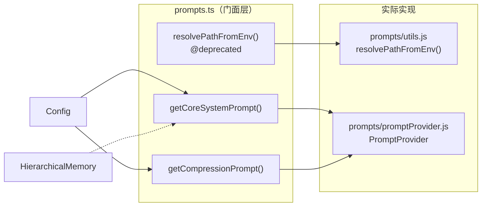

# prompts.ts

> 系统提示词（System Prompt）的门面模块，提供获取核心系统提示和压缩提示的便捷函数。

## 概述

`prompts.ts` 是一个薄门面层（Facade），将提示词相关的功能委托给 `PromptProvider` 类处理。它导出三个函数：一个已弃用的路径解析工具函数和两个获取系统提示词的函数。

该文件在模块中扮演向后兼容的适配器角色。核心提示词逻辑已迁移到 `../prompts/promptProvider.js` 和 `../prompts/utils.js`，此文件保留为历史 API 的兼容入口点。

## 架构图



## 主要导出

### 函数

#### `resolvePathFromEnv()`

```typescript
export function resolvePathFromEnv(envVar?: string): string | boolean | undefined
```

**用途：** 从环境变量解析路径或开关值。

**状态：** `@deprecated` - 已弃用，建议使用 `@google/gemini-cli-core/prompts/utils` 中的同名函数。

**参数：**
- `envVar` - 可选，环境变量名

**实现：** 直接委托给 `resolvePathFromEnvImpl`。

---

#### `getCoreSystemPrompt()`

```typescript
export function getCoreSystemPrompt(
  config: Config,
  userMemory?: string | HierarchicalMemory,
  interactiveOverride?: boolean,
): string
```

**用途：** 获取 Agent 的核心系统提示词。这是 Agent 运行时使用的主要系统指令，包含工具使用规则、行为准则、上下文信息等。

**参数：**
- `config` - 配置对象，包含模型、工具等信息
- `userMemory` - 可选，用户记忆数据（字符串或层次化记忆对象），会被整合到系统提示中
- `interactiveOverride` - 可选，覆盖交互模式设置

**实现：** 创建新的 `PromptProvider` 实例并调用其 `getCoreSystemPrompt` 方法。

---

#### `getCompressionPrompt()`

```typescript
export function getCompressionPrompt(config: Config): string
```

**用途：** 获取对话历史压缩的系统提示词。当对话历史过长需要压缩时，使用此提示指导 LLM 进行摘要压缩。

**参数：**
- `config` - 配置对象

**实现：** 创建新的 `PromptProvider` 实例并调用其 `getCompressionPrompt` 方法。

## 核心逻辑

该文件本身不包含核心业务逻辑，仅作为转发层。每个函数调用都会创建一个新的 `PromptProvider` 实例（无状态设计），然后将请求委托给它。

**设计考量：**
- 保持向后兼容性：旧代码可以继续从 `core/prompts.js` 导入这些函数
- 无状态：每次调用创建新的 `PromptProvider`，避免跨调用的状态泄漏
- 弃用路径清晰：`resolvePathFromEnv` 带有 `@deprecated` 标记，引导迁移

## 内部依赖

| 模块路径 | 导入内容 | 用途 |
|---------|---------|------|
| `../config/config.js` | `Config` | 配置类型 |
| `../config/memory.js` | `HierarchicalMemory` | 层次化记忆类型 |
| `../prompts/promptProvider.js` | `PromptProvider` | 提示词提供器实际实现 |
| `../prompts/utils.js` | `resolvePathFromEnv` (as `resolvePathFromEnvImpl`) | 路径解析工具函数实际实现 |

## 外部依赖

无直接的 npm 外部包依赖。
