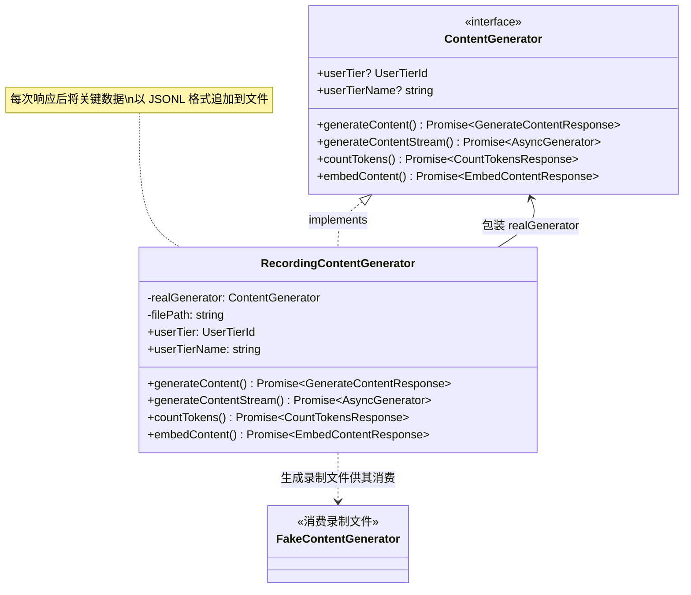
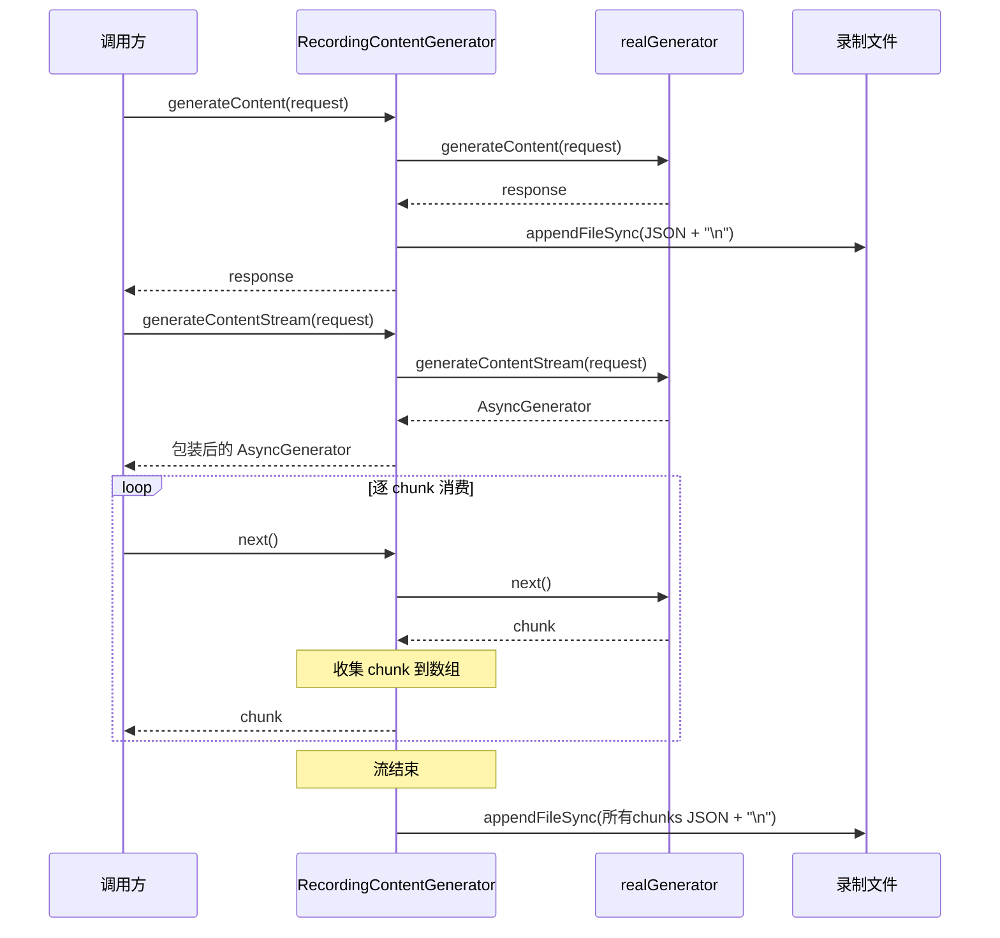

# recordingContentGenerator.ts

> 装饰器模式的内容生成器包装器，录制所有 API 响应并写入文件，用于后续回放测试。

## 概述

`recordingContentGenerator.ts` 实现了一个基于装饰器（Decorator）模式的 `RecordingContentGenerator` 类。它包装一个真实的 `ContentGenerator`，在代理所有请求到真实生成器的同时，将每个响应的关键数据录制到文件中。录制的文件采用 JSONL（每行一条 JSON）格式，可供 `FakeContentGenerator` 通过 `--fake-responses` CLI 参数读取回放。

该文件在测试基础设施中扮演重要角色：通过录制真实 API 交互，开发者可以创建可重复的测试场景，无需实际调用 Gemini API。

## 架构图



## 主要导出

### 类

#### `RecordingContentGenerator`

```typescript
export class RecordingContentGenerator implements ContentGenerator {
  constructor(
    private readonly realGenerator: ContentGenerator,
    private readonly filePath: string,
  )
}
```

**用途：** 实现 `ContentGenerator` 接口的录制包装器。代理所有请求到 `realGenerator`，同时将响应录制到 `filePath` 指定的文件。

**属性：**
- `userTier` (getter) - 代理到 `realGenerator.userTier`
- `userTierName` (getter) - 代理到 `realGenerator.userTierName`

**方法：**

##### `generateContent()`
```typescript
async generateContent(
  request: GenerateContentParameters,
  userPromptId: string,
  role: LlmRole,
): Promise<GenerateContentResponse>
```
调用真实生成器，录制响应中的 `candidates` 和 `usageMetadata` 字段，以 `method: 'generateContent'` 格式写入文件。

##### `generateContentStream()`
```typescript
async generateContentStream(
  request: GenerateContentParameters,
  userPromptId: string,
  role: LlmRole,
): Promise<AsyncGenerator<GenerateContentResponse>>
```
调用真实生成器获取流，返回一个新的异步生成器。在流的每个 chunk 中收集 `candidates` 和 `usageMetadata`，流结束时一次性将所有 chunk 以数组形式录制到文件。

##### `countTokens()`
```typescript
async countTokens(
  request: CountTokensParameters,
): Promise<CountTokensResponse>
```
调用真实生成器，录制响应中的 `totalTokens` 和 `cachedContentTokenCount` 字段。

##### `embedContent()`
```typescript
async embedContent(
  request: EmbedContentParameters,
): Promise<EmbedContentResponse>
```
调用真实生成器，录制响应中的 `embeddings` 和 `metadata` 字段。

## 核心逻辑

### 录制策略

1. **选择性录制：** 不录制完整响应对象，仅保留"有意义的部分"（candidates、usageMetadata、totalTokens 等），减小录制文件体积
2. **JSONL 格式：** 每次响应追加一行 JSON 到文件，使用 `appendFileSync` 保证写入的原子性
3. **FakeResponse 兼容：** 录制数据的格式遵循 `FakeResponse` 类型联合定义，确保 `FakeContentGenerator` 可直接解析
4. **流式录制特殊处理：** 对于 `generateContentStream`，不是逐 chunk 写入，而是收集所有 chunk 到数组，待流消费完毕后一次性写入。这通过内部的 `stream()` 异步生成器函数实现

### 文件写入流程



## 内部依赖

| 模块路径 | 导入内容 | 用途 |
|---------|---------|------|
| `./contentGenerator.js` | `ContentGenerator` | 接口定义 |
| `./fakeContentGenerator.js` | `FakeResponse` | 录制数据的类型定义 |
| `../code_assist/types.js` | `UserTierId` | 用户层级类型 |
| `../utils/safeJsonStringify.js` | `safeJsonStringify` | 安全 JSON 序列化（处理循环引用等） |
| `../telemetry/types.js` | `LlmRole` | LLM 角色类型 |

## 外部依赖

| npm 包 | 导入内容 | 用途 |
|--------|---------|------|
| `@google/genai` | `CountTokensResponse`, `GenerateContentParameters`, `GenerateContentResponse`, `CountTokensParameters`, `EmbedContentResponse`, `EmbedContentParameters` | Google GenAI SDK 类型定义 |
| `node:fs` | `appendFileSync` | 同步追加写入录制文件 |
