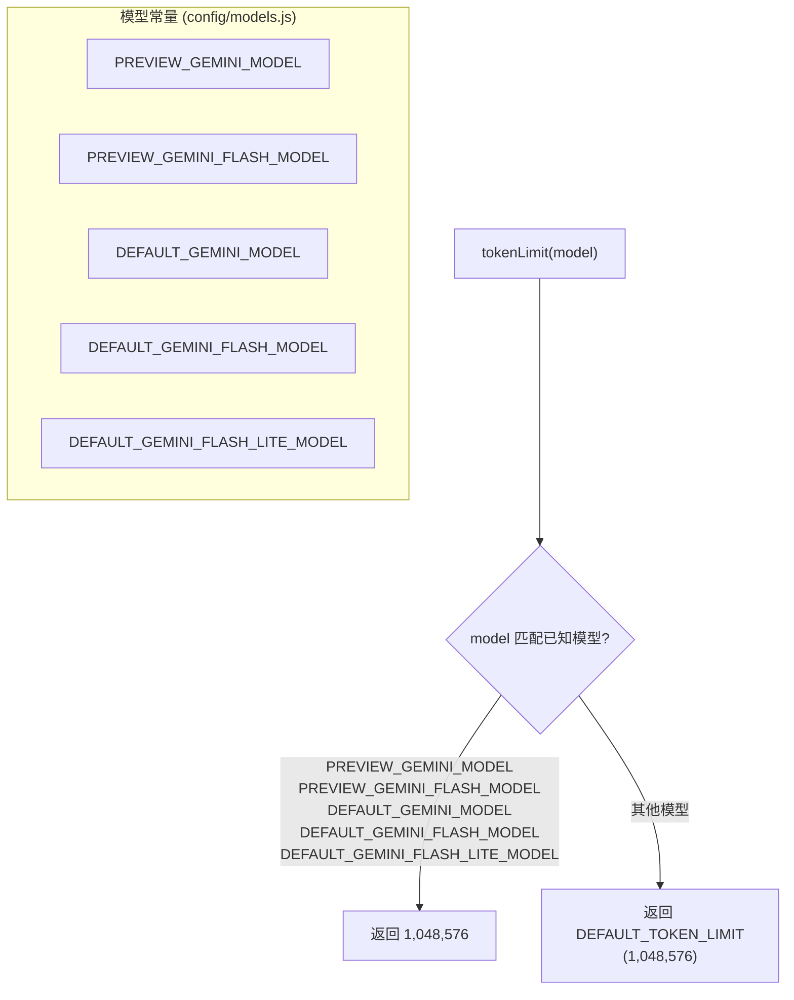

# tokenLimits.ts

> 根据模型名称查询 Token 上下文窗口大小限制。

## 概述

`tokenLimits.ts` 是一个简洁的工具模块，提供根据 Gemini 模型名称查询其 Token 限制（上下文窗口大小）的功能。当前所有已知模型共享相同的默认限制（1,048,576 tokens，即 1M tokens），未知模型也使用此默认值。

该文件在 Agent 的上下文管理中使用，帮助决定何时需要压缩对话历史或截断输入内容以适应模型的上下文窗口。

## 架构图



## 主要导出

### 常量

#### `DEFAULT_TOKEN_LIMIT`

```typescript
export const DEFAULT_TOKEN_LIMIT = 1_048_576;
```

**用途：** 默认 Token 限制值（1,048,576 = 1M tokens）。当模型未被显式匹配时使用此默认值。也可被外部模块直接引用。

### 类型

```typescript
type Model = string;
type TokenCount = number;
```

**用途：** 内部类型别名，提高代码可读性。`Model` 表示模型名称字符串，`TokenCount` 表示 Token 数量。（非导出，仅模块内部使用。）

### 函数

#### `tokenLimit()`

```typescript
export function tokenLimit(model: Model): TokenCount
```

**用途：** 根据模型名称返回该模型的上下文窗口 Token 限制。

**参数：**
- `model` - 模型名称字符串

**返回值：** Token 数量上限

**匹配规则：**

| 模型常量 | 模型名称 | Token 限制 |
|---------|---------|-----------|
| `PREVIEW_GEMINI_MODEL` | `gemini-3-pro-preview` | 1,048,576 |
| `PREVIEW_GEMINI_FLASH_MODEL` | `gemini-3-flash-preview` | 1,048,576 |
| `DEFAULT_GEMINI_MODEL` | `gemini-2.5-pro` | 1,048,576 |
| `DEFAULT_GEMINI_FLASH_MODEL` | `gemini-2.5-flash` | 1,048,576 |
| `DEFAULT_GEMINI_FLASH_LITE_MODEL` | `gemini-2.5-flash-lite` | 1,048,576 |
| 其他（default） | * | 1,048,576 |

## 核心逻辑

当前实现使用 `switch` 语句进行模型名称的精确匹配。所有已知 Gemini 模型均返回 1M tokens 的上下文窗口大小。`default` 分支也返回相同的 `DEFAULT_TOKEN_LIMIT` 值。

**设计意图：**
- 虽然当前所有分支返回相同值，但 switch 结构为未来添加不同限制的模型（如更大或更小上下文窗口的模型）预留了扩展点
- 参考来源标注为 https://ai.google.dev/gemini-api/docs/models
- 使用 `_` 分隔符的数字字面量（`1_048_576`）提高了大数值的可读性

## 内部依赖

| 模块路径 | 导入内容 | 用途 |
|---------|---------|------|
| `../config/models.js` | `DEFAULT_GEMINI_FLASH_LITE_MODEL`, `DEFAULT_GEMINI_FLASH_MODEL`, `DEFAULT_GEMINI_MODEL`, `PREVIEW_GEMINI_FLASH_MODEL`, `PREVIEW_GEMINI_MODEL` | Gemini 模型名称常量 |

## 外部依赖

无直接的 npm 外部包依赖。
