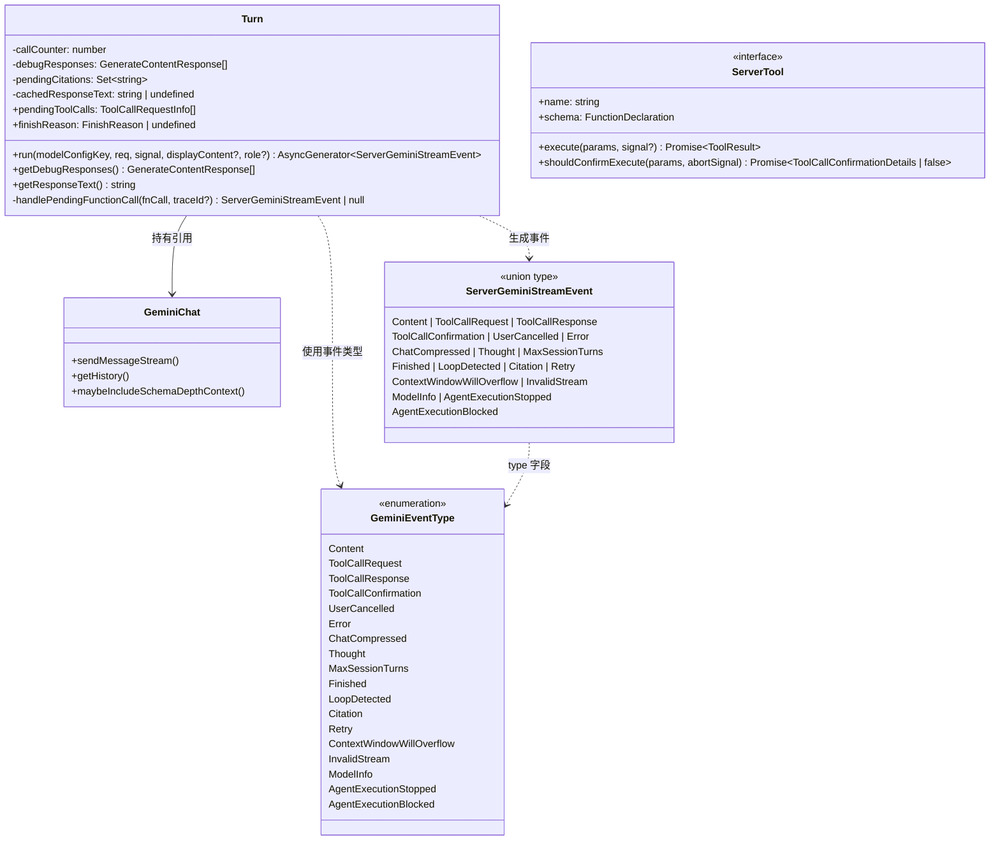
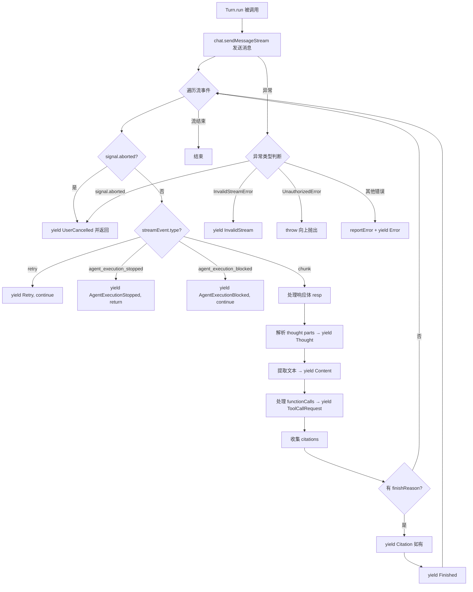

# turn.ts

> 管理 Gemini API 流式响应的单次代理循环（agentic loop turn），将底层流事件转换为统一的服务端事件流。

## 概述

`turn.ts` 是 gemini-cli 核心模块中负责处理单次 AI 对话回合的关键文件。它定义了 `Turn` 类以及围绕其运作的完整事件类型体系。

**设计动机：** 当用户向 Gemini 模型发送一条消息时，模型可能返回文本内容、思考过程、工具调用请求、引用信息等多种类型的响应片段。`Turn` 类将这些底层的 `GenerateContentResponse` 流式响应解析、分类，并转化为语义清晰的 `ServerGeminiStreamEvent` 事件流，供上层服务端逻辑（如调度器、UI 层）消费。

**模块角色：** `Turn` 是代理循环（agentic loop）的核心执行单元。每一次模型调用（包含发送消息、接收流式响应、提取工具调用等完整流程）对应一个 `Turn` 实例。它位于 `GeminiChat`（底层聊天通道）与上层调度器之间，是事件流转换的桥梁。

## 架构图





## 主要导出

### 接口（Interfaces）

#### `ServerTool`
```typescript
export interface ServerTool {
  name: string;
  schema: FunctionDeclaration;
  execute(params: Record<string, unknown>, signal?: AbortSignal): Promise<ToolResult>;
  shouldConfirmExecute(params: Record<string, unknown>, abortSignal: AbortSignal): Promise<ToolCallConfirmationDetails | false>;
}
```
服务端工具的标准接口。每个工具有名称、JSON Schema 声明、执行方法，以及用于判断是否需要用户确认执行的方法。

#### `StructuredError`
```typescript
export interface StructuredError {
  message: string;
  status?: number;
}
```
结构化错误信息，包含错误消息和可选的 HTTP 状态码。

#### `GeminiErrorEventValue`
```typescript
export interface GeminiErrorEventValue {
  error: unknown;
}
```
错误事件的值载荷，封装了原始错误对象。

#### `GeminiFinishedEventValue`
```typescript
export interface GeminiFinishedEventValue {
  reason: FinishReason | undefined;
  usageMetadata: GenerateContentResponseUsageMetadata | undefined;
}
```
完成事件的值载荷，包含结束原因和 token 使用统计元数据。

#### `ServerToolCallConfirmationDetails`
```typescript
export interface ServerToolCallConfirmationDetails {
  request: ToolCallRequestInfo;
  details: ToolCallConfirmationDetails;
}
```
工具调用确认的详细信息，将工具调用请求与确认细节关联。

#### `ChatCompressionInfo`
```typescript
export interface ChatCompressionInfo {
  originalTokenCount: number;
  newTokenCount: number;
  compressionStatus: CompressionStatus;
}
```
聊天压缩的信息，包含压缩前后的 token 数量和压缩状态。

### 枚举（Enums）

#### `GeminiEventType`
```typescript
export enum GeminiEventType {
  Content = 'content',
  ToolCallRequest = 'tool_call_request',
  ToolCallResponse = 'tool_call_response',
  ToolCallConfirmation = 'tool_call_confirmation',
  UserCancelled = 'user_cancelled',
  Error = 'error',
  ChatCompressed = 'chat_compressed',
  Thought = 'thought',
  MaxSessionTurns = 'max_session_turns',
  Finished = 'finished',
  LoopDetected = 'loop_detected',
  Citation = 'citation',
  Retry = 'retry',
  ContextWindowWillOverflow = 'context_window_will_overflow',
  InvalidStream = 'invalid_stream',
  ModelInfo = 'model_info',
  AgentExecutionStopped = 'agent_execution_stopped',
  AgentExecutionBlocked = 'agent_execution_blocked',
}
```
定义了所有可能的服务端事件类型，涵盖：
- **内容类**：`Content`（文本内容）、`Thought`（模型思考过程）、`Citation`（引用来源）
- **工具调用类**：`ToolCallRequest`（工具调用请求）、`ToolCallResponse`（工具调用响应）、`ToolCallConfirmation`（工具调用确认）
- **控制流类**：`Finished`（回合完成）、`UserCancelled`（用户取消）、`Retry`（重试）、`MaxSessionTurns`（达到最大会话轮次）
- **错误/异常类**：`Error`（一般错误）、`InvalidStream`（无效流）、`ContextWindowWillOverflow`（上下文窗口即将溢出）、`LoopDetected`（检测到循环）
- **代理控制类**：`AgentExecutionStopped`（代理执行停止）、`AgentExecutionBlocked`（代理执行被阻止）
- **信息类**：`ChatCompressed`（聊天压缩）、`ModelInfo`（模型信息）

#### `CompressionStatus`
```typescript
export enum CompressionStatus {
  COMPRESSED = 1,
  COMPRESSION_FAILED_INFLATED_TOKEN_COUNT,
  COMPRESSION_FAILED_TOKEN_COUNT_ERROR,
  COMPRESSION_FAILED_EMPTY_SUMMARY,
  NOOP,
  CONTENT_TRUNCATED,
}
```
聊天历史压缩的状态枚举：
- `COMPRESSED`：压缩成功
- `COMPRESSION_FAILED_INFLATED_TOKEN_COUNT`：压缩后 token 数反而增大，压缩失败
- `COMPRESSION_FAILED_TOKEN_COUNT_ERROR`：计算 token 数时出错，压缩失败
- `COMPRESSION_FAILED_EMPTY_SUMMARY`：压缩摘要为空，压缩失败
- `NOOP`：无需压缩
- `CONTENT_TRUNCATED`：因先前压缩失败，内容被截断至预算范围

### 类型别名（Type Aliases）

文件定义了 17 个事件类型别名，每个对应 `GeminiEventType` 中的一种事件：

| 类型名 | 事件类型 | 值载荷 |
|--------|---------|--------|
| `ServerGeminiContentEvent` | `Content` | `string` + 可选 `traceId` |
| `ServerGeminiThoughtEvent` | `Thought` | `ThoughtSummary` + 可选 `traceId` |
| `ServerGeminiToolCallRequestEvent` | `ToolCallRequest` | `ToolCallRequestInfo` |
| `ServerGeminiToolCallResponseEvent` | `ToolCallResponse` | `ToolCallResponseInfo` |
| `ServerGeminiToolCallConfirmationEvent` | `ToolCallConfirmation` | `ServerToolCallConfirmationDetails` |
| `ServerGeminiUserCancelledEvent` | `UserCancelled` | 无 |
| `ServerGeminiErrorEvent` | `Error` | `GeminiErrorEventValue` |
| `ServerGeminiChatCompressedEvent` | `ChatCompressed` | `ChatCompressionInfo \| null` |
| `ServerGeminiMaxSessionTurnsEvent` | `MaxSessionTurns` | 无 |
| `ServerGeminiFinishedEvent` | `Finished` | `GeminiFinishedEventValue` |
| `ServerGeminiLoopDetectedEvent` | `LoopDetected` | 无 |
| `ServerGeminiCitationEvent` | `Citation` | `string` |
| `ServerGeminiRetryEvent` | `Retry` | 无 |
| `ServerGeminiContextWindowWillOverflowEvent` | `ContextWindowWillOverflow` | `{estimatedRequestTokenCount, remainingTokenCount}` |
| `ServerGeminiInvalidStreamEvent` | `InvalidStream` | 无 |
| `ServerGeminiModelInfoEvent` | `ModelInfo` | `string` |
| `ServerGeminiAgentExecutionStoppedEvent` | `AgentExecutionStopped` | `{reason, systemMessage?, contextCleared?}` |
| `ServerGeminiAgentExecutionBlockedEvent` | `AgentExecutionBlocked` | `{reason, systemMessage?, contextCleared?}` |

#### `ServerGeminiStreamEvent`
```typescript
export type ServerGeminiStreamEvent =
  | ServerGeminiChatCompressedEvent
  | ServerGeminiCitationEvent
  | ServerGeminiContentEvent
  | ... // 所有 17 种事件类型的联合类型
```
所有服务端事件的联合类型，是上层消费事件流时的统一类型。

### 类（Classes）

#### `Turn`
```typescript
export class Turn {
  readonly pendingToolCalls: ToolCallRequestInfo[];
  finishReason: FinishReason | undefined;

  constructor(chat: GeminiChat, prompt_id: string);

  async *run(
    modelConfigKey: ModelConfigKey,
    req: PartListUnion,
    signal: AbortSignal,
    displayContent?: PartListUnion,
    role?: LlmRole,
  ): AsyncGenerator<ServerGeminiStreamEvent>;

  getDebugResponses(): GenerateContentResponse[];
  getResponseText(): string;
}
```

`Turn` 是本文件的核心类，管理一次完整的代理循环回合。

**构造参数：**
- `chat: GeminiChat` — 底层聊天通道实例
- `prompt_id: string` — 当前提示的唯一标识

**公开属性：**
- `pendingToolCalls` — 本回合中待执行的工具调用请求列表（只读数组）
- `finishReason` — 模型返回的结束原因

**公开方法：**
- `run()` — 异步生成器，执行一次回合并逐个 yield 事件
- `getDebugResponses()` — 获取本回合所有原始响应（用于调试）
- `getResponseText()` — 获取本回合所有响应的合并文本（带缓存）

## 核心逻辑

### `run()` 方法 — 流式事件处理主循环

`run()` 方法是一个异步生成器（`AsyncGenerator`），它实现了以下核心流程：

1. **发送消息**：调用 `chat.sendMessageStream()` 发起流式请求，传入模型配置键、请求内容、提示 ID、取消信号、角色和可选的显示内容。

2. **遍历流事件**：对返回的响应流进行 `for await...of` 遍历，逐个处理每个流事件。

3. **取消检测**：每次迭代首先检查 `signal.aborted`，若已取消则 yield `UserCancelled` 事件并立即返回。

4. **事件分类处理**：
   - `retry` 类型：yield `Retry` 事件并跳过当前迭代（`continue`）
   - `agent_execution_stopped` 类型：yield `AgentExecutionStopped` 事件并返回（中止回合）
   - `agent_execution_blocked` 类型：yield `AgentExecutionBlocked` 事件并继续
   - 其他（chunk 类型）：从 `streamEvent.value` 提取 `GenerateContentResponse` 并进行以下子处理：

5. **响应体处理（对每个 chunk）**：
   - 将响应存入 `debugResponses` 数组
   - 遍历响应的 `parts`，检测 `thought` 标记，解析思考内容并 yield `Thought` 事件
   - 提取文本内容，yield `Content` 事件
   - 遍历 `functionCalls`，调用 `handlePendingFunctionCall()` 创建工具调用请求并 yield `ToolCallRequest` 事件
   - 收集引用信息到 `pendingCitations` 集合
   - 检查 `finishReason`：若存在则先 yield 累积的 `Citation` 事件（排序后），再 yield `Finished` 事件

6. **异常处理**：
   - `signal.aborted`：yield `UserCancelled`
   - `InvalidStreamError`：yield `InvalidStream`
   - `UnauthorizedError`：直接向上抛出（不在本层处理）
   - 其他错误：调用 `reportError()` 上报错误，构建 `StructuredError`，调用 `chat.maybeIncludeSchemaDepthContext()` 补充上下文信息，最后 yield `Error` 事件

### `handlePendingFunctionCall()` 方法 — 工具调用请求构造

该私有方法负责：
1. 从 `FunctionCall` 对象提取函数名和参数
2. 生成唯一的 `callId`（优先使用 `fnCall.id`，否则生成 `${name}_${Date.now()}_${callCounter++}` 格式）
3. 构建 `ToolCallRequestInfo` 对象并加入 `pendingToolCalls` 列表
4. 返回 `ToolCallRequest` 事件

### `getResponseText()` 方法 — 带缓存的文本提取

该方法将本回合所有 `debugResponses` 中的文本内容拼接为一个字符串。由于可能被多次调用，结果会被缓存到 `cachedResponseText` 中，避免重复计算。

## 内部依赖

| 模块路径 | 导入项 | 用途 |
|----------|--------|------|
| `../tools/tools.js` | `ToolCallConfirmationDetails`, `ToolResult` | 工具调用确认与执行结果类型 |
| `../utils/partUtils.js` | `getResponseText` | 从响应中提取文本内容 |
| `../utils/errorReporting.js` | `reportError` | 错误上报 |
| `../utils/errors.js` | `getErrorMessage`, `UnauthorizedError`, `toFriendlyError` | 错误处理工具 |
| `./geminiChat.js` | `InvalidStreamError`, `GeminiChat` | 底层聊天通道与无效流错误 |
| `../utils/thoughtUtils.js` | `parseThought`, `ThoughtSummary` | 解析模型思考过程 |
| `../services/modelConfigService.js` | `ModelConfigKey` | 模型配置键类型 |
| `../utils/generateContentResponseUtilities.js` | `getCitations` | 提取引用信息 |
| `../telemetry/types.js` | `LlmRole` | LLM 角色枚举 |
| `../scheduler/types.js` | `ToolCallRequestInfo`, `ToolCallResponseInfo` | 调度器相关类型 |

## 外部依赖

| npm 包 | 导入项 | 用途 |
|--------|--------|------|
| `@google/genai` | `createUserContent`, `PartListUnion`, `GenerateContentResponse`, `FunctionCall`, `FunctionDeclaration`, `FinishReason`, `GenerateContentResponseUsageMetadata` | Google Generative AI SDK，提供内容创建、响应类型、函数调用声明等核心类型 |
