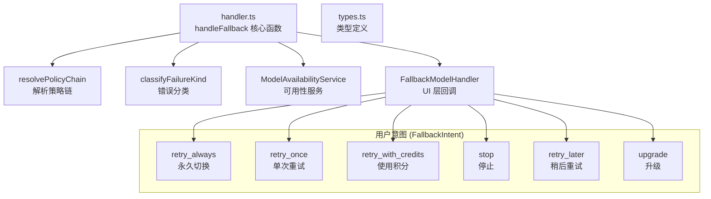

# fallback 架构

> 模型降级策略模块，在主模型不可用时协调 UI 交互并选择替代模型

## 概述

`fallback/` 模块处理当 Gemini API 返回持续性 429 错误（配额耗尽/容量不足）时的降级流程。它与 `availability/` 模块协作，基于策略链（PolicyChain）选择可用的替代模型，并通过 `FallbackModelHandler` 回调与 UI 层交互，让用户决定降级意图（自动切换、仅重试一次、使用积分、停止等）。模块还支持升级引导（打开升级页面）。

## 架构图



## 目录结构

```
fallback/
├── types.ts     # FallbackIntent、FallbackRecommendation、Handler 类型
└── handler.ts   # handleFallback 核心实现
```

## 关键文件

| 文件 | 功能 |
|------|------|
| `types.ts` | 定义 `FallbackIntent`（6 种用户意图）、`FallbackRecommendation`（降级建议，含动作、失败类型、选中策略）、`FallbackModelHandler`（UI 回调类型）、`ValidationHandler`/`ValidationIntent`（验证处理） |
| `handler.ts` | `handleFallback`：核心降级处理函数——(1) 解析策略链获取候选模型；(2) 分类失败类型；(3) 从可用性服务选择替代模型；(4) 根据策略决定是静默切换还是提示用户；(5) 调用 UI 回调获取用户意图；(6) 根据意图执行切换（config.setModel）、重试或打开升级页面 |

## 内部依赖

- `config/config.ts` - Config 类（模型切换）
- `availability/errorClassification.ts` - 错误分类
- `availability/policyHelpers.ts` - 策略链解析和应用
- `availability/modelPolicy.ts` - ModelPolicy 类型
- `availability/modelAvailabilityService.ts` - ModelSelectionResult 类型
- `utils/secure-browser-launcher.ts` - 打开升级 URL
- `utils/debugLogger.ts` - 调试日志

## 外部依赖

无直接外部依赖。
