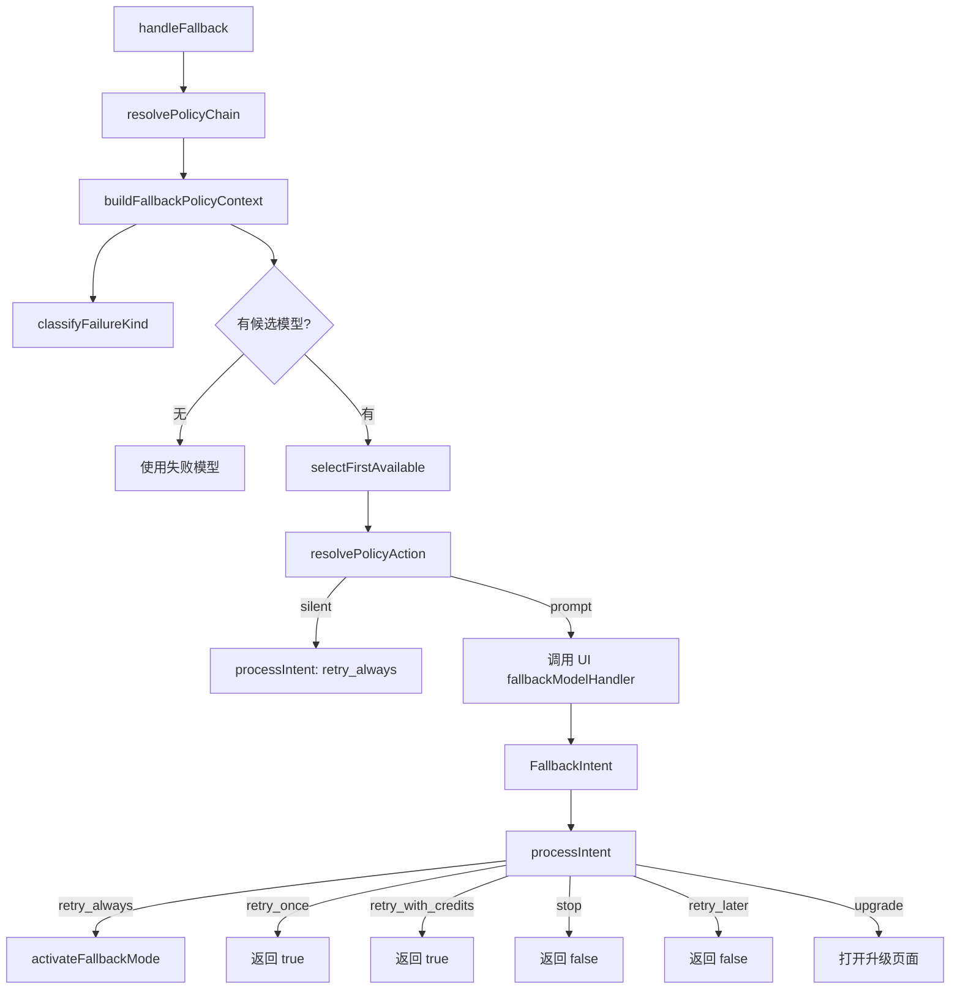

# handler.ts

> 模型回退处理器，协调策略链、可用性服务和 UI 层完成模型切换流程。

## 概述

`handler.ts` 是回退模块的核心实现，当主模型 API 调用失败时被调用。它整合了策略链解析、错误分类、可用性状态管理和 UI 交互（通过 `FallbackModelHandler`），最终决定是否切换到备选模型。该文件实现了静默回退（直接切换）和交互式回退（询问用户）两种模式，并根据用户选择的 intent（retry_always、retry_once、upgrade 等）执行相应操作。

## 架构图

## 主要导出

### 常量

| 常量 | 值 | 说明 |
|------|-----|------|
| `UPGRADE_URL_PAGE` | `'https://goo.gle/set-up-gemini-code-assist'` | 升级页面 URL |

### 函数

| 函数 | 签名 | 说明 |
|------|------|------|
| `handleFallback` | `(config, failedModel, authType?, error?) => Promise<string \| boolean \| null>` | 主回退处理函数，返回 `true`（已切换）、`false`（用户拒绝）或 `null`（无法处理） |

## 核心逻辑

1. **策略链解析与候选筛选**：从配置解析完整策略链，找到失败模型的位置并获取后续候选列表。
2. **可用性过滤**：使用 `ModelAvailabilityService.selectFirstAvailable` 从候选中排除已标记为不可用的模型。
3. **静默 vs 交互**：`resolvePolicyAction` 判断动作类型 -- `silent` 直接切换，`prompt` 调用 UI handler 询问用户。
4. **意图处理**（`processIntent`）：
   - `retry_always`：激活回退模式，永久切换到备选模型
   - `retry_once`：仅本次请求使用备选模型
   - `retry_with_credits`：使用 AI 额度重试
   - `stop`/`retry_later`：不切换，返回 false
   - `upgrade`：打开浏览器到升级页面
5. **状态转换时机**：仅在用户选择 `retry_always` 或 `retry_once` 时才对失败模型应用可用性状态转换，保留用户"稍后重试"的可能性。

## 内部依赖

| 模块 | 导入项 | 用途 |
|------|--------|------|
| `../config/config.js` | `Config` (type) | 全局配置 |
| `../utils/secure-browser-launcher.js` | `openBrowserSecurely`, `shouldLaunchBrowser` | 安全打开浏览器 |
| `../utils/debugLogger.js` | `debugLogger` | 调试日志 |
| `../utils/errors.js` | `getErrorMessage` | 错误消息提取 |
| `./types.js` | `FallbackIntent`, `FallbackRecommendation` (types) | 回退类型 |
| `../availability/errorClassification.js` | `classifyFailureKind` | 错误分类 |
| `../availability/policyHelpers.js` | 多个策略辅助函数 | 策略链操作 |

## 外部依赖

无。
