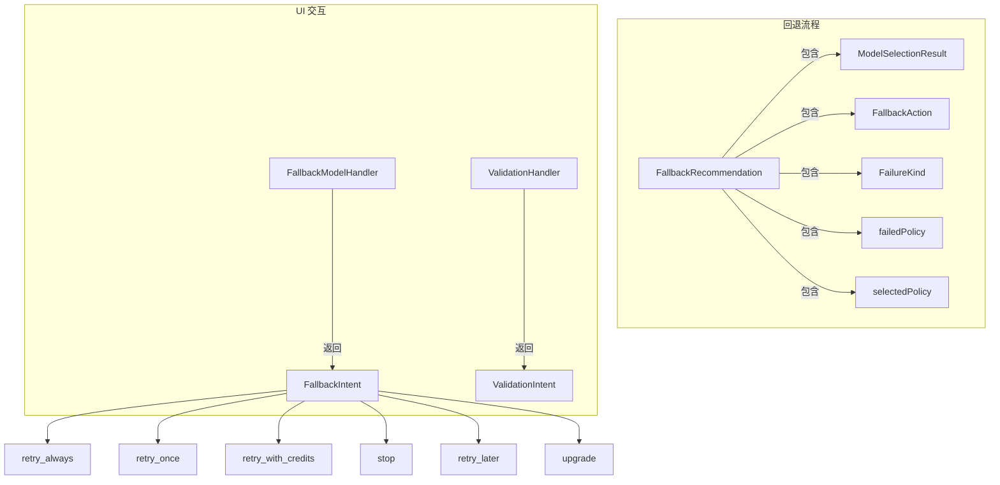

# types.ts (fallback)

> 定义回退模块的核心类型，包括回退意图、推荐结果和 UI 处理器接口。

## 概述

`types.ts` 定义了回退系统中各层之间的交互协议。核心概念包括：`FallbackIntent`（用户在回退对话中的选择意图）、`FallbackRecommendation`（系统推荐的回退方案）、`FallbackModelHandler`（UI 层提供的回退交互处理器）以及验证相关的类型。该文件建立了核心逻辑层与 UI 层之间的契约。

## 架构图

## 主要导出

### 类型

| 类型 | 定义 | 说明 |
|------|------|------|
| `FallbackIntent` | `'retry_always' \| 'retry_once' \| 'retry_with_credits' \| 'stop' \| 'retry_later' \| 'upgrade'` | 用户在回退场景中的六种选择意图 |
| `FallbackModelHandler` | `(failedModel, fallbackModel, error?) => Promise<FallbackIntent \| null>` | UI 层提供的回退交互处理器 |
| `ValidationIntent` | `'verify' \| 'change_auth' \| 'cancel'` | 验证场景中的用户意图 |
| `ValidationHandler` | `(validationLink?, validationDescription?, learnMoreUrl?) => Promise<ValidationIntent>` | 验证场景的 UI 处理器 |

### 接口

| 接口 | 说明 |
|------|------|
| `FallbackRecommendation` | 继承 `ModelSelectionResult`，扩展 action、failureKind 和策略信息 |

## 核心逻辑

纯类型定义文件，无运行时逻辑。关键设计：

- **意图驱动**：回退流程由用户意图（Intent）驱动，每种意图对应明确的后续行为。
- **处理器模式**：`FallbackModelHandler` 和 `ValidationHandler` 作为依赖注入点，允许不同 UI 实现（CLI、IDE 插件等）提供各自的用户交互方式。
- **推荐与意图分离**：`FallbackRecommendation` 携带系统推荐信息，`FallbackIntent` 表达用户最终决定。

## 内部依赖

| 模块 | 导入项 | 用途 |
|------|--------|------|
| `../availability/modelAvailabilityService.js` | `ModelSelectionResult` (type) | 模型选择结果 |
| `../availability/modelPolicy.js` | `FailureKind`, `FallbackAction`, `ModelPolicy` (types) | 策略类型 |

## 外部依赖

无。
