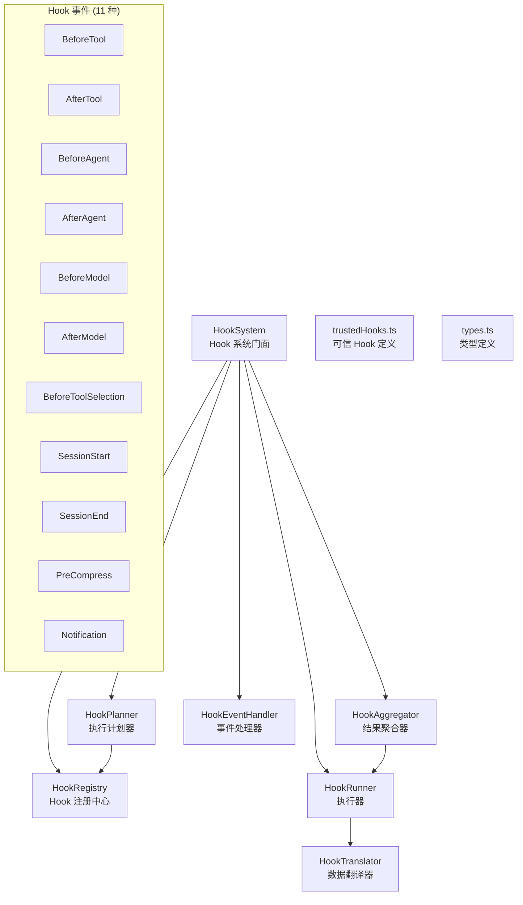

# hooks 架构

> Hook 事件系统，支持在 Agent 生命周期的关键节点注入自定义逻辑（命令执行或运行时函数）

## 概述

`hooks/` 模块实现了 Gemini CLI 的可扩展 Hook 系统。Hook 允许用户在 Agent 执行的关键节点（BeforeTool、AfterTool、BeforeAgent、AfterAgent、BeforeModel、AfterModel 等 11 种事件）注入自定义逻辑。Hook 支持两种实现方式：**命令 Hook**（执行外部命令）和**运行时 Hook**（注册 JavaScript 函数）。系统采用分层架构：Registry 管理注册、Planner 制定执行计划、Runner 执行 Hook、Aggregator 聚合结果、EventHandler 处理特定事件。

## 架构图



## 目录结构

```
hooks/
├── index.ts              # 模块入口，导出所有公共组件
├── types.ts              # 类型定义（事件名、Hook 配置、输入/输出）
├── hookSystem.ts         # HookSystem：主门面类
├── hookRegistry.ts       # HookRegistry：Hook 注册与管理
├── hookPlanner.ts        # HookPlanner：制定执行计划
├── hookRunner.ts         # HookRunner：执行 Hook（命令或运行时）
├── hookAggregator.ts     # HookAggregator：聚合多个 Hook 的结果
├── hookEventHandler.ts   # HookEventHandler：特定事件的处理逻辑
├── hookTranslator.ts     # HookTranslator：LLM 请求/响应数据翻译
└── trustedHooks.ts       # 可信 Hook 列表和定义
```

## 关键文件

| 文件 | 功能 |
|------|------|
| `types.ts` | 定义 `HookEventName`（11 种事件）、`HookType`（Command/Runtime）、`ConfigSource`（Runtime/Project/User/System/Extensions 优先级）、`HookDefinition`/`RuntimeHookConfig`/`CommandHookConfig` 配置类型、`HookInput`/`HookOutput` 数据类型 |
| `hookSystem.ts` | `HookSystem` 类：主门面，提供 `fireBeforeToolEvent`/`fireAfterToolEvent`/`fireBeforeAgentEvent`/`fireAfterAgentEvent`/`fireBeforeModelEvent`/`fireAfterModelEvent` 等方法，返回含 `shouldStopExecution()`/`isBlockingDecision()` 的输出对象 |
| `hookRegistry.ts` | `HookRegistry` 类：管理 Hook 的注册、查询和优先级排序 |
| `hookRunner.ts` | `HookRunner` 类：执行 Hook——对命令 Hook 使用子进程执行，对运行时 Hook 直接调用函数；支持超时和信号取消 |
| `hookAggregator.ts` | `HookAggregator` 类：聚合多个 Hook 的执行结果，合并 stop/block 决策 |
| `hookPlanner.ts` | `HookPlanner` 类：根据事件类型和 Hook 注册信息制定执行计划 |

## 内部依赖

- `config/config.ts` - Config 类
- `utils/debugLogger.ts` - 调试日志
- `tools/tools.ts` - ToolCallConfirmationDetails
- `@google/genai` - GenerateContentParameters、GenerateContentResponse 等

## 外部依赖

| 依赖 | 用途 |
|------|------|
| `@google/genai` | LLM 请求/响应类型（用于 BeforeModel/AfterModel Hook） |
