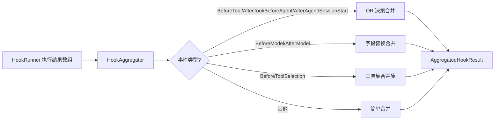

# hookAggregator.ts

> 将多个 Hook 的执行结果按事件类型策略合并为单一聚合结果。

## 概述

`HookAggregator` 类负责将同一事件上注册的多个 Hook 的执行结果合并为一个 `AggregatedHookResult`。不同事件类型采用不同的合并策略：工具/Agent 事件使用 OR 决策逻辑（任一 Hook 阻止即阻止），模型事件使用字段替换逻辑（后者覆盖前者），工具选择事件使用集合并集逻辑。

**设计动机：** 多个 Hook 可能对同一事件做出不同决策，需要一个统一的策略层来解决冲突。例如，一个安全 Hook 可能阻止某个工具调用，而另一个提供附加上下文——聚合器需要同时保留阻止决策和附加上下文。

**在模块中的角色：** 作为 Hook 执行管道的最后一环，被 `HookEventHandler.executeHooks()` 在 `HookRunner` 执行完毕后调用。

## 架构图



## 主要导出

### `interface AggregatedHookResult`

| 字段 | 类型 | 说明 |
|------|------|------|
| `success` | `boolean` | 是否全部无错误 |
| `finalOutput` | `DefaultHookOutput?` | 合并后的最终输出（带类型化方法） |
| `allOutputs` | `HookOutput[]` | 所有原始输出 |
| `errors` | `Error[]` | 所有错误 |
| `totalDuration` | `number` | 总耗时（毫秒） |

### `class HookAggregator`

#### 公开方法

```typescript
aggregateResults(results: HookExecutionResult[], eventName: HookEventName): AggregatedHookResult
```

## 核心逻辑

### 合并策略

#### OR 决策合并（`mergeWithOrDecision`）

适用于：BeforeTool、AfterTool、BeforeAgent、AfterAgent、SessionStart

- **阻止优先**：任一 Hook 返回 `block`/`deny` 即最终为阻止
- **停止优先**：任一 Hook 返回 `continue: false` 即最终停止
- **消息拼接**：所有 reason、systemMessage、stopReason 按换行拼接
- **抑制输出**：任一 Hook 设置 `suppressOutput: true` 即生效
- **清除上下文**：任一 Hook 设置 `clearContext: true` 即生效
- **默认放行**：无阻止且无停止时，decision 默认为 `'allow'`
- **附加上下文**：从所有 hookSpecificOutput 中提取 additionalContext 并合并

#### 字段替换合并（`mergeWithFieldReplacement`）

适用于：BeforeModel、AfterModel

后执行的 Hook 输出覆盖先执行的，`hookSpecificOutput` 做浅合并。

#### 工具选择合并（`mergeToolSelectionOutputs`）

适用于：BeforeToolSelection

- 工具名取**并集**（所有 Hook 的 allowedFunctionNames 合并）
- 模式取**最严格**：NONE > ANY > AUTO
- 函数名排序以保证确定性缓存

#### 简单合并（`mergeSimple`）

其他事件类型：后者覆盖前者。

### 类型化输出

`createSpecificHookOutput` 根据事件类型将合并后的 `HookOutput` 包装为对应的子类（如 `BeforeToolHookOutput`、`BeforeModelHookOutput`），使调用方可以使用类型特定的方法。

## 内部依赖

| 模块 | 说明 |
|------|------|
| `./types.js` | HookOutput、HookEventName、各 HookOutput 子类 |

## 外部依赖

| 包 | 说明 |
|------|------|
| `@google/genai` | `FunctionCallingConfigMode` 枚举 |
