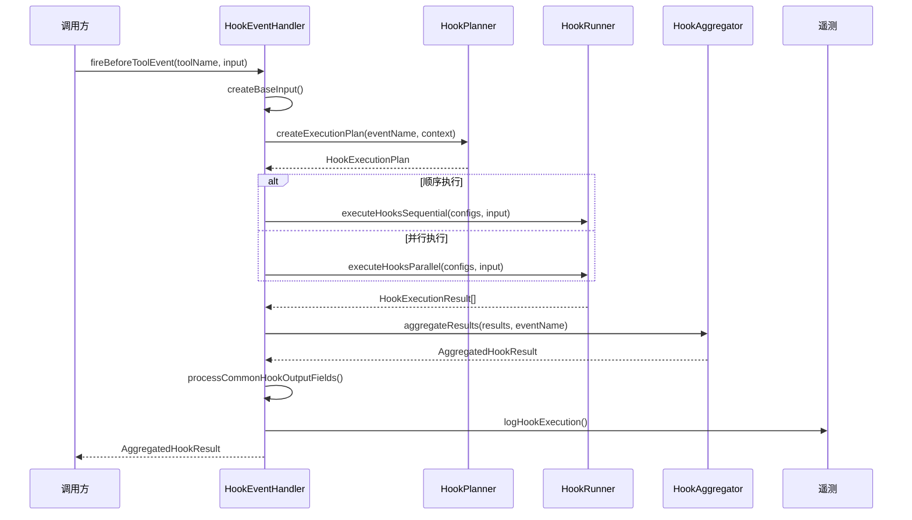

# hookEventHandler.ts

> 协调 Hook 事件的触发、执行和结果处理的中央事件总线。

## 概述

`HookEventHandler` 是 Hook 系统的事件协调中心，为系统中的每种 Hook 事件（BeforeTool、AfterTool、BeforeAgent、AfterAgent、BeforeModel、AfterModel 等）提供类型安全的触发方法。它串联了 HookPlanner（计划执行）、HookRunner（执行 Hook）和 HookAggregator（聚合结果）三个组件，形成完整的 Hook 执行管道。

**设计动机：** 将事件触发与 Hook 执行的细节解耦。调用方只需调用 `fireXxxEvent()`，无需关心 Hook 的发现、匹配、执行策略和结果合并。同时集中处理遥测日志和错误报告。

**在模块中的角色：** 被 `HookSystem` 封装为更高级的 API，也直接由 `HookSystem.getEventHandler()` 暴露给需要底层控制的调用方。

## 架构图



## 主要导出

### `class HookEventHandler`

#### 构造函数

```typescript
constructor(
  context: AgentLoopContext,
  hookPlanner: HookPlanner,
  hookRunner: HookRunner,
  hookAggregator: HookAggregator,
)
```

#### 事件触发方法

| 方法 | 签名 | 说明 |
|------|------|------|
| `fireBeforeToolEvent` | `(toolName, toolInput, mcpContext?, originalRequestName?)` | 工具执行前事件 |
| `fireAfterToolEvent` | `(toolName, toolInput, toolResponse, mcpContext?, originalRequestName?)` | 工具执行后事件 |
| `fireBeforeAgentEvent` | `(prompt)` | Agent 轮次开始前事件 |
| `fireAfterAgentEvent` | `(prompt, promptResponse, stopHookActive?)` | Agent 轮次结束后事件 |
| `fireNotificationEvent` | `(type, message, details)` | 通知事件 |
| `fireSessionStartEvent` | `(source)` | 会话开始事件 |
| `fireSessionEndEvent` | `(reason)` | 会话结束事件 |
| `firePreCompressEvent` | `(trigger)` | 上下文压缩前事件 |
| `fireBeforeModelEvent` | `(llmRequest)` | 模型调用前事件 |
| `fireAfterModelEvent` | `(llmRequest, llmResponse)` | 模型调用后事件 |
| `fireBeforeToolSelectionEvent` | `(llmRequest)` | 工具选择前事件 |

所有方法返回 `Promise<AggregatedHookResult>`。

## 核心逻辑

### 执行管道（`executeHooks`）

1. **创建执行计划**：`HookPlanner.createExecutionPlan()` 确定匹配的 Hook 和执行策略
2. **空计划快速返回**：无匹配 Hook 时返回空成功结果
3. **执行 Hook**：根据计划的 `sequential` 标志选择串行或并行执行
4. **生命周期回调**：执行前后通过 `coreEvents` 发射 `HookStart`/`HookEnd` 事件（用于 UI 展示）
5. **聚合结果**：调用 `HookAggregator.aggregateResults()`
6. **处理公共输出字段**：systemMessage 日志、停止执行信号处理
7. **遥测日志**：为每个 Hook 记录 `HookCallEvent`

### 基础输入构建

`createBaseInput()` 为所有事件构建公共字段：
- `session_id`: 当前会话 ID
- `transcript_path`: 对话记录文件路径
- `cwd`: 工作目录
- `hook_event_name`: 事件名称
- `timestamp`: ISO 时间戳

### 失败去重

使用 `WeakMap<object, Set<string>>` 跟踪已报告的失败，以 `requestContext`（原始请求对象）为键，确保流式场景下同一请求的相同失败只报告一次。

### LLM 请求转换

BeforeModel 和 AfterModel 事件使用 `defaultHookTranslator` 将 SDK 的 `GenerateContentParameters` 转换为稳定的 `LLMRequest` 格式，再传递给 Hook。

## 内部依赖

| 模块 | 说明 |
|------|------|
| `./hookPlanner.js` | 执行计划生成 |
| `./hookRunner.js` | Hook 执行 |
| `./hookAggregator.js` | 结果聚合 |
| `./hookTranslator.js` | LLM 请求/响应格式转换 |
| `./types.js` | 类型定义 |
| `../telemetry/loggers.js` | 遥测日志 |
| `../utils/events.js` | 核心事件发射 |
| `../utils/debugLogger.js` | 调试日志 |
| `../config/agent-loop-context.js` | AgentLoopContext 类型 |

## 外部依赖

| 包 | 说明 |
|------|------|
| `@google/genai` | GenerateContentParameters、GenerateContentResponse 类型 |
