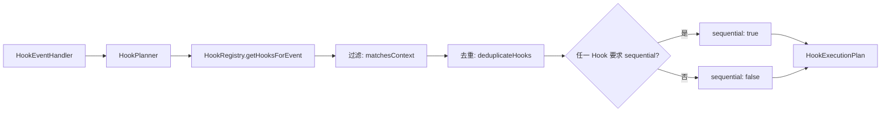

# hookPlanner.ts

> 根据事件类型和上下文筛选匹配的 Hook 并生成执行计划。

## 概述

`HookPlanner` 负责 Hook 执行管道的"计划"阶段。给定一个事件名称和可选的上下文信息（如工具名、触发源），它从 `HookRegistry` 中筛选匹配的 Hook，去除重复项，确定执行策略（串行或并行），并输出一个 `HookExecutionPlan`。

**设计动机：** 将 Hook 匹配和执行策略决策与实际执行解耦。匹配逻辑支持正则表达式（用于工具名匹配）和精确字符串（用于触发源匹配），使 Hook 配置灵活而强大。

**在模块中的角色：** 位于 HookRegistry（注册表）和 HookRunner（执行器）之间，是执行管道的中间环节。

## 架构图



## 主要导出

### `class HookPlanner`

#### 构造函数

```typescript
constructor(hookRegistry: HookRegistry)
```

#### 公开方法

```typescript
createExecutionPlan(eventName: HookEventName, context?: HookEventContext): HookExecutionPlan | null
```

返回 `null` 表示无匹配 Hook。返回的 `HookExecutionPlan` 包含：
- `eventName`: 事件名称
- `hookConfigs`: 匹配的 Hook 配置数组
- `sequential`: 是否需要顺序执行

### `interface HookEventContext`

Hook 事件匹配上下文。

| 字段 | 类型 | 说明 |
|------|------|------|
| `toolName` | `string?` | 工具名称（用于 BeforeTool/AfterTool 事件的 matcher 匹配） |
| `trigger` | `string?` | 触发源（用于 SessionStart/SessionEnd/PreCompress 事件的 matcher 匹配） |

## 核心逻辑

### 匹配规则（`matchesContext`）

1. **无 matcher** 或无 context -> 匹配所有
2. **空字符串或 `*`** -> 匹配所有
3. **工具名匹配** (`context.toolName`):
   - 先尝试将 matcher 作为正则表达式匹配工具名
   - 如果正则解析失败，回退为精确字符串匹配
4. **触发源匹配** (`context.trigger`): 精确字符串匹配

### 去重（`deduplicateHooks`）

使用 `getHookKey(config)` 生成唯一键（格式为 `name:command`），基于 Set 去除重复的 Hook 配置。

### 执行策略

如果**任何一个**匹配的 Hook 定义中 `sequential === true`，则整个计划采用顺序执行。这是一个保守策略——如果某个 Hook 需要依赖前一个 Hook 的输出，则所有 Hook 都顺序执行。

## 内部依赖

| 模块 | 说明 |
|------|------|
| `./hookRegistry.js` | HookRegistry、HookRegistryEntry |
| `./types.js` | HookExecutionPlan、HookEventName、getHookKey |
| `../utils/debugLogger.js` | 调试日志 |

## 外部依赖

无。
