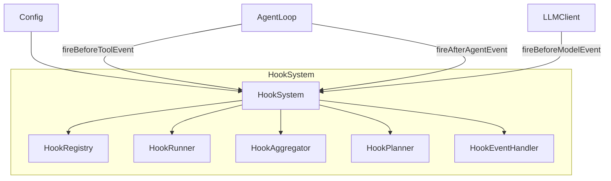

# hookSystem.ts

> Hook 系统的顶层门面类，对外提供简洁的 Hook 触发和管理 API。

## 概述

`HookSystem` 是 Hook 子系统的外观（Facade）类，封装了 `HookRegistry`、`HookRunner`、`HookAggregator`、`HookPlanner` 和 `HookEventHandler` 五个内部组件。它对外提供两层 API：
1. **管理 API**：注册/启用/禁用 Hook，查看所有 Hook
2. **事件 API**：类型安全的 `fireXxxEvent()` 方法，返回简化的结果类型

相比直接使用 `HookEventHandler`，`HookSystem` 的事件方法做了额外的错误处理和结果转换，返回更贴近业务场景的结果类型（如 `BeforeModelHookResult`）。

**设计动机：** 屏蔽 Hook 系统内部的组件交互细节，为 `Config` 和 Agent 循环提供简单易用的接口。同时统一处理异常降级（Hook 失败不应中断主流程）。

**在模块中的角色：** 被 `Config` 创建和持有，是 Hook 系统面向外部的唯一入口。

## 架构图



## 主要导出

### 结果类型

#### `interface BeforeModelHookResult`

| 字段 | 类型 | 说明 |
|------|------|------|
| `blocked` | `boolean` | 模型调用是否被阻止 |
| `stopped` | `boolean?` | 是否完全停止执行 |
| `reason` | `string?` | 阻止原因 |
| `syntheticResponse` | `GenerateContentResponse?` | Hook 提供的替代响应 |
| `modifiedConfig` | `GenerateContentConfig?` | 修改后的生成配置 |
| `modifiedContents` | `ContentListUnion?` | 修改后的内容 |

#### `interface BeforeToolSelectionHookResult`

| 字段 | 类型 | 说明 |
|------|------|------|
| `toolConfig` | `ToolConfig?` | 修改后的工具配置 |
| `tools` | `ToolListUnion?` | 修改后的工具列表 |

#### `interface AfterModelHookResult`

| 字段 | 类型 | 说明 |
|------|------|------|
| `response` | `GenerateContentResponse` | 最终响应（可能被修改） |
| `stopped` | `boolean?` | 是否停止执行 |
| `blocked` | `boolean?` | 是否被阻止 |
| `reason` | `string?` | 原因 |

### `class HookSystem`

#### 构造函数

```typescript
constructor(config: Config)
```

内部创建全部五个组件。

#### 管理方法

| 方法 | 说明 |
|------|------|
| `initialize()` | 初始化 Hook 注册表 |
| `getEventHandler()` | 获取底层 HookEventHandler |
| `getRegistry()` | 获取底层 HookRegistry |
| `setHookEnabled(name, enabled)` | 启用/禁用 Hook |
| `getAllHooks()` | 获取所有注册的 Hook |
| `registerHook(config, eventName, options?)` | 编程式注册 Hook |

#### 事件方法

| 方法 | 返回类型 | 说明 |
|------|---------|------|
| `fireSessionStartEvent(source)` | `DefaultHookOutput?` | 会话开始 |
| `fireSessionEndEvent(reason)` | `AggregatedHookResult?` | 会话结束 |
| `firePreCompressEvent(trigger)` | `AggregatedHookResult?` | 压缩前 |
| `fireBeforeAgentEvent(prompt)` | `DefaultHookOutput?` | Agent 前 |
| `fireAfterAgentEvent(prompt, response, stopHookActive?)` | `DefaultHookOutput?` | Agent 后 |
| `fireBeforeModelEvent(llmRequest)` | `BeforeModelHookResult` | 模型前 |
| `fireAfterModelEvent(request, chunk)` | `AfterModelHookResult` | 模型后 |
| `fireBeforeToolSelectionEvent(llmRequest)` | `BeforeToolSelectionHookResult` | 工具选择前 |
| `fireBeforeToolEvent(name, input, mcp?, original?)` | `DefaultHookOutput?` | 工具前 |
| `fireAfterToolEvent(name, input, response, mcp?, original?)` | `DefaultHookOutput?` | 工具后 |
| `fireToolNotificationEvent(confirmationDetails)` | `void` | 工具通知 |

## 核心逻辑

### BeforeModel 结果转换

`fireBeforeModelEvent` 将 `AggregatedHookResult` 转换为 `BeforeModelHookResult`：
1. `shouldStopExecution()` -> `{ blocked: true, stopped: true }`
2. `getBlockingError().blocked` -> `{ blocked: true, syntheticResponse }`（Hook 可提供替代响应）
3. 有 hookOutput 但未阻止 -> 提取 `modifiedConfig` 和 `modifiedContents`
4. 异常 -> `{ blocked: false }`（降级为无影响）

### AfterModel 结果转换

类似地检查停止/阻止信号，如有修改的响应则替换原始 chunk。

### 工具通知事件

`fireToolNotificationEvent` 特殊处理：
- 使用 `toSerializableDetails()` 将 `ToolCallConfirmationDetails` 转换为可序列化格式（排除函数属性）
- 使用 `getNotificationMessage()` 生成人类可读的通知消息

### 异常降级

所有 `fire*` 方法使用 try-catch 包裹，Hook 系统的任何异常都不会中断主流程，仅记录调试日志。

## 内部依赖

| 模块 | 说明 |
|------|------|
| `./hookRegistry.js` | HookRegistry |
| `./hookRunner.js` | HookRunner |
| `./hookAggregator.js` | HookAggregator |
| `./hookPlanner.js` | HookPlanner |
| `./hookEventHandler.js` | HookEventHandler |
| `./types.js` | 类型定义 |
| `../utils/debugLogger.js` | 调试日志 |
| `../tools/tools.js` | ToolCallConfirmationDetails |

## 外部依赖

| 包 | 说明 |
|------|------|
| `@google/genai` | GenerateContentParameters、GenerateContentResponse 等类型 |
