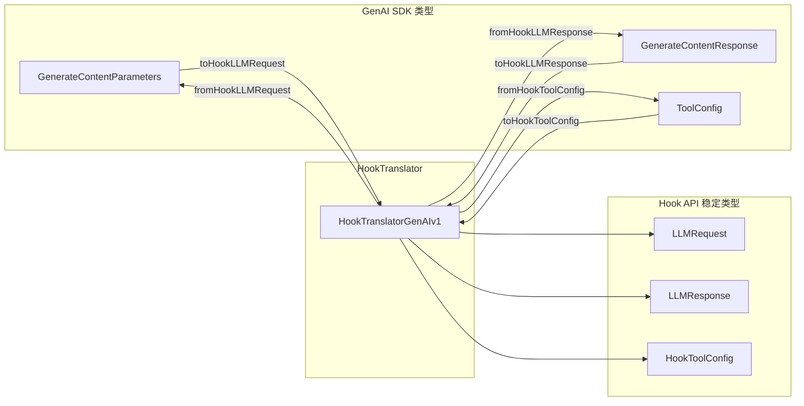

# hookTranslator.ts

> 在 Google GenAI SDK 格式与 Hook API 稳定格式之间进行双向转换。

## 概述

`hookTranslator.ts` 定义了一组与 SDK 版本无关的稳定数据格式（`LLMRequest`、`LLMResponse`、`HookToolConfig`），以及负责在这些格式与 Google GenAI SDK 类型之间进行双向转换的翻译器。这确保了 Hook 脚本/插件使用的数据格式在 SDK 升级时保持不变。

**设计动机：** Hook 可以是外部脚本或第三方插件，不应直接依赖 SDK 内部类型。翻译层提供了一个稳定的契约——即使底层 SDK 从 v1 升级到 v2，Hook 的输入输出格式不变。当前实现为 `HookTranslatorGenAIv1`，未来可添加新版本的翻译器。

**在模块中的角色：** 被 `HookEventHandler` 在触发 BeforeModel/AfterModel/BeforeToolSelection 事件时使用。

## 架构图



## 主要导出

### 稳定数据类型

#### `interface LLMRequest`

| 字段 | 类型 | 说明 |
|------|------|------|
| `model` | `string` | 模型名称 |
| `messages` | `Array<{ role, content }>` | 消息列表（role: user/model/system） |
| `config` | `{ temperature?, maxOutputTokens?, topP?, topK?, ... }?` | 生成配置 |
| `toolConfig` | `HookToolConfig?` | 工具配置 |

#### `interface LLMResponse`

| 字段 | 类型 | 说明 |
|------|------|------|
| `text` | `string?` | 响应文本 |
| `candidates` | `Array<{ content, finishReason?, index?, safetyRatings? }>` | 候选列表 |
| `usageMetadata` | `{ promptTokenCount?, candidatesTokenCount?, totalTokenCount? }?` | 用量元数据 |

#### `interface HookToolConfig`

| 字段 | 类型 | 说明 |
|------|------|------|
| `mode` | `'AUTO' \| 'ANY' \| 'NONE'?` | 工具调用模式 |
| `allowedFunctionNames` | `string[]?` | 允许的函数名列表 |

### 抽象基类

#### `abstract class HookTranslator`

定义双向转换的六个抽象方法：

```typescript
abstract toHookLLMRequest(sdkRequest): LLMRequest
abstract fromHookLLMRequest(hookRequest, baseRequest?): GenerateContentParameters
abstract toHookLLMResponse(sdkResponse): LLMResponse
abstract fromHookLLMResponse(hookResponse): GenerateContentResponse
abstract toHookToolConfig(sdkToolConfig): HookToolConfig
abstract fromHookToolConfig(hookToolConfig): ToolConfig
```

### 具体实现

#### `class HookTranslatorGenAIv1 extends HookTranslator`

GenAI SDK v1.x 的翻译器实现。

### 单例

```typescript
export const defaultHookTranslator = new HookTranslatorGenAIv1()
```

全局默认翻译器实例。

## 核心逻辑

### SDK -> Hook 转换（`toHookLLMRequest`）

1. 遍历 `sdkRequest.contents`
2. 字符串内容 -> `{ role: 'user', content: string }`
3. Content 对象 -> 提取 role，过滤出纯文本 parts（**有意忽略**图片、函数调用等非文本内容）
4. 仅有文本内容时才添加消息（避免空消息）
5. 提取 config 中的 temperature、maxOutputTokens、topP、topK

**设计决策**：v1 只暴露文本内容给 Hook，简化接口。未来版本可扩展。

### SDK -> Hook 转换（`toHookLLMResponse`）

1. 提取 `getResponseText()` 作为顶级 text
2. 遍历 candidates，过滤出文本 parts
3. 保留 finishReason、safetyRatings、usageMetadata

### Hook -> SDK 转换（`fromHookLLMRequest`）

1. 将 messages 转回 `{ role, parts: [{ text }] }` 格式
2. 如有 `baseRequest`，保留其未被 Hook 修改的字段
3. 合并 config 参数

### Hook -> SDK 转换（`fromHookLLMResponse`）

逆向构建 SDK 响应对象，将纯字符串 parts 包装为 `{ text: part }` 对象。

### 工具配置转换

在 `HookToolConfig`（简化的 mode + allowedFunctionNames）和 SDK 的 `ToolConfig`（嵌套 `functionCallingConfig`）之间转换。

## 内部依赖

| 模块 | 说明 |
|------|------|
| `../config/models.js` | `DEFAULT_GEMINI_FLASH_MODEL`（默认模型名回退） |
| `../utils/partUtils.js` | `getResponseText`（提取响应文本） |

## 外部依赖

| 包 | 说明 |
|------|------|
| `@google/genai` | GenerateContentResponse、GenerateContentParameters、ToolConfig、FinishReason、FunctionCallingConfig |
