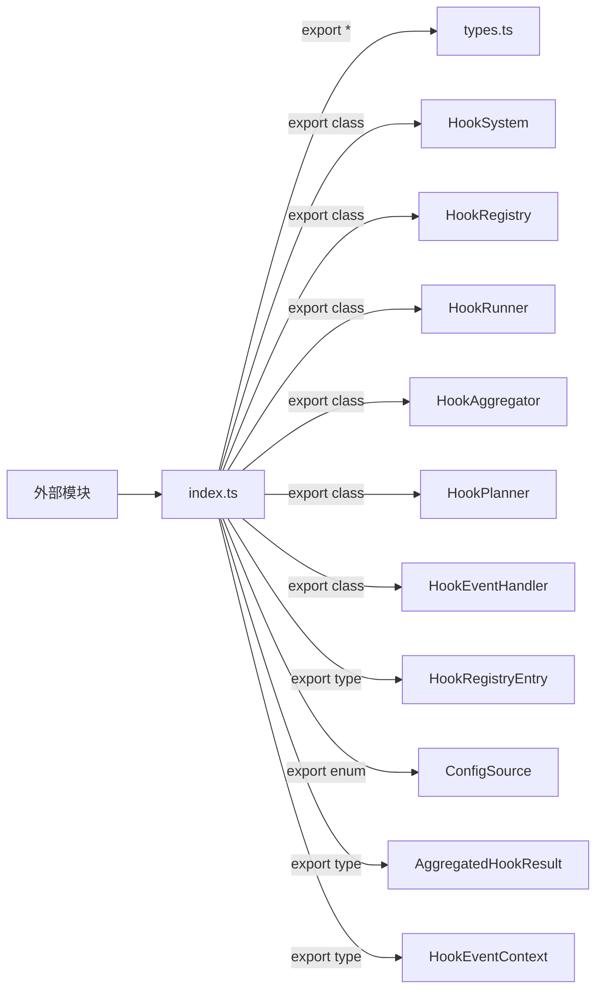

# index.ts

> hooks 模块的统一导出入口，重新导出所有公共类型和组件。

## 概述

`index.ts` 是 hooks 模块的 barrel 文件（桶导出文件），集中导出模块中所有需要对外暴露的类型、类和接口。外部模块只需从 `../hooks/index.js` 导入，无需关心具体实现文件的位置。

**设计动机：** 遵循 TypeScript 模块组织的最佳实践——每个功能模块通过 `index.ts` 提供单一导入路径，降低模块间的耦合，同时在内部重构文件结构时不影响外部导入。

**在模块中的角色：** 模块的公共 API 定义。

## 架构图

## 主要导出

### 类型重导出（`export *`）

从 `types.ts` 重导出所有类型，包括：
- 枚举：`HookEventName`、`HookType`、`ConfigSource`、`NotificationType`、`SessionStartSource`、`SessionEndReason`、`PreCompressTrigger`
- 接口：`HookInput`、`HookOutput`、`HookConfig`、`HookDefinition`、`HookExecutionResult`、`HookExecutionPlan` 及各事件特定的输入/输出类型
- 类：`DefaultHookOutput`、`BeforeToolHookOutput`、`BeforeModelHookOutput`、`AfterModelHookOutput`、`BeforeToolSelectionHookOutput`、`AfterAgentHookOutput`

### 核心类

| 导出 | 来源 |
|------|------|
| `HookSystem` | `./hookSystem.js` |
| `HookRegistry` | `./hookRegistry.js` |
| `HookRunner` | `./hookRunner.js` |
| `HookAggregator` | `./hookAggregator.js` |
| `HookPlanner` | `./hookPlanner.js` |
| `HookEventHandler` | `./hookEventHandler.js` |

### 类型导出

| 导出 | 来源 |
|------|------|
| `HookRegistryEntry` (type) | `./hookRegistry.js` |
| `ConfigSource` (enum, 额外具名导出) | `./types.js` |
| `AggregatedHookResult` (type) | `./hookAggregator.js` |
| `HookEventContext` (type) | `./hookPlanner.js` |

## 核心逻辑

纯导出文件，无业务逻辑。

## 内部依赖

| 模块 | 说明 |
|------|------|
| `./types.js` | 类型定义 |
| `./hookSystem.js` | HookSystem 类 |
| `./hookRegistry.js` | HookRegistry 类和 HookRegistryEntry 接口 |
| `./hookRunner.js` | HookRunner 类 |
| `./hookAggregator.js` | HookAggregator 类和 AggregatedHookResult 接口 |
| `./hookPlanner.js` | HookPlanner 类和 HookEventContext 接口 |
| `./hookEventHandler.js` | HookEventHandler 类 |

## 外部依赖

无。
