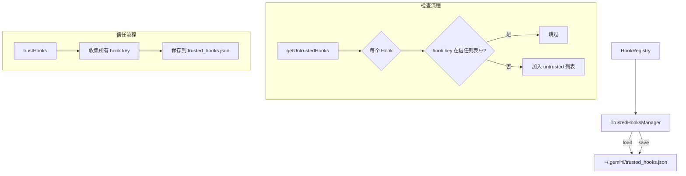

# trustedHooks.ts

> 管理项目级 Hook 的信任状态，防止未审查的 Hook 静默执行。

## 概述

`TrustedHooksManager` 维护一个持久化的信任列表，记录每个项目路径下哪些 Hook 已被用户信任。当新的项目级 Hook 被检测到且尚未信任时，系统会向用户发出警告。首次警告后自动信任这些 Hook，后续不再重复告警。

**设计动机：** 项目级 Hook 可以通过 `.gemini/settings.json` 配置任意 shell 命令，存在安全风险。信任管理机制确保用户至少被告知了 Hook 的存在，防止恶意项目在不知情的情况下执行代码。

**在模块中的角色：** 被 `HookRegistry.processHooksFromConfig()` 在加载项目级 Hook 时调用，执行信任检查和自动信任。

## 架构图



## 主要导出

### `class TrustedHooksManager`

#### 构造函数

```typescript
constructor()
```

构造时自动加载 `~/.gemini/trusted_hooks.json`。

#### 公开方法

| 方法 | 签名 | 说明 |
|------|------|------|
| `getUntrustedHooks` | `(projectPath, hooks): string[]` | 获取指定项目中尚未信任的 Hook 列表 |
| `trustHooks` | `(projectPath, hooks): void` | 将指定项目的所有 Hook 标记为已信任 |

## 核心逻辑

### 数据结构

```typescript
interface TrustedHooksConfig {
  [projectPath: string]: string[];  // 项目路径 -> 已信任的 hook key 数组
}
```

存储在 `~/.gemini/trusted_hooks.json`。

### Hook 标识

每个 Hook 通过 `getHookKey(hook)` 生成唯一标识，格式为 `name:command`。

### 获取未信任 Hook（`getUntrustedHooks`）

1. 获取该项目路径已信任的 key 集合
2. 遍历所有事件名下的 HookDefinition
3. 遍历每个 Definition 的 hooks 数组
4. **跳过运行时 Hook**（`HookType.Runtime`）——运行时 Hook 由代码注册，不需要信任检查
5. 对于命令 Hook，检查其 key 是否在信任集合中
6. 返回去重后的未信任 Hook 名称/命令列表

### 信任 Hook（`trustHooks`）

1. 获取（或创建）该项目路径的已信任 key 集合
2. 遍历所有命令 Hook，将其 key 加入集合
3. 同步写入 JSON 文件

### 容错处理

- 加载失败 -> 空信任列表
- 保存失败 -> 记录警告日志，不中断

## 内部依赖

| 模块 | 说明 |
|------|------|
| `../config/storage.js` | `Storage.getGlobalGeminiDir()` 获取配置目录 |
| `./types.js` | `getHookKey`、`HookType`、`HookDefinition`、`HookEventName` |
| `../utils/debugLogger.js` | 调试日志 |

## 外部依赖

| 包 | 说明 |
|------|------|
| `node:fs` | 文件读写（同步） |
| `node:path` | 路径拼接 |
