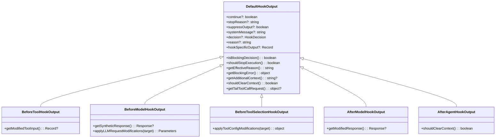

# types.ts

> 定义 Hook 系统的全部类型、接口、枚举和输出类层次结构。

## 概述

`types.ts` 是 Hook 系统的类型基石，定义了约 40 个类型/接口/枚举/类，涵盖事件名称、Hook 配置、输入输出格式、执行结果和计划等。它还定义了以 `DefaultHookOutput` 为基类的输出类层次结构，每个子类为特定事件类型提供定制化的操作方法。

**设计动机：** 作为 Hook 系统的类型契约，确保所有组件（Registry、Runner、Aggregator、Planner、EventHandler）之间的接口一致性。输出类层次结构避免了大量 `if-else` 类型判断，用多态代替分支。

**在模块中的角色：** 通过 `index.ts` 被 `export *` 全量导出，是 Hook 系统最基础的依赖。

## 架构图

## 主要导出

### 枚举

#### `enum ConfigSource`

Hook 配置来源优先级。

| 值 | 说明 |
|----|------|
| `Runtime` | 运行时代码注册 |
| `Project` | 项目级配置 |
| `User` | 用户级配置 |
| `System` | 系统级配置 |
| `Extensions` | 扩展提供 |

#### `enum HookEventName`

所有支持的 Hook 事件。

| 值 | 触发时机 |
|----|---------|
| `BeforeTool` | 工具执行前 |
| `AfterTool` | 工具执行后 |
| `BeforeAgent` | Agent 轮次开始前 |
| `AfterAgent` | Agent 轮次结束后 |
| `Notification` | 通知事件 |
| `SessionStart` | 会话开始 |
| `SessionEnd` | 会话结束 |
| `PreCompress` | 上下文压缩前 |
| `BeforeModel` | 模型调用前 |
| `AfterModel` | 模型调用后 |
| `BeforeToolSelection` | 工具选择前 |

#### `enum HookType`

| 值 | 说明 |
|----|------|
| `Command` | 命令行 Hook（子进程执行） |
| `Runtime` | 运行时 Hook（函数调用） |

#### 其他枚举

| 枚举 | 值 |
|------|------|
| `NotificationType` | `ToolPermission` |
| `SessionStartSource` | `Startup`, `Resume`, `Clear` |
| `SessionEndReason` | `Exit`, `Clear`, `Logout`, `PromptInputExit`, `Other` |
| `PreCompressTrigger` | `Manual`, `Auto` |

### Hook 配置类型

#### `interface CommandHookConfig`

| 字段 | 类型 | 说明 |
|------|------|------|
| `type` | `HookType.Command` | 固定为 command |
| `command` | `string` | Shell 命令 |
| `name` | `string?` | 显示名称 |
| `description` | `string?` | 描述 |
| `timeout` | `number?` | 超时（毫秒） |
| `source` | `ConfigSource?` | 来源 |
| `env` | `Record<string, string>?` | 环境变量 |

#### `interface RuntimeHookConfig`

| 字段 | 类型 | 说明 |
|------|------|------|
| `type` | `HookType.Runtime` | 固定为 runtime |
| `name` | `string` | 唯一名称（必填） |
| `action` | `HookAction` | 执行函数 |
| `timeout` | `number?` | 超时（毫秒） |

#### `type HookConfig = CommandHookConfig | RuntimeHookConfig`

#### `interface HookDefinition`

Hook 定义（包含 matcher 和 hooks 数组）。

| 字段 | 类型 | 说明 |
|------|------|------|
| `matcher` | `string?` | 匹配模式（正则或精确） |
| `sequential` | `boolean?` | 是否要求顺序执行 |
| `hooks` | `HookConfig[]` | Hook 配置列表 |

### 输入/输出类型

#### `interface HookInput`（基础输入）

| 字段 | 类型 |
|------|------|
| `session_id` | `string` |
| `transcript_path` | `string` |
| `cwd` | `string` |
| `hook_event_name` | `string` |
| `timestamp` | `string` |

#### 事件特定输入

| 类型 | 扩展字段 |
|------|---------|
| `BeforeToolInput` | `tool_name`, `tool_input`, `mcp_context?`, `original_request_name?` |
| `AfterToolInput` | `tool_name`, `tool_input`, `tool_response`, `mcp_context?` |
| `BeforeAgentInput` | `prompt` |
| `AfterAgentInput` | `prompt`, `prompt_response`, `stop_hook_active` |
| `NotificationInput` | `notification_type`, `message`, `details` |
| `SessionStartInput` | `source` |
| `SessionEndInput` | `reason` |
| `PreCompressInput` | `trigger` |
| `BeforeModelInput` | `llm_request: LLMRequest` |
| `AfterModelInput` | `llm_request`, `llm_response` |
| `BeforeToolSelectionInput` | `llm_request` |

#### `interface HookOutput`（基础输出）

| 字段 | 类型 | 说明 |
|------|------|------|
| `continue` | `boolean?` | 是否继续执行 |
| `stopReason` | `string?` | 停止原因 |
| `suppressOutput` | `boolean?` | 是否抑制输出 |
| `systemMessage` | `string?` | 系统消息 |
| `decision` | `HookDecision?` | 决策（ask/block/deny/approve/allow） |
| `reason` | `string?` | 决策原因 |
| `hookSpecificOutput` | `Record<string, unknown>?` | 事件特定的输出数据 |

### 输出类层次结构

#### `class DefaultHookOutput`

基类，实现所有公共方法：
- `isBlockingDecision()`: decision 为 block 或 deny
- `shouldStopExecution()`: continue 为 false
- `getEffectiveReason()`: 优先 stopReason，然后 reason
- `getBlockingError()`: 返回 `{ blocked, reason }`
- `getAdditionalContext()`: 从 hookSpecificOutput 提取并 HTML 转义
- `shouldClearContext()`: 基类返回 false
- `getTailToolCallRequest()`: 提取尾调用请求

#### 子类特定方法

| 子类 | 特定方法 |
|------|---------|
| `BeforeToolHookOutput` | `getModifiedToolInput()` |
| `BeforeModelHookOutput` | `getSyntheticResponse()`, `applyLLMRequestModifications()` |
| `BeforeToolSelectionHookOutput` | `applyToolConfigModifications()` |
| `AfterModelHookOutput` | `getModifiedResponse()` |
| `AfterAgentHookOutput` | `shouldClearContext()` (override, 检查 clearContext) |

### 其他类型

#### `interface McpToolContext`

MCP 工具执行上下文，包含服务器名称、工具名称和连接信息。

#### `interface HookExecutionResult`

Hook 执行结果。

| 字段 | 类型 | 说明 |
|------|------|------|
| `hookConfig` | `HookConfig` | 执行的 Hook 配置 |
| `eventName` | `HookEventName` | 事件名 |
| `success` | `boolean` | 是否成功 |
| `output` | `HookOutput?` | 输出 |
| `stdout` / `stderr` | `string?` | 标准输出/错误 |
| `exitCode` | `number?` | 退出码 |
| `duration` | `number` | 执行耗时（毫秒） |
| `error` | `Error?` | 错误 |

#### `interface HookExecutionPlan`

Hook 执行计划。

| 字段 | 类型 | 说明 |
|------|------|------|
| `eventName` | `HookEventName` | 事件名 |
| `hookConfigs` | `HookConfig[]` | 待执行的 Hook 列表 |
| `sequential` | `boolean` | 是否顺序执行 |

### 工具函数

#### `function getHookKey(hook: HookConfig): string`

生成 Hook 的唯一标识键，格式为 `name:command`。用于去重和信任管理。

#### `function createHookOutput(eventName, data): DefaultHookOutput`

工厂函数，根据事件名创建对应的输出子类实例。

### 常量

#### `const HOOKS_CONFIG_FIELDS`

值为 `['enabled', 'disabled', 'notifications']`——hooks 配置对象中不是事件名的字段，在遍历时需要跳过。

## 核心逻辑

### 安全性：`getAdditionalContext()`

对 additionalContext 中的 `<` 和 `>` 进行 HTML 实体转义，防止注入恶意标签。

### 类型联合与判别

`HookConfig` 使用判别联合模式（`type` 字段），`CommandHookConfig` 和 `RuntimeHookConfig` 互斥字段使用 `never` 类型标注。

## 内部依赖

| 模块 | 说明 |
|------|------|
| `./hookTranslator.js` | LLMRequest、LLMResponse、HookToolConfig、defaultHookTranslator |

## 外部依赖

| 包 | 说明 |
|------|------|
| `@google/genai` | GenerateContentResponse、GenerateContentParameters、ToolConfig、ToolListUnion |
