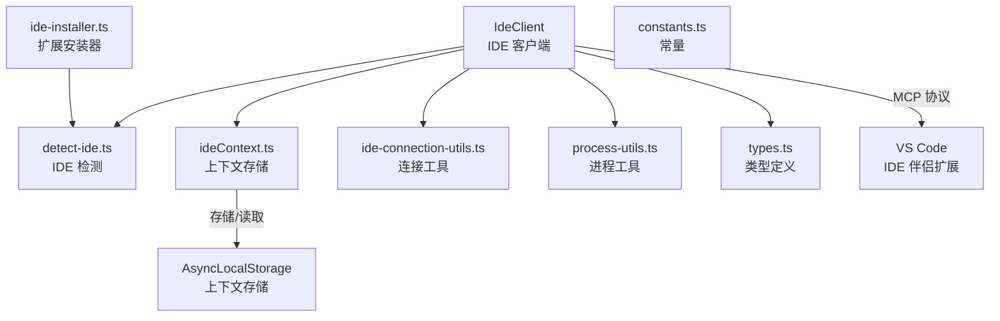

# ide 架构

> IDE 集成模块，通过 MCP 协议连接 VS Code 等 IDE，实现文件编辑、Diff 预览和上下文同步

## 概述

`ide/` 模块实现了 Gemini CLI 与 IDE（当前主要是 VS Code）的双向集成。通过 MCP（Model Context Protocol）协议连接到 IDE 伴侣扩展，支持获取 IDE 工作区上下文（打开的文件、活动文件、光标位置、选中文本）、展示 Diff 预览、执行工具操作。`IdeClient` 类管理连接生命周期，支持 HTTP 和 Stdio 两种传输方式。IDE 检测模块自动识别当前运行的 IDE 环境。

## 架构图



## 目录结构

```
ide/
├── ide-client.ts            # IdeClient：IDE 连接与交互管理
├── detect-ide.ts            # IDE 检测（VS Code、IntelliJ 等）
├── ideContext.ts             # IDE 上下文存储（AsyncLocalStorage）
├── ide-installer.ts         # IDE 扩展自动安装
├── ide-connection-utils.ts  # 连接配置工具函数
├── process-utils.ts         # IDE 进程信息获取
├── types.ts                 # 类型定义（File、IdeContext、通知 Schema）
└── constants.ts             # 常量（超时时间等）
```

## 关键文件

| 文件 | 功能 |
|------|------|
| `ide-client.ts` | `IdeClient` 类：单例模式管理 IDE 连接；支持 HTTP（StreamableHTTPClientTransport）和 Stdio 传输；处理 `ide/contextUpdate`、`ide/diffAccepted`、`ide/diffRejected` 通知；提供 `openDiff`/`closeDiff` 操作；管理连接状态和信任变更监听 |
| `types.ts` | Zod schema 定义：`FileSchema`（文件信息：路径、时间戳、活动状态、选中文本、光标位置）、`IdeContextSchema`（工作区状态）、`IdeContextNotificationSchema`/`IdeDiffAcceptedNotificationSchema`/`IdeDiffRejectedNotificationSchema`（MCP 通知格式）、`OpenDiffRequestSchema`/`CloseDiffRequestSchema` |
| `detect-ide.ts` | IDE 检测逻辑：`IDE_DEFINITIONS` 列表支持 VS Code、Cloud Shell、IntelliJ 等环境的识别 |
| `ideContext.ts` | `ideContextStore`：使用 `AsyncLocalStorage` 或全局变量存储当前 IDE 上下文 |
| `ide-installer.ts` | VS Code 扩展的自动安装逻辑 |
| `ide-connection-utils.ts` | 连接配置：从环境变量或文件读取端口/配置，验证工作区路径，创建代理感知的 fetch |

## 内部依赖

- `utils/debugLogger.ts` - 调试日志

## 外部依赖

| 依赖 | 用途 |
|------|------|
| `@modelcontextprotocol/sdk` | MCP 客户端（Client、StreamableHTTPClientTransport、StdioClientTransport） |
| `zod` | 类型 schema 验证 |
