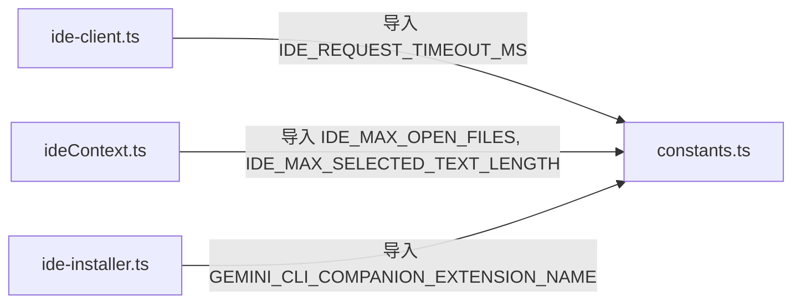

# constants.ts

> IDE 集成模块的全局常量定义

## 概述

本文件定义了 IDE 集成功能所需的全局常量，包括伴侣扩展名称、打开文件数上限、选中文本长度上限以及请求超时时间。这些常量被 `ide-client.ts`、`ideContext.ts` 等多个模块引用，起到集中管理配置参数的作用，避免硬编码散布在各处。

## 架构图



## 主要导出

### `GEMINI_CLI_COMPANION_EXTENSION_NAME`

```typescript
export const GEMINI_CLI_COMPANION_EXTENSION_NAME = 'Gemini CLI Companion';
```

Gemini CLI 伴侣扩展的显示名称，用于安装提示和错误信息中。

### `IDE_MAX_OPEN_FILES`

```typescript
export const IDE_MAX_OPEN_FILES = 10;
```

IDE 上下文中最多跟踪的打开文件数量。在 `IdeContextStore.set()` 中用于截断文件列表。

### `IDE_MAX_SELECTED_TEXT_LENGTH`

```typescript
export const IDE_MAX_SELECTED_TEXT_LENGTH = 16384; // 16 KiB
```

活动文件中选中文本的最大长度（字节）。超出部分会被截断并追加 `... [TRUNCATED]`。

### `IDE_REQUEST_TIMEOUT_MS`

```typescript
export const IDE_REQUEST_TIMEOUT_MS = 10 * 60 * 1000; // 10 分钟
```

向 IDE MCP 服务端发送请求（如 `openDiff`、`closeDiff`）时的超时时间。

## 核心逻辑

本文件无复杂逻辑，仅为常量声明。所有数值均为硬编码，无运行时计算。

## 内部依赖

无。本文件是叶子模块，不依赖项目内其他文件。

## 外部依赖

无。
