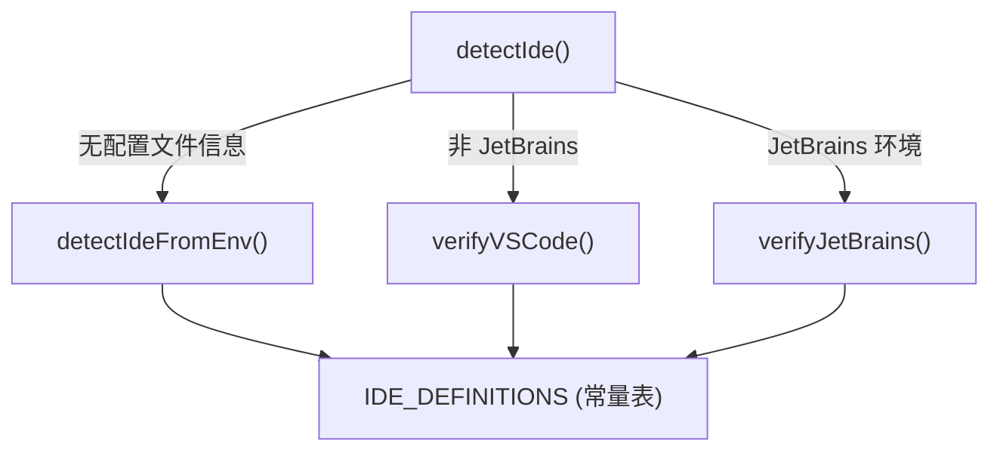

# detect-ide.ts

> 通过环境变量和进程信息自动检测当前运行的 IDE 类型

## 概述

本文件负责识别 Gemini CLI 所运行的 IDE 环境。它维护了一份包含 20 余种 IDE 的定义表 (`IDE_DEFINITIONS`)，并提供三层检测逻辑：

1. **环境变量快速检测** (`detectIdeFromEnv`) -- 通过特定环境变量判断 IDE 类型
2. **进程信息精确验证** (`verifyVSCode` / `verifyJetBrains`) -- 根据进程命令行进一步区分同族 IDE
3. **对外统一入口** (`detectIde`) -- 优先使用配置文件中的 IDE 信息，否则走自动检测流程

该模块在 `IdeClient` 初始化时被调用，检测结果决定了后续是否启用 IDE 集成功能以及使用哪个安装器。

## 架构图



## 主要导出

### `IDE_DEFINITIONS`

```typescript
export const IDE_DEFINITIONS = { ... } as const;
```

只读对象，键为 IDE 标识符（如 `vscode`、`cursor`），值为 `{ name, displayName }` 结构。覆盖 VS Code、JetBrains 系列、Zed、Xcode 等主流 IDE。

### `IdeInfo`

```typescript
export interface IdeInfo {
  name: string;
  displayName: string;
}
```

IDE 信息的类型定义，`name` 用于内部标识，`displayName` 用于用户界面展示。

### `isCloudShell(): boolean`

检测当前环境是否为 Google Cloud Shell（通过 `EDITOR_IN_CLOUD_SHELL` 或 `CLOUD_SHELL` 环境变量）。

### `detectIdeFromEnv(): IdeInfo`

仅通过环境变量检测 IDE 类型，返回匹配的 `IdeInfo`。未匹配时默认返回 `vscode`。检测顺序：Antigravity > Devin > Replit > Cursor > Codespaces > Cloud Shell > Trae > Firebase Studio > Positron > Sublime Text > Zed > Xcode > JetBrains > VS Code。

### `detectIde(ideProcessInfo, ideInfoFromFile?): IdeInfo | undefined`

对外主入口。优先使用文件配置中的 IDE 信息；如果当前终端不属于已支持的 IDE（VS Code、Sublime Text、JetBrains、Zed、Xcode），返回 `undefined`；否则通过环境变量 + 进程信息联合判断。

## 核心逻辑

- `detectIdeFromEnv` 使用一系列 `if` 条件按优先级依次匹配环境变量，形成"瀑布式"检测链
- `verifyVSCode` 在基础检测为 VS Code 时，检查进程命令是否包含 `code`，否则标记为 `vscodefork`
- `verifyJetBrains` 在基础检测为 JetBrains 时，遍历产品列表（idea、webstorm、pycharm 等），根据进程命令精确匹配具体产品
- `isJetBrains` 通过 `TERMINAL_EMULATOR` 环境变量中是否包含 `jetbrains` 来判断

## 内部依赖

无。本文件是 IDE 检测的源头模块。

## 外部依赖

无。仅使用 Node.js 内置的 `process.env`。
