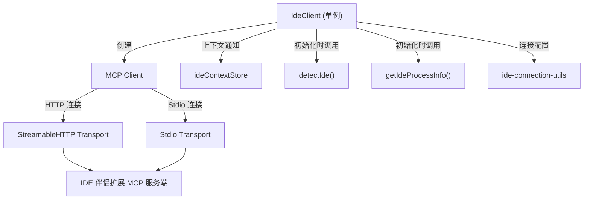

# ide-client.ts

> IDE 集成的核心客户端，管理与 IDE MCP 服务端的连接、diff 交互和状态通知

## 概述

`IdeClient` 是 IDE 集成模块的中枢类，采用单例模式，负责：

1. **连接管理** -- 支持 HTTP (StreamableHTTP) 和 stdio 两种传输协议连接到 IDE 伴侣扩展的 MCP 服务端
2. **Diff 交互** -- 通过 `openDiff` / `closeDiff` 在 IDE 中打开 diff 视图，等待用户接受或拒绝，并使用 promise-based mutex 确保同时只有一个 diff 视图处于活跃状态
3. **状态与事件管理** -- 维护连接状态（Connected/Disconnected/Connecting），通过监听器模式通知外部组件状态变化和信任级别变化
4. **工具发现** -- 连接后自动发现 IDE 支持的 MCP 工具列表

该类是 CLI 与 IDE 之间的唯一通信桥梁，所有 IDE 操作均通过此类完成。

## 架构图



## 主要导出

### `DiffUpdateResult` (类型)

```typescript
export type DiffUpdateResult =
  | { status: 'accepted'; content?: string }
  | { status: 'rejected'; content: undefined };
```

Diff 操作的结果类型。`accepted` 时可能携带用户手动编辑后的内容。

### `IDEConnectionState` (类型)

```typescript
export type IDEConnectionState = {
  status: IDEConnectionStatus;
  details?: string;
};
```

### `IDEConnectionStatus` (枚举)

```typescript
export enum IDEConnectionStatus {
  Connected = 'connected',
  Disconnected = 'disconnected',
  Connecting = 'connecting',
}
```

### `IdeClient` (类)

| 方法 | 签名 | 用途 |
|------|------|------|
| `getInstance` | `static getInstance(): Promise<IdeClient>` | 获取单例实例（含异步初始化） |
| `connect` | `connect(options?): Promise<void>` | 建立与 IDE 的连接 |
| `disconnect` | `disconnect(): Promise<void>` | 断开连接并清理 diff |
| `openDiff` | `openDiff(filePath, newContent): Promise<DiffUpdateResult>` | 在 IDE 中打开 diff 视图 |
| `closeDiff` | `closeDiff(filePath, options?): Promise<string \| undefined>` | 关闭 diff 视图 |
| `resolveDiffFromCli` | `resolveDiffFromCli(filePath, outcome): Promise<void>` | 从 CLI 端主动解决 diff |
| `getCurrentIde` | `getCurrentIde(): IdeInfo \| undefined` | 获取当前检测到的 IDE 信息 |
| `getConnectionStatus` | `getConnectionStatus(): IDEConnectionState` | 获取当前连接状态 |
| `isDiffingEnabled` | `isDiffingEnabled(): boolean` | 检查 diff 功能是否可用 |
| `addStatusChangeListener` | `addStatusChangeListener(listener): void` | 注册连接状态变化监听器 |
| `addTrustChangeListener` | `addTrustChangeListener(listener): void` | 注册工作区信任状态变化监听器 |

## 核心逻辑

1. **单例初始化**: `getInstance()` 使用 promise 缓存模式，确保只创建一次实例。初始化时获取 IDE 进程信息并检测 IDE 类型
2. **连接优先级**: `connect()` 依次尝试：配置文件 HTTP > 配置文件 stdio > 环境变量 HTTP > 环境变量 stdio
3. **Diff Mutex**: `acquireMutex()` 实现 promise 链式互斥锁，确保 `openDiff` 串行执行，避免 IDE 中多个 diff 视图冲突
4. **通知处理**: 注册三种 diff 通知处理器（`diffAccepted`、`diffRejected`、`diffClosed`），其中 `diffClosed` 为向后兼容
5. **SSRF 防护**: HTTP 连接时验证端口号范围（1-65535）

## 内部依赖

| 模块 | 用途 |
|------|------|
| `detect-ide.ts` | 检测 IDE 类型 |
| `ideContext.ts` | IDE 上下文存储 |
| `types.ts` | 通知 Schema 定义 |
| `process-utils.ts` | 获取 IDE 进程信息 |
| `constants.ts` | 请求超时常量 |
| `ide-connection-utils.ts` | 连接配置、代理、工作区验证 |
| `../utils/debugLogger.js` | 调试日志 |

## 外部依赖

| 包 | 用途 |
|---|------|
| `@modelcontextprotocol/sdk/client/index.js` | MCP 客户端 |
| `@modelcontextprotocol/sdk/client/streamableHttp.js` | HTTP 传输层 |
| `@modelcontextprotocol/sdk/client/stdio.js` | Stdio 传输层 |
| `@modelcontextprotocol/sdk/types.js` | MCP 类型 Schema |
