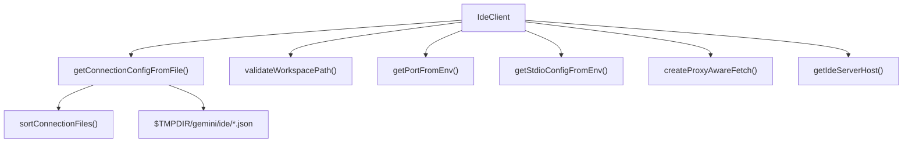

# ide-connection-utils.ts

> IDE 连接的底层工具函数集合：配置文件解析、工作区验证、代理感知 fetch、容器环境检测

## 概述

本文件是 `IdeClient` 的连接基础设施层，提供从环境变量和配置文件中读取连接参数的能力。主要职责包括：

- 从临时目录中读取 IDE 伴侣扩展写入的连接配置 JSON 文件
- 验证 IDE 工作区路径与 CLI 当前目录的一致性
- 创建代理感知的 fetch 函数以支持企业代理环境
- 检测容器/SSH/DevContainer 环境并选择合适的服务端主机地址

## 架构图



## 主要导出

### `StdioConfig` (类型)

```typescript
export type StdioConfig = { command: string; args: string[] };
```

Stdio 传输协议的配置类型。

### `ConnectionConfig` (类型)

```typescript
export type ConnectionConfig = { port?: string; authToken?: string; stdio?: StdioConfig };
```

连接配置类型，包含 HTTP 端口、认证令牌和 stdio 配置。

### `validateWorkspacePath(ideWorkspacePath, cwd): { isValid, error? }`

验证 IDE 工作区路径：
- `undefined` -> 扩展未运行
- 空字符串 -> 未打开工作区
- 路径不匹配 -> 目录不一致

使用 `resolveToRealPath` 解析符号链接后再比较，支持多工作区（路径以 `path.delimiter` 分隔）。

### `getPortFromEnv(): string | undefined`

从 `GEMINI_CLI_IDE_SERVER_PORT` 环境变量读取 HTTP 端口。

### `getStdioConfigFromEnv(): StdioConfig | undefined`

从 `GEMINI_CLI_IDE_SERVER_STDIO_COMMAND` 和 `GEMINI_CLI_IDE_SERVER_STDIO_ARGS`（JSON 数组）环境变量读取 stdio 配置。

### `getConnectionConfigFromFile(pid): Promise<ConnectionConfig & { workspacePath?, ideInfo? } | undefined>`

从临时目录读取连接配置文件。支持两种文件命名格式：
1. 旧版：`gemini-ide-server-{pid}.json`
2. 新版：`gemini-ide-server-{pid}-{timestamp}.json`（支持多窗口）

当存在多个有效配置文件时，按以下优先级排序：目标 PID 匹配 > 进程存活 > PID 最大（最新）。

### `createProxyAwareFetch(ideServerHost): Promise<fetch>`

返回一个代理感知的 fetch 函数，将 IDE 服务端主机加入 `NO_PROXY` 列表以绕过企业代理。使用 `undici` 的 `EnvHttpProxyAgent`。

### `getIdeServerHost(): string`

根据运行环境返回 IDE 服务端主机地址：
- 默认：`127.0.0.1`
- 容器内（非 SSH、非 DevContainer）：`host.docker.internal`

## 核心逻辑

1. **配置文件搜索**: 先尝试旧版精确匹配文件名，失败后使用正则遍历目录，排序后依次尝试
2. **多窗口处理**: `sortConnectionFiles` 优先匹配当前父进程 PID，其次选择仍存活的进程，最后按 PID 降序（最新优先）
3. **进程存活检测**: Unix 使用 `process.kill(pid, 0)` 探测（`EPERM` 也视为存活），Windows 跳过检测直接返回 true
4. **容器环境检测**: 通过 `/.dockerenv` 或 `/run/.containerenv` 文件判断容器，通过 `SSH_CONNECTION` 判断 SSH

## 内部依赖

| 模块 | 用途 |
|------|------|
| `../utils/debugLogger.js` | 调试日志 |
| `../utils/paths.js` | `isSubpath`, `resolveToRealPath` |
| `../utils/errors.js` | `isNodeError` |
| `detect-ide.ts` | `IdeInfo` 类型 |

## 外部依赖

| 包 | 用途 |
|---|------|
| `undici` | `EnvHttpProxyAgent`，代理感知 HTTP 客户端 |
| `node:fs` | 文件系统操作 |
| `node:path` | 路径处理 |
| `node:os` | `tmpdir()`, `platform()` |
